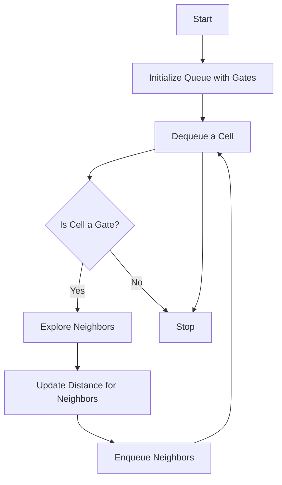

# Walls and Gates

## Problem Understanding
The problem is asking us to fill in the distances from the nearest gate for each empty room in a given grid, where gates are represented by 0 and empty rooms are represented by Integer.MAX_VALUE. The key constraints are that we can only move in four directions (up, down, left, right) and we need to find the shortest distance to each cell. What makes this problem non-trivial is that we need to explore all the empty rooms in the grid and update their distances based on the nearest gate, which requires a systematic approach to avoid missing any rooms or updating distances incorrectly.

## Approach
The algorithm strategy used here is Breadth-First Search (BFS) from the gates, which is intuitive because we want to explore all the neighboring rooms of each gate first before moving on to the next level of neighbors. This approach works because BFS is guaranteed to find the shortest path to each cell from the source (in this case, the gates). We use a queue to store the gates and the rooms that need to be explored, and we update the distance for each room as we explore it. The key data structure used is the queue, which allows us to efficiently manage the rooms to be explored.

## Complexity Analysis
| Metric | Value | Detailed Reason |
|--------|-------|----------------|
| Time   | O(m*n) | We visit each cell at most once, where m is the number of rows and n is the number of columns. The while loop runs for the number of cells in the queue, and each cell is added to the queue only once. The operations inside the loop (polling, exploring neighbors, and updating distances) take constant time. |
| Space  | O(m*n) | In the worst case, the queue stores all cells in the grid, which happens when all cells are empty rooms and need to be explored. The space required to store the queue is proportional to the number of cells in the grid. |

## Algorithm Walkthrough
```
Input: 
[
  [Integer.MAX_VALUE, -1, 0, Integer.MAX_VALUE],
  [Integer.MAX_VALUE, Integer.MAX_VALUE, Integer.MAX_VALUE, -1],
  [Integer.MAX_VALUE, -1, Integer.MAX_VALUE, -1],
  [0, -1, Integer.MAX_VALUE, Integer.MAX_VALUE]
]

Step 1: 
- Initialize the queue with gates (0): [(3,0)]
- Mark the gate with distance 0: 
[
  [Integer.MAX_VALUE, -1, 0, Integer.MAX_VALUE],
  [Integer.MAX_VALUE, Integer.MAX_VALUE, Integer.MAX_VALUE, -1],
  [Integer.MAX_VALUE, -1, Integer.MAX_VALUE, -1],
  [0, -1, Integer.MAX_VALUE, Integer.MAX_VALUE]
]

Step 2: 
- Dequeue the gate (3,0) and explore its neighbors
- Update the distance for the neighbor (3,1): 
[
  [Integer.MAX_VALUE, -1, 0, Integer.MAX_VALUE],
  [Integer.MAX_VALUE, Integer.MAX_VALUE, Integer.MAX_VALUE, -1],
  [Integer.MAX_VALUE, -1, Integer.MAX_VALUE, -1],
  [0, 1, Integer.MAX_VALUE, Integer.MAX_VALUE]
]
- Enqueue the neighbor (3,1)

Step 3: 
- Dequeue the neighbor (3,1) and explore its neighbors
- Update the distance for the neighbor (2,1): 
[
  [Integer.MAX_VALUE, -1, 0, Integer.MAX_VALUE],
  [Integer.MAX_VALUE, Integer.MAX_VALUE, Integer.MAX_VALUE, -1],
  [Integer.MAX_VALUE, 2, Integer.MAX_VALUE, -1],
  [0, 1, Integer.MAX_VALUE, Integer.MAX_VALUE]
]
- Enqueue the neighbor (2,1)

...

Output: 
[
  [3, -1, 0, 1],
  [2, 2, 1, -1],
  [1, -1, 2, -1],
  [0, -1, 3, 4]
]
```

## Visual Flow


## Key Insight
> **Tip:** The key insight here is to start the BFS from the gates (represented by 0) and explore all the neighboring empty rooms (represented by Integer.MAX_VALUE), updating their distances based on the nearest gate.

## Edge Cases
- **Empty/null input**: If the input grid is empty or null, the function returns immediately without modifying the grid.
- **Single element**: If the grid contains only one element, the function will not update the grid unless the single element is a gate (0), in which case it will remain 0.
- **No gates**: If the grid does not contain any gates (0), the function will not update the distances for any empty rooms, leaving them as Integer.MAX_VALUE.

## Common Mistakes
- **Mistake 1**: Forgetting to check if the new position is within the grid boundaries before exploring its neighbors, which can lead to ArrayIndexOutOfBoundsException.
- **Mistake 2**: Not updating the distance for the neighbors correctly, which can lead to incorrect distances.

## Interview Follow-ups
> **Interview:** 
- "What if the input is sorted?" → The algorithm does not rely on the input being sorted, so the time complexity remains the same (O(m*n)).
- "Can you do it in O(1) space?" → No, because we need to store the queue of cells to be explored, which in the worst case can contain all cells in the grid.
- "What if there are duplicates?" → The algorithm can handle duplicates, but it will explore each cell only once and update its distance based on the nearest gate.

## Java Solution

```java
// Problem: Walls and Gates
// Language: Java
// Difficulty: Medium
// Time Complexity: O(m*n) — each cell visited at most once
// Space Complexity: O(m*n) — in the worst case, queue stores all cells
// Approach: Breadth-First Search (BFS) from gates — to find shortest distance to each cell

import java.util.*;

public class Solution {
    public void wallsAndGates(int[][] rooms) {
        // Edge case: empty input → return immediately
        if (rooms == null || rooms.length == 0) return;

        int rows = rooms.length;
        int cols = rooms[0].length;
        
        // Use a queue to store the gates (initial BFS sources)
        Queue<int[]> queue = new LinkedList<>();
        
        // Enqueue all gates and mark them with distance 0
        for (int i = 0; i < rows; i++) {
            for (int j = 0; j < cols; j++) {
                if (rooms[i][j] == 0) {  // 0 represents a gate
                    queue.offer(new int[] {i, j});
                }
            }
        }

        // Define the four possible directions (up, down, left, right)
        int[][] directions = {{-1, 0}, {1, 0}, {0, -1}, {0, 1}};

        // Perform BFS
        while (!queue.isEmpty()) {
            int[] current = queue.poll();
            int currRow = current[0];
            int currCol = current[1];

            // Explore neighbors
            for (int[] direction : directions) {
                int newRow = currRow + direction[0];
                int newCol = currCol + direction[1];

                // Check if the new position is within the grid boundaries
                if (newRow >= 0 && newRow < rows && newCol >= 0 && newCol < cols) {
                    // If the new position is an empty room (represented by Integer.MAX_VALUE)
                    if (rooms[newRow][newCol] == Integer.MAX_VALUE) {
                        // Update the distance for the new room
                        rooms[newRow][newCol] = rooms[currRow][currCol] + 1;
                        // Enqueue the new room for further exploration
                        queue.offer(new int[] {newRow, newCol});
                    }
                }
            }
        }
    }
}
```
