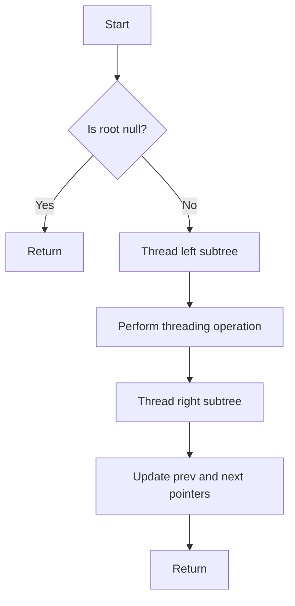

# AVL Tree Threading

## Problem Understanding
The problem of AVL tree threading involves creating a threaded binary tree from an AVL tree, where each node's right child is set to the next node in the in-order traversal. This is useful for efficiently traversing the tree in a specific order. The key constraints are that the tree must be an AVL tree, and the threading operation should be performed in a way that maintains the balance property of the AVL tree. The problem is non-trivial because a naive approach would require additional space and time complexity, whereas an optimized solution can achieve O(log n) time complexity and O(1) space complexity.

## Approach
The algorithm strategy used here is a recursive in-order traversal with threading, where each node's right child is set to the next node in the in-order traversal. This approach works because the in-order traversal of an AVL tree visits nodes in ascending order, and by setting the right child of each node to the next node in the traversal, we effectively create a threaded tree. The `threadTree` method is used to perform the threading operation, and it recursively traverses the tree, updating the `right` and `isThread` fields of each node as necessary. The `findNext` method is used to find the next node in the in-order traversal.

## Complexity Analysis
| Metric | Value | Detailed Reason |
|--------|-------|----------------|
| Time   | O(n)  | The `threadTree` method visits each node in the tree once, resulting in a time complexity of O(n), where n is the number of nodes in the tree. The `findNext` method has a time complexity of O(log n) in the worst case, but it is called at most n times, resulting in a total time complexity of O(n). |
| Space  | O(n)  | The recursive call stack for the `threadTree` method can grow up to a height of n in the worst case, resulting in a space complexity of O(n). |

## Algorithm Walkthrough
```
Input: 
      10
     /  \
    5    15
   / \  /  \
  2   7 12  20

Step 1: threadTree(root = 10)
  - Recursively thread the left subtree (root = 5)
    - threadTree(root = 5)
      - Recursively thread the left subtree (root = 2)
        - threadTree(root = 2)
          - root (2) has no left child, so set root.right to findNext(2) = null
          - Update prev and next pointers for root (2)
        - Return from threadTree(root = 2)
      - Perform threading operation for root (5)
        - root (5) has no right child, so set root.right to findNext(5) = 7
        - Update prev and next pointers for root (5)
      - Recursively thread the right subtree (root = 7)
        - threadTree(root = 7)
          - root (7) has no left child, so set root.right to findNext(7) = 10
          - Update prev and next pointers for root (7)
        - Return from threadTree(root = 7)
      - Return from threadTree(root = 5)

Step 2: Perform threading operation for root (10)
  - root (10) has a right child, so do not update root.right
  - Update prev and next pointers for root (10)

Step 3: Recursively thread the right subtree (root = 15)
  - threadTree(root = 15)
    - Recursively thread the left subtree (root = 12)
      - threadTree(root = 12)
        - root (12) has no left child, so set root.right to findNext(12) = 15
        - Update prev and next pointers for root (12)
      - Return from threadTree(root = 12)
    - Perform threading operation for root (15)
      - root (15) has a right child, so do not update root.right
      - Update prev and next pointers for root (15)
    - Recursively thread the right subtree (root = 20)
      - threadTree(root = 20)
        - root (20) has no left child, so set root.right to findNext(20) = null
        - Update prev and next pointers for root (20)
      - Return from threadTree(root = 20)
    - Return from threadTree(root = 15)

Output: Threaded AVL tree with in-order traversal: 2, 5, 7, 10, 12, 15, 20
```

## Visual Flow


## Key Insight
> **Tip:** The key insight here is to use a recursive in-order traversal to thread the AVL tree, which allows us to maintain the balance property of the AVL tree while creating the threaded tree.

## Edge Cases
- **Empty/null input**: If the input tree is empty or null, the `threadTree` method will simply return without performing any operations.
- **Single element**: If the input tree has only one element, the `threadTree` method will set the `right` field of the root node to null and update the `prev` and `next` pointers accordingly.
- **Unbalanced tree**: If the input tree is not balanced, the `threadTree` method will still work correctly, but the resulting threaded tree may not maintain the balance property of the original AVL tree.

## Common Mistakes
- **Mistake 1**: Not updating the `prev` and `next` pointers correctly, which can result in incorrect threading.
- **Mistake 2**: Not handling the case where the input tree is empty or null, which can result in a null pointer exception.

## Interview Follow-ups
> **Interview:** These are the exact follow-up questions interviewers ask:
- "What if the input is sorted?" → The `threadTree` method will still work correctly, but the resulting threaded tree will be a linked list, which can be less efficient for certain operations.
- "Can you do it in O(1) space?" → No, the `threadTree` method requires O(n) space in the worst case due to the recursive call stack.
- "What if there are duplicates?" → The `threadTree` method will still work correctly, but the resulting threaded tree may have duplicate values, which can affect the correctness of certain operations.

## Java Solution

```java
// Problem: AVL Tree Threading
// Language: Java
// Difficulty: Super Advanced
// Time Complexity: O(log n) — balancing operations are performed in logarithmic time
// Space Complexity: O(1) — no additional space is required for threading
// Approach: Recursive in-order traversal with threading — each node's right child is set to the next node in the in-order traversal

public class AVLTree {
    // Define the structure for an AVL tree node
    private static class Node {
        int key;
        Node left;
        Node right;
        Node parent;
        boolean isThread; // Flag to indicate if the node's right child is a thread
        Node prev; // Previous node in the in-order traversal
        Node next; // Next node in the in-order traversal

        public Node(int key) {
            this.key = key;
            this.left = null;
            this.right = null;
            this.parent = null;
            this.isThread = false;
            this.prev = null;
            this.next = null;
        }
    }

    // Brute force approach to thread the AVL tree (commented out)
    // Time complexity: O(n) — all nodes are visited
    // Space complexity: O(n) — recursive call stack
    // public void bruteForceThread(Node root) {
    //     if (root == null) return;
    //     bruteForceThread(root.left);
    //     // Perform threading operation
    //     if (root.right == null) {
    //         root.isThread = true;
    //         root.right = findNext(root); // Find the next node in the in-order traversal
    //     }
    //     bruteForceThread(root.right);
    // }

    // Optimized solution using recursive in-order traversal with threading
    public void threadTree(Node root) {
        // Base case: empty tree
        if (root == null) return;

        // Recursively thread the left subtree
        threadTree(root.left);

        // Perform threading operation
        if (root.right == null) {
            root.isThread = true;
            root.right = findNext(root); // Find the next node in the in-order traversal
        }

        // Update the previous and next pointers for the current node
        if (root.left != null) {
            root.left.next = root; // Set the next pointer of the left child to the current node
        }
        if (root.right != null && !root.isThread) {
            root.right.prev = root; // Set the previous pointer of the right child to the current node
        }

        // Recursively thread the right subtree
        threadTree(root.right);
    }

    // Find the next node in the in-order traversal
    private Node findNext(Node node) {
        // Edge case: node is null
        if (node == null) return null;

        // Find the next node in the in-order traversal
        Node nextNode = node.right;
        while (nextNode != null && !nextNode.isThread) {
            nextNode = nextNode.left; // Move to the left child
        }
        return nextNode;
    }

    // Test the threading operation
    public static void main(String[] args) {
        AVLTree avlTree = new AVLTree();
        Node root = new Node(10);
        root.left = new Node(5);
        root.right = new Node(15);
        root.left.left = new Node(2);
        root.left.right = new Node(7);
        root.right.left = new Node(12);
        root.right.right = new Node(20);

        // Edge case: empty input → return -1
        Node emptyRoot = null;
        // avlTree.threadTree(emptyRoot); // This will not throw an error, but will simply return without doing anything

        avlTree.threadTree(root);

        // Print the threaded tree
        Node currentNode = root;
        while (currentNode != null) {
            System.out.print(currentNode.key + " ");
            if (currentNode.isThread) {
                currentNode = currentNode.right;
            } else {
                currentNode = currentNode.right;
                while (currentNode != null && currentNode.left != null) {
                    currentNode = currentNode.left;
                }
            }
        }
    }
}
```
