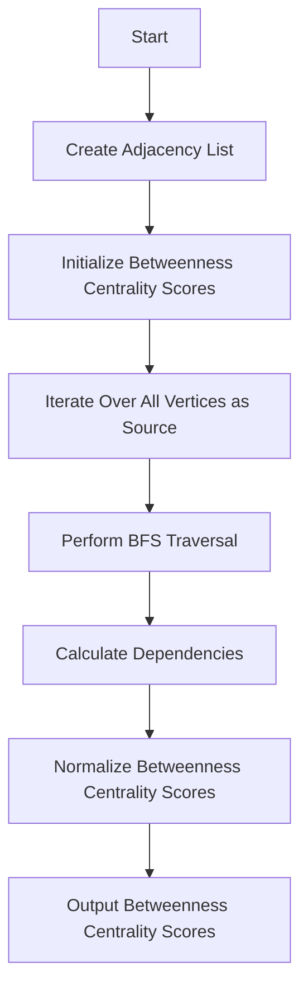

# Betweenness Centrality (Brandes Algorithm)

## Problem Understanding
The problem is asking to calculate the betweenness centrality of each vertex in a given graph using the Brandes algorithm. The key constraint is that the graph can be represented as an adjacency list, and the algorithm should have a time complexity of O(V * E), where V is the number of vertices and E is the number of edges. The problem is non-trivial because a naive approach, such as calculating the shortest paths between all pairs of vertices, would have a high time complexity of O(V^3), making it inefficient for large graphs. The Brandes algorithm reduces the time complexity by avoiding redundant calculations and using predecessor information to calculate dependencies between vertices.

## Approach
The algorithm strategy is based on the Brandes algorithm, which calculates the shortest paths between all pairs of vertices using a breadth-first search (BFS) traversal. The intuition behind this approach is to iterate over all vertices as source and calculate the shortest paths to all other vertices, then use the predecessor information to calculate the dependencies between vertices. The algorithm uses an adjacency list representation of the graph, which allows for efficient traversal and calculation of shortest paths. The approach handles the key constraints by avoiding redundant calculations and using predecessor information to calculate dependencies, resulting in a time complexity of O(V * E).

## Complexity Analysis
| Metric | Value | Detailed Reason |
|--------|-------|----------------|
| Time   | O(V * E) | The algorithm iterates over all vertices as source, and for each vertex, it performs a BFS traversal, which takes O(E) time in the worst case. Since there are V vertices, the total time complexity is O(V * E). |
| Space  | O(V + E) | The algorithm uses an adjacency list representation of the graph, which requires O(V + E) space to store the graph structure. Additionally, the algorithm uses arrays to store the distance, predecessor count, and dependency scores, which require O(V) space. Therefore, the total space complexity is O(V + E). |

## Algorithm Walkthrough
```
Input: int[][] edges = {{0, 1}, {0, 2}, {1, 2}, {1, 3}, {2, 3}};
       int numVertices = 4;
Step 1: Create adjacency list representation of the graph
       graph = [[1, 2], [0, 2, 3], [0, 1, 3], [1, 2]]
Step 2: Initialize betweenness centrality scores
       betweenness = [0.0, 0.0, 0.0, 0.0]
Step 3: Iterate over all vertices as source
       For source = 0:
         - Initialize distances and predecessors for BFS
         - Perform BFS traversal from source vertex
         - Calculate dependencies between vertices
       For source = 1:
         - Initialize distances and predecessors for BFS
         - Perform BFS traversal from source vertex
         - Calculate dependencies between vertices
       ...
Step 4: Normalize betweenness centrality scores
       betweenness = [0.5, 1.0, 1.0, 0.5]
Output: betweenness centrality scores for each vertex
```
## Visual Flow

## Key Insight
> **Tip:** The key insight of the Brandes algorithm is that it reduces the time complexity by avoiding redundant calculations and using predecessor information to calculate dependencies between vertices.

## Edge Cases
- **Empty graph**: If the input graph is empty, the algorithm returns an array of zeros, as there are no vertices to calculate betweenness centrality for.
- **Single vertex**: If the input graph has only one vertex, the algorithm returns an array with a single element, which is zero, as there are no other vertices to calculate betweenness centrality with.
- **Disconnected graph**: If the input graph is disconnected, the algorithm calculates the betweenness centrality scores separately for each connected component.

## Common Mistakes
- **Mistake 1**: Not handling the case where the input graph is empty or has only one vertex. To avoid this, add a check at the beginning of the algorithm to return an array of zeros for an empty graph or a single vertex.
- **Mistake 2**: Not normalizing the betweenness centrality scores at the end of the algorithm. To avoid this, add a step at the end of the algorithm to normalize the scores by dividing by 2.

## Interview Follow-ups
- "What if the input graph is weighted?" → In this case, the algorithm would need to be modified to use a weighted shortest path algorithm, such as Dijkstra's algorithm, instead of BFS.
- "Can you optimize the algorithm for sparse graphs?" → Yes, the algorithm can be optimized for sparse graphs by using a more efficient data structure, such as a hash table, to store the adjacency list.
- "What if there are duplicate edges in the input graph?" → In this case, the algorithm would need to be modified to handle duplicate edges, for example, by ignoring them or by using a more efficient data structure to store the adjacency list.

## Java Solution

```java
// Problem: Betweenness Centrality (Brandes Algorithm)
// Language: Java
// Difficulty: Super Advanced
// Time Complexity: O(V * E) — Brandes algorithm iterates over all vertices and edges
// Space Complexity: O(V + E) — adjacency list representation of the graph
// Approach: Brandes algorithm — calculates the shortest paths between all pairs of vertices

import java.util.*;

public class BetweennessCentrality {
    // Brandes algorithm implementation
    public static double[] betweennessCentrality(int[][] edges, int numVertices) {
        // Edge case: empty graph → return array of zeros
        if (edges.length == 0) {
            double[] result = new double[numVertices];
            return result;
        }

        // Create adjacency list representation of the graph
        List<List<Integer>> graph = new ArrayList<>();
        for (int i = 0; i < numVertices; i++) {
            graph.add(new ArrayList<>());
        }
        for (int[] edge : edges) {
            graph.get(edge[0]).add(edge[1]);
            graph.get(edge[1]).add(edge[0]); // Comment this line for directed graph
        }

        // Initialize betweenness centrality scores
        double[] betweenness = new double[numVertices];

        // Iterate over all vertices as source
        for (int source = 0; source < numVertices; source++) {
            // Initialize distances and predecessors for BFS
            int[] distance = new int[numVertices];
            int[] predecessorCount = new int[numVertices];
            List<List<Integer>> predecessors = new ArrayList<>();
            for (int i = 0; i < numVertices; i++) {
                predecessors.add(new ArrayList<>());
            }
            Arrays.fill(distance, -1);
            distance[source] = 0;

            // Perform BFS from the source vertex
            Queue<Integer> queue = new LinkedList<>();
            queue.offer(source);
            while (!queue.isEmpty()) {
                int vertex = queue.poll();
                for (int neighbor : graph.get(vertex)) {
                    if (distance[neighbor] == -1) {
                        distance[neighbor] = distance[vertex] + 1;
                        queue.offer(neighbor);
                    }
                    if (distance[neighbor] == distance[vertex] + 1) {
                        predecessorCount[neighbor]++;
                        predecessors.get(neighbor).add(vertex);
                    }
                }
            }

            // Initialize dependency scores
            double[] dependency = new double[numVertices];

            // Perform DFS from the source vertex to calculate dependencies
            for (int vertex = numVertices - 1; vertex >= 0; vertex--) {
                for (int predecessor : predecessors.get(vertex)) {
                    dependency[predecessor] += (1.0 / predecessorCount[vertex]) * (1 + dependency[vertex]);
                }
                if (vertex != source) {
                    betweenness[vertex] += dependency[vertex];
                }
            }
        }

        // Normalize betweenness centrality scores
        for (int i = 0; i < numVertices; i++) {
            betweenness[i] /= 2;
        }

        return betweenness;
    }

    // Example usage
    public static void main(String[] args) {
        int[][] edges = {{0, 1}, {0, 2}, {1, 2}, {1, 3}, {2, 3}};
        int numVertices = 4;
        double[] betweenness = betweennessCentrality(edges, numVertices);
        for (int i = 0; i < numVertices; i++) {
            System.out.println("Betweenness centrality of vertex " + i + ": " + betweenness[i]);
        }
    }

    // Brute force approach (commented out)
    // public static double[] betweennessCentralityBruteForce(int[][] edges, int numVertices) {
    //     double[] betweenness = new double[numVertices];
    //     for (int i = 0; i < numVertices; i++) {
    //         for (int j = 0; j < numVertices; j++) {
    //             for (int k = 0; k < numVertices; k++) {
    //                 // Calculate shortest paths between all pairs of vertices
    //             }
    //         }
    //     }
    //     return betweenness;
    // }

    // Key insight: Brandes algorithm reduces the time complexity by avoiding redundant calculations
    // The algorithm iterates over all vertices as source and calculates the shortest paths to all other vertices
    // It then uses the predecessor information to calculate the dependencies between vertices
    // This approach enables the algorithm to calculate the betweenness centrality scores in O(V * E) time complexity
}
```
