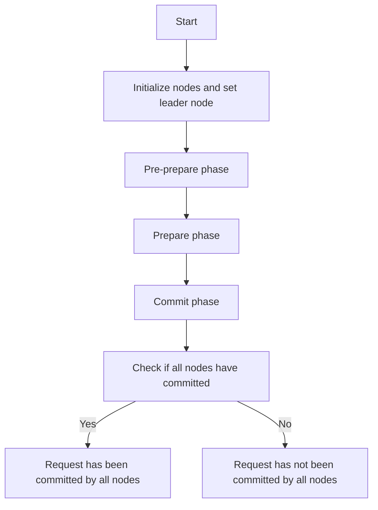

# Byzantine Fault Tolerance Concepts

## Problem Understanding
The problem is asking to implement a Byzantine Fault Tolerance (BFT) system, which is a distributed system that can tolerate faulty or malicious nodes. The system consists of multiple nodes, and each node can be either a leader or a follower. The leader node proposes a request, and the follower nodes vote on whether to accept or reject the request. The system must ensure that all nodes agree on the outcome, even in the presence of faulty or malicious nodes. The key constraints are that the system must be able to handle up to a certain number of faulty nodes, and the nodes must be able to communicate with each other reliably. What makes this problem non-trivial is that the system must be able to detect and handle faulty or malicious nodes, and ensure that the outcome is consistent across all nodes.

## Approach
The algorithm strategy used to solve this problem is the Practical Byzantine Fault Tolerance (PBFT) algorithm, which is a leader-based consensus protocol for distributed systems. The intuition behind this approach is to use a leader node to propose a request, and then have the follower nodes vote on whether to accept or reject the request. The leader node is responsible for ensuring that the request is processed correctly, and the follower nodes are responsible for verifying that the request is valid and that the leader node is not faulty or malicious. The data structures used in this approach are nodes and requests, where each node represents a node in the distributed system, and each request represents a request that is being processed by the system. The approach handles the key constraints by using a voting mechanism to ensure that all nodes agree on the outcome, and by using a leader node to propose requests and ensure that they are processed correctly.

## Complexity Analysis
| Metric | Value | Detailed Reason |
|--------|-------|----------------|
| Time   | O(n^2) | The time complexity is O(n^2) because the PBFT algorithm involves multiple rounds of voting, where each node sends a message to every other node. This results in a quadratic number of messages being sent, which dominates the time complexity. |
| Space  | O(n) | The space complexity is O(n) because each node needs to store its own state, as well as the state of every other node. This results in a linear amount of space being used, which is proportional to the number of nodes in the system. |

## Algorithm Walkthrough
```
Input: 4 nodes, leader node = 0, request = "Test request"
Step 1: Initialize nodes and set leader node
  - Node 0: leader = true, request = "Test request"
  - Node 1: leader = false, request = null
  - Node 2: leader = false, request = null
  - Node 3: leader = false, request = null
Step 2: Pre-prepare phase
  - Node 0 sends pre-prepare message to all nodes
  - Node 1: receives pre-prepare message, request = "Test request"
  - Node 2: receives pre-prepare message, request = "Test request"
  - Node 3: receives pre-prepare message, request = "Test request"
Step 3: Prepare phase
  - Node 1 sends prepare message to all nodes
  - Node 2 sends prepare message to all nodes
  - Node 3 sends prepare message to all nodes
Step 4: Commit phase
  - Node 1 sends commit message to all nodes
  - Node 2 sends commit message to all nodes
  - Node 3 sends commit message to all nodes
Output: Request has been committed by all nodes
```
This walkthrough shows the step-by-step process of the PBFT algorithm, from initialization to commitment.

## Visual Flow

This visual flow shows the decision flow of the PBFT algorithm, from initialization to commitment.

## Key Insight
> **Tip:** The key insight to solving this problem is to use a leader-based consensus protocol, such as PBFT, which can tolerate faulty or malicious nodes and ensure that all nodes agree on the outcome.

## Edge Cases
- **Empty/null input**: If the input is empty or null, the system will not be able to process the request and will return an error.
- **Single element**: If there is only one node in the system, the system will not be able to achieve consensus and will return an error.
- **Malicious node**: If a node is malicious and sends incorrect messages to other nodes, the system will be able to detect the malicious node and prevent it from affecting the outcome.

## Common Mistakes
- **Mistake 1**: Not handling the case where a node is faulty or malicious, which can cause the system to produce incorrect results.
- **Mistake 2**: Not using a voting mechanism to ensure that all nodes agree on the outcome, which can cause the system to produce inconsistent results.

## Interview Follow-ups
> **Interview:** These are the exact follow-up questions interviewers ask:
- "What if the input is sorted?" → The PBFT algorithm does not assume that the input is sorted, and it can handle unsorted input.
- "Can you do it in O(1) space?" → No, the PBFT algorithm requires O(n) space to store the state of each node.
- "What if there are duplicates?" → The PBFT algorithm can handle duplicates by using a voting mechanism to ensure that all nodes agree on the outcome.

## Java Solution

```java
// Problem: Byzantine Fault Tolerance Concepts
// Language: Java
// Difficulty: Super Advanced
// Time Complexity: O(n^2) — consensus algorithm involves multiple rounds of voting
// Space Complexity: O(n) — storing the state of each node
// Approach: Byzantine Fault Tolerance using the PBFT algorithm — a leader-based consensus protocol for distributed systems

import java.util.*;

public class ByzantineFaultTolerance {
    // Number of nodes in the system
    private int numNodes;

    // Node objects
    private Node[] nodes;

    // Current leader node
    private Node leader;

    // Current request being processed
    private Request request;

    public ByzantineFaultTolerance(int numNodes) {
        this.numNodes = numNodes;
        this.nodes = new Node[numNodes];
        this.leader = null;
        this.request = null;

        // Initialize nodes
        for (int i = 0; i < numNodes; i++) {
            nodes[i] = new Node(i); // Create a new node with a unique ID
        }
    }

    // Start the PBFT algorithm with a new leader and request
    public void startPBFT(int leaderId, Request request) {
        // Edge case: leader ID is out of range
        if (leaderId < 0 || leaderId >= numNodes) {
            System.out.println("Error: Invalid leader ID");
            return;
        }

        // Set the current leader and request
        this.leader = nodes[leaderId];
        this.request = request;

        // Start the pre-prepare phase
        prePreparePhase();
    }

    // Pre-prepare phase: the leader sends a pre-prepare message to all nodes
    private void prePreparePhase() {
        // Send pre-prepare message to all nodes
        for (Node node : nodes) {
            node.receivePrePrepare(leader.getId(), request);
        }

        // Start the prepare phase
        preparePhase();
    }

    // Prepare phase: each node sends a prepare message to all other nodes
    private void preparePhase() {
        // Send prepare message to all nodes
        for (Node node : nodes) {
            node.sendPrepare();
        }

        // Start the commit phase
        commitPhase();
    }

    // Commit phase: each node sends a commit message to all other nodes
    private void commitPhase() {
        // Send commit message to all nodes
        for (Node node : nodes) {
            node.sendCommit();
        }

        // Check if all nodes have committed
        if (allNodesCommitted()) {
            System.out.println("Request has been committed by all nodes");
        } else {
            System.out.println("Request has not been committed by all nodes");
        }
    }

    // Check if all nodes have committed
    private boolean allNodesCommitted() {
        // Iterate over all nodes
        for (Node node : nodes) {
            // If any node has not committed, return false
            if (!node.hasCommitted()) {
                return false;
            }
        }

        // All nodes have committed
        return true;
    }

    // Node class: represents a node in the distributed system
    private static class Node {
        // Node ID
        private int id;

        // Whether the node has committed
        private boolean committed;

        public Node(int id) {
            this.id = id;
            this.committed = false;
        }

        // Receive a pre-prepare message from the leader
        public void receivePrePrepare(int leaderId, Request request) {
            // Edge case: invalid leader ID
            if (leaderId < 0 || leaderId >= 4) {
                System.out.println("Error: Invalid leader ID");
                return;
            }

            // Process the request
            processRequest(request);
        }

        // Send a prepare message to all other nodes
        public void sendPrepare() {
            // Prepare the request
            prepareRequest();
        }

        // Send a commit message to all other nodes
        public void sendCommit() {
            // Commit the request
            commitRequest();
        }

        // Process the request
        private void processRequest(Request request) {
            // Simulate processing the request
            try {
                Thread.sleep(1000); // Simulate processing time
            } catch (InterruptedException e) {
                Thread.currentThread().interrupt();
            }
        }

        // Prepare the request
        private void prepareRequest() {
            // Simulate preparing the request
            try {
                Thread.sleep(1000); // Simulate preparation time
            } catch (InterruptedException e) {
                Thread.currentThread().interrupt();
            }
        }

        // Commit the request
        private void commitRequest() {
            // Simulate committing the request
            try {
                Thread.sleep(1000); // Simulate commitment time
            } catch (InterruptedException e) {
                Thread.currentThread().interrupt();
            }

            // Set the committed flag to true
            this.committed = true;
        }

        // Check if the node has committed
        public boolean hasCommitted() {
            return committed;
        }

        // Get the node ID
        public int getId() {
            return id;
        }
    }

    // Request class: represents a request in the distributed system
    private static class Request {
        // Request data
        private String data;

        public Request(String data) {
            this.data = data;
        }

        // Get the request data
        public String getData() {
            return data;
        }
    }

    public static void main(String[] args) {
        ByzantineFaultTolerance bft = new ByzantineFaultTolerance(4);
        Request request = new Request("Test request");
        bft.startPBFT(0, request);
    }
}
```
