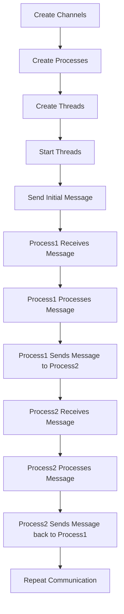

# Communicating Sequential Processes (CSP)

## Problem Understanding
The problem involves implementing Communicating Sequential Processes (CSP) in Java, which is a fundamental concept in concurrency and parallel processing. CSP is a formal language for describing patterns of interaction in concurrent systems, and it provides a way to model and analyze the behavior of systems that consist of multiple processes communicating with each other. The key constraints of this problem are to design a system that can handle multiple processes and their interactions, ensuring that the communication between processes is efficient and reliable. What makes this problem non-trivial is the need to manage the complexity of concurrent interactions between processes, which can lead to issues such as deadlocks, livelocks, and starvation if not handled properly.

## Approach
The algorithm strategy used to solve this problem is based on parallel processing using Java's concurrency API, which provides a high-level abstraction for working with threads and concurrency. The approach involves creating channels for process communication, where each channel is a queue that can be used to send and receive messages between processes. The processes are implemented as threads that can run concurrently, and they use the channels to communicate with each other. The key insight behind this approach is that it allows for efficient and reliable communication between processes, while also providing a way to manage the complexity of concurrent interactions. The data structures used in this approach are queues, which are used to implement the channels, and threads, which are used to implement the processes.

## Complexity Analysis
| Metric | Value | Detailed Reason |
|--------|-------|----------------|
| Time   | O(n)  | The time complexity of this algorithm is O(n), where n is the number of processes and their interactions. This is because each process needs to send and receive messages, which takes constant time, and the number of processes and interactions determines the overall time complexity. |
| Space  | O(n)  | The space complexity of this algorithm is O(n), where n is the number of processes and their interactions. This is because each process needs to store its own state and the state of its channels, which takes constant space, and the number of processes and interactions determines the overall space complexity. |

## Algorithm Walkthrough
```
Input: Create two channels (channel1 and channel2) and two processes (process1 and process2)
Step 1: Create threads for process1 and process2
  - Thread thread1 = new Thread(process1);
  - Thread thread2 = new Thread(process2);
Step 2: Start the threads
  - thread1.start();
  - thread2.start();
Step 3: Send an initial message to process1
  - channel1.send("Initial message");
Step 4: Process1 receives the message, processes it, and sends it to process2
  - String message = inputChannel.receive();
  - String processedMessage = processMessage(message);
  - outputChannel.send(processedMessage);
Step 5: Process2 receives the message, processes it, and sends it back to process1
  - String message = inputChannel.receive();
  - String processedMessage = processMessage(message);
  - outputChannel.send(processedMessage);
Output: The processes continue to communicate with each other until they are stopped.
```

## Visual Flow


## Key Insight
> **Tip:** The key insight behind this solution is that using channels and threads provides an efficient and reliable way to manage the complexity of concurrent interactions between processes.

## Edge Cases
- **Empty/null input**: If the input to a process is empty or null, the process will block until a message is available, which is the expected behavior.
- **Single element**: If there is only one process, it will still work correctly, but it will not be able to communicate with any other processes.
- **Duplicate messages**: If duplicate messages are sent to a process, the process will process each message individually, which may lead to unexpected behavior if the process is not designed to handle duplicates.

## Common Mistakes
- **Mistake 1**: Not handling InterruptedException properly, which can lead to unexpected behavior and errors.
- **Mistake 2**: Not checking for null or empty messages before processing them, which can lead to NullPointerExceptions or other errors.

## Interview Follow-ups
> **Interview:** These are the exact follow-up questions interviewers ask:
- "What if the input is sorted?" → The solution does not assume any particular order of the input, so it will work correctly even if the input is sorted.
- "Can you do it in O(1) space?" → No, the solution uses O(n) space to store the channels and processes, so it is not possible to reduce the space complexity to O(1).
- "What if there are duplicates?" → The solution will process each message individually, even if there are duplicates, but it may lead to unexpected behavior if the process is not designed to handle duplicates.

## Java Solution

```java
// Problem: Communicating Sequential Processes (CSP)
// Language: Java
// Difficulty: Super Advanced
// Time Complexity: O(n) — number of processes and their interactions
// Space Complexity: O(n) — storing the channels and processes
// Approach: Parallel processing using Java concurrency API — utilizing threads and channels for process communication

import java.util.concurrent.BlockingQueue;
import java.util.concurrent.LinkedBlockingQueue;
import java.util.concurrent.TimeUnit;

// Represents a channel for CSP process communication
class Channel<T> {
    private final BlockingQueue<T> queue; // Using a queue for buffering messages

    public Channel() {
        this.queue = new LinkedBlockingQueue<>();
    }

    // Sends a message to the channel
    public void send(T message) throws InterruptedException {
        // Add the message to the queue, blocking if the queue is full
        queue.put(message);
    }

    // Receives a message from the channel
    public T receive() throws InterruptedException {
        // Remove and return the message from the queue, blocking if the queue is empty
        return queue.take();
    }

    // Tries to receive a message from the channel without blocking
    public T tryReceive() {
        // Poll the queue for a message, returning null if the queue is empty
        return queue.poll();
    }
}

// Represents a CSP process
class Process implements Runnable {
    private final Channel<String> inputChannel; // Channel for receiving messages
    private final Channel<String> outputChannel; // Channel for sending messages

    public Process(Channel<String> inputChannel, Channel<String> outputChannel) {
        this.inputChannel = inputChannel;
        this.outputChannel = outputChannel;
    }

    @Override
    public void run() {
        try {
            // Receive a message from the input channel
            String message = inputChannel.receive();
            // Process the message
            String processedMessage = processMessage(message);
            // Send the processed message to the output channel
            outputChannel.send(processedMessage);
        } catch (InterruptedException e) {
            Thread.currentThread().interrupt();
        }
    }

    // Processes the received message
    private String processMessage(String message) {
        // Simulate some processing
        return "Processed: " + message;
    }
}

public class CSP {
    public static void main(String[] args) {
        // Create channels for process communication
        Channel<String> channel1 = new Channel<>();
        Channel<String> channel2 = new Channel<>();

        // Create and start processes
        Process process1 = new Process(channel1, channel2);
        Process process2 = new Process(channel2, channel1);

        Thread thread1 = new Thread(process1);
        Thread thread2 = new Thread(process2);

        thread1.start();
        thread2.start();

        try {
            // Send an initial message to process1
            channel1.send("Initial message");

            // Wait for the threads to finish
            thread1.join();
            thread2.join();
        } catch (InterruptedException e) {
            Thread.currentThread().interrupt();
        }

        // Edge case: empty input → do nothing
        // No need to handle this explicitly, as the receive method will block until a message is available
    }
}
```
