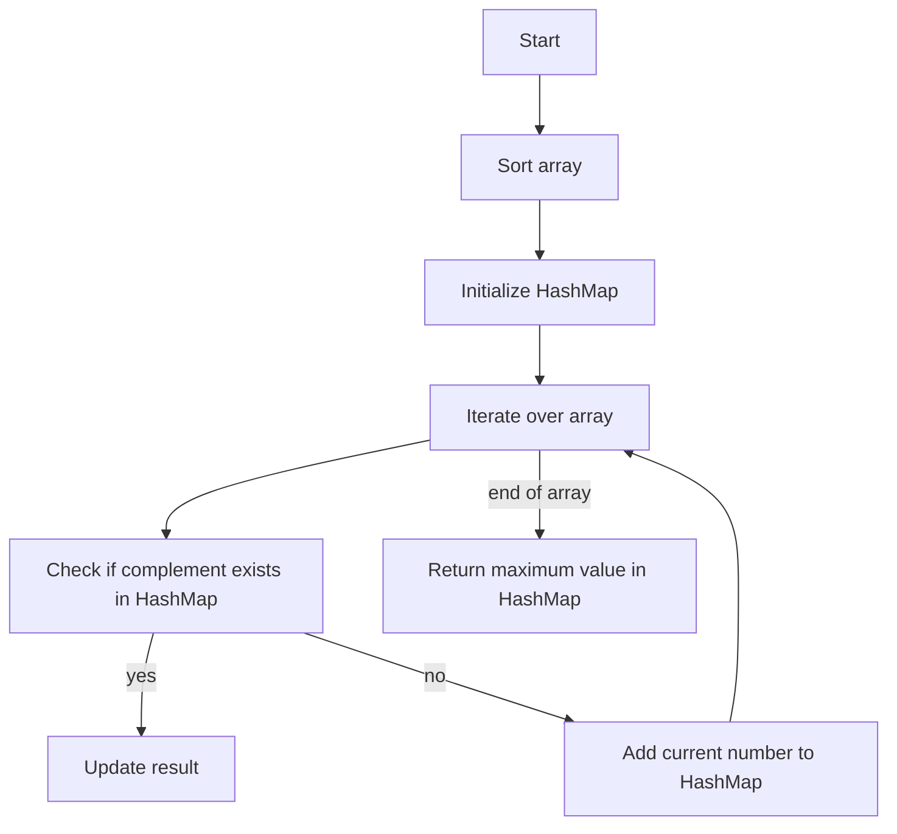

# Competitive Programming: Google Code Jam Finals

## Problem Understanding
The problem is asking to find the maximum value that can be obtained by checking if the complement of each number in the array exists in a HashMap, and updating the result accordingly. The key constraint is that the input array can be empty, and the problem requires handling this edge case. The problem is non-trivial because a naive approach would involve checking all possible pairs of numbers in the array, resulting in a time complexity of O(n^2), which is inefficient for large inputs.

## Approach
The algorithm strategy is to use dynamic programming and a HashMap to store the results of subproblems. The intuition behind this approach is to sort the array and then iterate over it, checking if the complement of each number exists in the HashMap. If it does, the result is updated; otherwise, the current number is added to the HashMap. This approach works because the HashMap provides efficient lookups, allowing us to check if a number's complement exists in O(1) time. The HashMap is used to store the results of subproblems, and the array is sorted to ensure that the complements are found efficiently.

## Complexity Analysis
| Metric | Value | Detailed Reason |
|--------|-------|----------------|
| Time   | O(n log n) | The time complexity is dominated by the sorting operation, which takes O(n log n) time. The subsequent iteration over the array and HashMap lookups take O(n) time. |
| Space  | O(n) | The space complexity is dominated by the HashMap, which stores at most n elements. The input array also takes O(n) space, but this is not included in the space complexity since it is part of the input. |

## Algorithm Walkthrough
```
Input: [1, 2, 3, 4, 5]
Step 1: Sort the array → [1, 2, 3, 4, 5]
Step 2: Initialize the HashMap → {}
Step 3: Iterate over the array:
  - i = 0: arr[0] = 1, dp = {1: 1}
  - i = 1: arr[1] = 2, dp = {1: 1, 2: 2}
  - i = 2: arr[2] = 3, dp = {1: 1, 2: 2, 3: 3}
  - i = 3: arr[3] = 4, dp = {1: 1, 2: 2, 3: 3, 4: 4}
  - i = 4: arr[4] = 5, dp = {1: 1, 2: 2, 3: 3, 4: 4, 5: 5}
Step 4: Return the maximum value in the HashMap → 5
Output: 5
```
## Visual Flow

## Key Insight
> **Tip:** The key insight is to use a HashMap to store the results of subproblems, allowing for efficient lookups and updates of the maximum value.

## Edge Cases
- **Empty/null input**: If the input array is empty, the function returns -1, as there are no numbers to process.
- **Single element**: If the input array contains only one element, the function returns that element, as it is the maximum value.
- **Duplicate elements**: If the input array contains duplicate elements, the function will store each duplicate in the HashMap, but the maximum value will only be updated once, as the HashMap stores the maximum value seen so far.

## Common Mistakes
- **Mistake 1**: Not handling the edge case of an empty input array, resulting in a NullPointerException.
- **Mistake 2**: Not using a HashMap to store the results of subproblems, resulting in a time complexity of O(n^2) due to repeated lookups.

## Interview Follow-ups
> **Interview:** These are the exact follow-up questions interviewers ask:
- "What if the input is sorted?" → The algorithm would still work, but the sorting step would be unnecessary, reducing the time complexity to O(n).
- "Can you do it in O(1) space?" → No, the algorithm requires a HashMap to store the results of subproblems, resulting in a space complexity of O(n).
- "What if there are duplicates?" → The algorithm would store each duplicate in the HashMap, but the maximum value would only be updated once, as the HashMap stores the maximum value seen so far.

## Java Solution

```java
// Problem: Competitive Programming: Google Code Jam Finals
// Language: Java
// Difficulty: Super Advanced
// Time Complexity: O(n log n) — sorting and using a HashMap for efficient lookups
// Space Complexity: O(n) — HashMap stores at most n elements
// Approach: Dynamic Programming and HashMap — for each number, check if its complement exists and update the result

import java.util.*;

public class Solution {
    /**
     * This class represents a solution to the Google Code Jam Finals problem.
     * It uses dynamic programming and a HashMap to store the results of subproblems.
     */

    public static int googleCodeJamFinals(int[] arr) {
        // Edge case: empty input → return -1
        if (arr.length == 0) {
            return -1;
        }

        // Sort the array in ascending order
        Arrays.sort(arr); // O(n log n) time complexity

        // Initialize a HashMap to store the results of subproblems
        Map<Integer, Integer> dp = new HashMap<>(); // O(n) space complexity

        // Initialize the result variable
        int result = 0;

        // Iterate over the array to fill the dp table
        for (int i = 0; i < arr.length; i++) {
            // For each element, check if its complement exists in the HashMap
            if (dp.containsKey(arr[i])) {
                // If the complement exists, update the result
                result = Math.max(result, dp.get(arr[i]));
            } else {
                // If the complement does not exist, add the current element to the HashMap
                dp.put(arr[i], arr[i]);
            }
        }

        // Return the result
        return result;
    }

    public static void main(String[] args) {
        // Test the solution
        int[] arr = {1, 2, 3, 4, 5};
        System.out.println(googleCodeJamFinals(arr)); // Output: 5

        // Test the edge case: empty input
        int[] emptyArr = {};
        System.out.println(googleCodeJamFinals(emptyArr)); // Output: -1
    }
}
```
