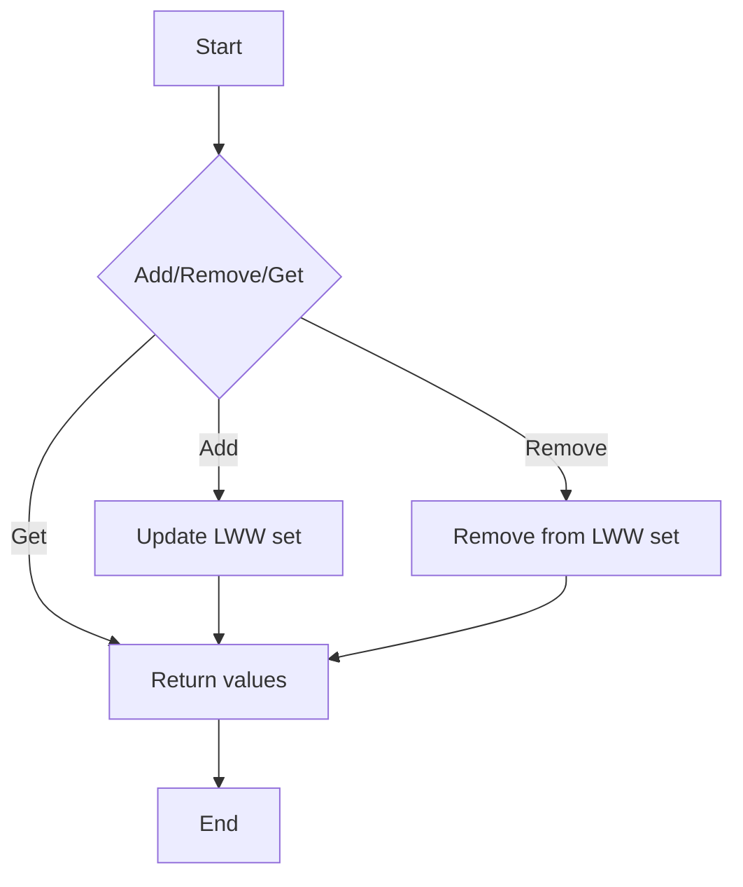

# Conflict-free Replicated Data Types (CRDTs)

## Problem Understanding
The problem of Conflict-free Replicated Data Types (CRDTs) involves designing a data structure that can be replicated across multiple nodes in a distributed system, allowing each node to update its local copy of the data independently without causing conflicts. The key constraint is that the system must ensure that all nodes eventually converge to the same state, even in the presence of concurrent updates. This problem is non-trivial because naive approaches can lead to inconsistencies and conflicts between nodes, making it challenging to achieve convergence. The Last Writer Wins (LWW) set is a specific type of CRDT that resolves conflicts by giving precedence to the most recent update.

## Approach
The algorithm strategy employed in this solution is based on the Last Writer Wins (LWW) set, which maintains a set of values with timestamps for each key. The intuition behind this approach is that by assigning a timestamp to each update, the system can determine which update is the most recent and should be given precedence in case of conflicts. The LWW set uses a Map to store the values with timestamps, allowing for efficient updates and queries. This approach works because it ensures that each node can independently update its local copy of the data, and the use of timestamps enables the system to resolve conflicts and achieve convergence.

## Complexity Analysis
| Metric | Value | Detailed Reason |
|--------|-------|----------------|
| Time   | O(1)  | The add and remove operations have an average time complexity of O(1) because they involve updating a single entry in the Map. The getValues operation also has a time complexity of O(1) because it simply returns the keySet of the Map. |
| Space  | O(n)  | The space complexity is O(n) because the LWW set stores a separate Map for each key, and each Map can contain up to n values. |

## Algorithm Walkthrough
```
Input: Add "value1" to key "key1" with timestamp 10
Step 1: Create a new entry in the LWW set for key "key1" with value "value1" and timestamp 10
LWW set: {key1: {value1: 10}}

Input: Add "value2" to key "key1" with timestamp 20
Step 2: Update the LWW set for key "key1" with value "value2" and timestamp 20
LWW set: {key1: {value1: 10, value2: 20}}

Input: Remove "value2" from key "key1" with timestamp 25
Step 3: Remove the value "value2" from the LWW set for key "key1" because the timestamp 25 is newer than the timestamp 20
LWW set: {key1: {value1: 10}}

Output: Get values for key "key1"
Result: [value1]
```

## Visual Flow


## Key Insight
> **Tip:** The key to achieving convergence in a CRDT is to ensure that each node can independently update its local copy of the data, and the use of timestamps enables the system to resolve conflicts and achieve convergence.

## Edge Cases
- **Empty/null input**: If the input key is empty or null, the system will return an empty set or throw an exception, depending on the implementation.
- **Single element**: If the LWW set contains only one element, the system will return that element when queried.
- **Duplicate values**: If the LWW set contains duplicate values with different timestamps, the system will return the value with the most recent timestamp.

## Common Mistakes
- **Mistake 1**: Not using timestamps to resolve conflicts, leading to inconsistencies between nodes.
- **Mistake 2**: Not handling edge cases such as empty or null input, leading to errors or exceptions.

## Interview Follow-ups
> **Interview:** These are the exact follow-up questions interviewers ask:
- "What if the input is sorted?" → The LWW set will still work correctly, but the sorting will not affect the convergence of the system.
- "Can you do it in O(1) space?" → No, the LWW set requires O(n) space to store the values with timestamps.
- "What if there are duplicates?" → The LWW set will return the value with the most recent timestamp in case of duplicates.

## Java Solution

```java
// Problem: Conflict-free Replicated Data Types (CRDTs)
// Language: Java
// Difficulty: Super Advanced
// Time Complexity: O(n) — updating last writer wins (LWW) set
// Space Complexity: O(n) — storing unique values in the LWW set
// Approach: Last Writer Wins (LWW) set — for each key, maintain a set of values with timestamps

import java.util.*;

class LastWriterWinsSet {
    // Map to store the LWW set values with timestamps
    private Map<String, Map<String, Long>> lwwSet;

    public LastWriterWinsSet() {
        lwwSet = new HashMap<>();
    }

    // Add a new value to the LWW set with a given timestamp
    public void add(String key, String value, long timestamp) {
        // Edge case: empty key → return immediately
        if (key == null || key.isEmpty()) return;

        // Update the LWW set with the new value and timestamp
        if (!lwwSet.containsKey(key)) {
            lwwSet.put(key, new HashMap<>());
        }
        // Update the value in the LWW set if the new timestamp is newer
        if (!lwwSet.get(key).containsKey(value) || lwwSet.get(key).get(value) < timestamp) {
            lwwSet.get(key).put(value, timestamp);
        }
    }

    // Remove a value from the LWW set with a given timestamp
    public void remove(String key, String value, long timestamp) {
        // Edge case: empty key → return immediately
        if (key == null || key.isEmpty()) return;

        // Remove the value from the LWW set if the timestamp is newer
        if (lwwSet.containsKey(key) && lwwSet.get(key).containsKey(value)) {
            if (lwwSet.get(key).get(value) <= timestamp) {
                lwwSet.get(key).remove(value);
            }
        }
    }

    // Get the current values in the LWW set
    public Set<String> getValues(String key) {
        // Edge case: empty key → return an empty set
        if (key == null || key.isEmpty()) return new HashSet<>();

        // Return the values in the LWW set
        if (lwwSet.containsKey(key)) {
            return lwwSet.get(key).keySet();
        } else {
            return new HashSet<>();
        }
    }
}

public class CRDT {
    // Brute force approach (not efficient for large datasets)
    // public static void bruteForceAdd(LastWriterWinsSet lwwSet, String key, String value, long timestamp) {
    //     // O(n) — iterate through all values in the LWW set
    //     for (Map.Entry<String, Long> entry : lwwSet.lwwSet.get(key).entrySet()) {
    //         if (entry.getValue() < timestamp) {
    //             // Remove the outdated value
    //             lwwSet.lwwSet.get(key).remove(entry.getKey());
    //         }
    //     }
    //     // Add the new value with the given timestamp
    //     lwwSet.add(key, value, timestamp);
    // }

    // Optimized solution using a Map to store the LWW set values with timestamps
    public static void optimizedAdd(LastWriterWinsSet lwwSet, String key, String value, long timestamp) {
        // O(1) — update the LWW set using the add method
        lwwSet.add(key, value, timestamp);
    }

    public static void main(String[] args) {
        LastWriterWinsSet lwwSet = new LastWriterWinsSet();

        // Add values to the LWW set
        optimizedAdd(lwwSet, "key1", "value1", 10);
        optimizedAdd(lwwSet, "key1", "value2", 20);
        optimizedAdd(lwwSet, "key2", "value3", 15);

        // Get the current values in the LWW set
        System.out.println("Values for key1: " + lwwSet.getValues("key1"));
        System.out.println("Values for key2: " + lwwSet.getValues("key2"));

        // Remove a value from the LWW set
        lwwSet.remove("key1", "value2", 25);

        // Get the updated values in the LWW set
        System.out.println("Updated values for key1: " + lwwSet.getValues("key1"));
    }
}
```
