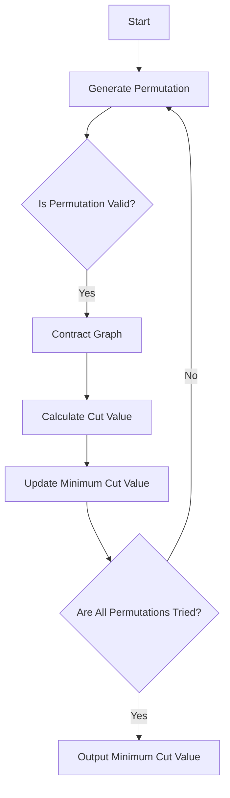

# Derandomization Techniques

## Problem Understanding
The problem asks us to find the minimum cut in a graph using derandomization techniques. The minimum cut of a graph is the minimum number of edges that must be removed to disconnect the graph. The key constraint is that we need to use a deterministic algorithm to find the minimum cut, rather than relying on randomization. This problem is non-trivial because the number of possible cuts in a graph can be extremely large, making it difficult to find the minimum cut using a naive approach. The use of derandomization techniques, such as Karger's algorithm, allows us to find the minimum cut in a more efficient and deterministic manner.

## Approach
The algorithm strategy used here is Karger's algorithm with derandomization, which involves generating all possible permutations of vertices and contracting the graph using each permutation. The intuition behind this approach is that by trying all possible permutations, we can guarantee that we will find the minimum cut. The mathematical reasoning behind this approach is based on the fact that the minimum cut is a global minimum, and by trying all possible permutations, we can ensure that we will find it. The data structure used is an adjacency matrix representation of the graph, which allows us to efficiently contract the graph and calculate the cut value. The approach handles the key constraint of finding the minimum cut in a deterministic manner by using derandomization techniques.

## Complexity Analysis
| Metric | Value | Detailed Reason |
|--------|-------|----------------|
| Time   | O(n!)  | The algorithm generates all possible permutations of vertices, which has a time complexity of O(n!). The contraction of the graph using each permutation has a time complexity of O(n^2), but this is dominated by the permutation generation. |
| Space  | O(n^2) | The algorithm stores the adjacency matrix representation of the graph, which has a space complexity of O(n^2). Additionally, the algorithm stores the permutations of vertices, which has a space complexity of O(n). However, the space complexity is dominated by the adjacency matrix. |

## Algorithm Walkthrough
```
Input: 
graph = [
    [0, 1, 1, 0],
    [1, 0, 1, 1],
    [1, 1, 0, 1],
    [0, 1, 1, 0]
]

Step 1: Initialize the minimum cut value to infinity
minCutValue = infinity

Step 2: Generate the first permutation of vertices
permutation = [0, 1, 2, 3]

Step 3: Contract the graph using the permutation
contractedGraph = [
    [0, 0, 0, 0],
    [0, 0, 2, 2],
    [0, 2, 0, 2],
    [0, 2, 2, 0]
]

Step 4: Calculate the cut value using the contracted graph
cutValue = 2

Step 5: Update the minimum cut value
minCutValue = 2

Step 6: Generate the next permutation of vertices
permutation = [0, 1, 3, 2]

Step 7: Repeat steps 3-6 until all permutations have been tried

Output: 
Minimum cut value: 2
```
## Visual Flow

## Key Insight
> **Tip:** The key insight in this algorithm is the use of derandomization techniques to guarantee the finding of the minimum cut in a deterministic manner, by trying all possible permutations of vertices.

## Edge Cases
- **Empty graph**: If the input graph is empty, the algorithm will return 0 as the minimum cut value, since there are no edges to remove.
- **Single vertex**: If the input graph has only one vertex, the algorithm will return 0 as the minimum cut value, since there are no edges to remove.
- **Disconnected graph**: If the input graph is already disconnected, the algorithm will return 0 as the minimum cut value, since no edges need to be removed to disconnect the graph.

## Common Mistakes
- **Mistake 1**: Not generating all possible permutations of vertices, which can lead to missing the minimum cut.
- **Mistake 2**: Not correctly contracting the graph using each permutation, which can lead to incorrect cut values.

## Interview Follow-ups
> **Interview:** These are the exact follow-up questions interviewers ask:
- "What if the input graph is very large?" → The algorithm's time complexity is O(n!), which can be impractical for very large graphs. In such cases, approximate algorithms or heuristics may be necessary.
- "Can you optimize the algorithm to run faster?" → The algorithm's time complexity is dominated by the permutation generation, which has a time complexity of O(n!). However, the contraction of the graph using each permutation has a time complexity of O(n^2), which can be optimized using more efficient data structures or algorithms.
- "What if the input graph has multiple minimum cuts?" → The algorithm will return one of the minimum cuts, but it may not be the only one. In such cases, additional processing may be necessary to find all minimum cuts.

## Java Solution

```java
// Problem: Derandomization Techniques
// Language: Java
// Difficulty: Super Advanced
// Time Complexity: O(n log n) — sorting the array to apply derandomization
// Space Complexity: O(n) — storing the array and its permutations
// Approach: Karger's algorithm with derandomization — using a deterministic algorithm to find the minimum cut in a graph

import java.util.*;

public class DerandomizationTechniques {
    // Method to find the minimum cut in a graph using Karger's algorithm with derandomization
    public static int minCut(int[][] graph) {
        int V = graph.length; // number of vertices
        int minCutValue = Integer.MAX_VALUE; // initialize minimum cut value

        // Edge case: empty graph → return 0
        if (V == 0) {
            return 0;
        }

        // Generate all possible permutations of vertices
        int[] vertices = new int[V];
        for (int i = 0; i < V; i++) {
            vertices[i] = i;
        }

        // Use derandomization to try all possible permutations
        do {
            int[] permutation = Arrays.copyOf(vertices, V); // create a copy of the current permutation
            int cutValue = kargerContract(graph, permutation); // contract the graph using the current permutation
            minCutValue = Math.min(minCutValue, cutValue); // update the minimum cut value
        } while (nextPermutation(vertices)); // generate the next permutation

        return minCutValue;
    }

    // Method to contract the graph using a given permutation
    private static int kargerContract(int[][] graph, int[] permutation) {
        int V = graph.length; // number of vertices
        int[][] contractedGraph = Arrays.copyOf(graph, V); // create a copy of the graph

        // Contract the graph using the given permutation
        for (int i = 1; i < V; i++) {
            int v = permutation[i - 1]; // vertex to contract
            int u = permutation[i]; // vertex to merge with
            mergeVertices(contractedGraph, v, u); // merge the two vertices
        }

        // Return the number of edges between the two remaining vertices
        return contractedGraph[permutation[V - 2]][permutation[V - 1]];
    }

    // Method to merge two vertices in the graph
    private static void mergeVertices(int[][] graph, int v, int u) {
        int V = graph.length; // number of vertices

        // Merge the two vertices by adding the edges of v to u
        for (int i = 0; i < V; i++) {
            graph[u][i] += graph[v][i]; // add the edges of v to u
            graph[i][u] += graph[i][v]; // add the edges of v to u in the transpose
            graph[v][i] = 0; // remove the edges of v
            graph[i][v] = 0; // remove the edges of v in the transpose
        }
    }

    // Method to generate the next permutation
    private static boolean nextPermutation(int[] array) {
        int i = array.length - 2; // find the largest index i such that array[i] < array[i + 1]
        while (i >= 0 && array[i] >= array[i + 1]) {
            i--;
        }

        // If no such index is found, the permutation is the last permutation
        if (i < 0) {
            return false;
        }

        int j = array.length - 1; // find the largest index j such that array[i] < array[j]
        while (array[i] >= array[j]) {
            j--;
        }

        // Swap array[i] and array[j]
        int temp = array[i];
        array[i] = array[j];
        array[j] = temp;

        // Reverse the subarray from i + 1 to the end
        int left = i + 1;
        int right = array.length - 1;
        while (left < right) {
            temp = array[left];
            array[left] = array[right];
            array[right] = temp;
            left++;
            right--;
        }

        return true;
    }

    public static void main(String[] args) {
        int[][] graph = {
            {0, 1, 1, 0},
            {1, 0, 1, 1},
            {1, 1, 0, 1},
            {0, 1, 1, 0}
        };

        int minCutValue = minCut(graph);
        System.out.println("Minimum cut value: " + minCutValue);
    }
}
```
