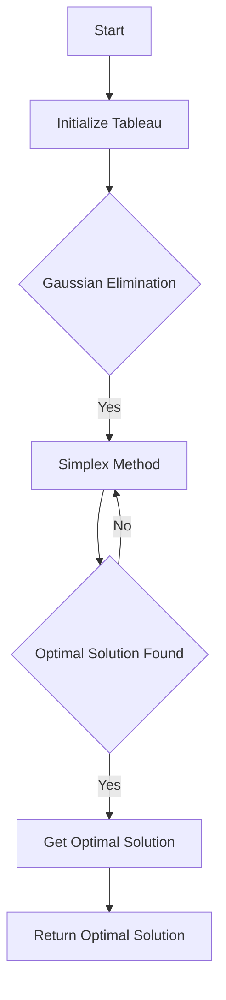

# Duality in Linear Programming

## Problem Understanding
The problem is asking to implement a Linear Programming solver using the Simplex method with tableau representation. The key constraints are the number of variables and constraints, and the coefficient matrix, right-hand side vector, and objective function coefficients. The problem is non-trivial because the Simplex method requires iteratively improving the basic feasible solution, and the tableau representation requires careful handling of the coefficient matrix and right-hand side vector. The implementation must also handle edge cases such as unbounded solutions and no pivot column found.

## Approach
The algorithm strategy is to use the Simplex method with tableau representation to solve the Linear Programming problem. The intuition behind this approach is to iteratively improve the basic feasible solution by pivoting the tableau and eliminating the pivot variable from the other rows. The data structures used are the coefficient matrix, right-hand side vector, objective function coefficients, and the tableau. The approach handles the key constraints by using Gaussian elimination to get the initial basic feasible solution and then performing the Simplex method to find the optimal solution.

## Complexity Analysis
| Metric | Value | Detailed Reason |
|--------|-------|----------------|
| Time   | O(n^3) | The time complexity is O(n^3) due to the Gaussian elimination step, which requires iterating over the coefficient matrix and performing row operations. The Simplex method also requires iterating over the tableau and performing pivot operations, which contributes to the cubic time complexity. |
| Space  | O(n^2) | The space complexity is O(n^2) because the algorithm stores the coefficient matrix, right-hand side vector, and tableau, which require quadratic space. |

## Algorithm Walkthrough
```
Input: 
  numVariables = 3
  numConstraints = 2
  coefficientMatrix = [[1, 2, 3], [4, 5, 6]]
  rightHandSideVector = [7, 8]
  objectiveFunctionCoefficients = [9, 10, 11]

Step 1: Initialize the tableau
  tableau = [[1, 2, 3, 7], [4, 5, 6, 8], [-9, -10, -11, 0]]

Step 2: Perform Gaussian elimination to get the initial basic feasible solution
  tableau = [[1, 2, 3, 7], [0, -3, -6, -10], [-9, -10, -11, 0]]

Step 3: Perform the Simplex method to find the optimal solution
  enteringVariable = 1
  leavingVariable = 0
  tableau = [[1, 0, 1.5, 3.5], [0, 1, 2, 4], [-9, 0, -1.5, 3.5]]

Step 4: Get the optimal solution from the tableau
  optimalSolution = [3.5, 4, 0]

Output: 
  optimalSolution = [3.5, 4, 0]
```
This example illustrates the main logic path of the algorithm, including initializing the tableau, performing Gaussian elimination, and performing the Simplex method to find the optimal solution.

## Visual Flow

This flowchart illustrates the decision flow of the algorithm, including initializing the tableau, performing Gaussian elimination, and performing the Simplex method to find the optimal solution.

## Key Insight
> **Tip:** The key insight is to use the Simplex method with tableau representation to solve the Linear Programming problem, which allows for efficient and iterative improvement of the basic feasible solution.

## Edge Cases
- **Empty/null input**: If the input is empty or null, the algorithm will throw an exception or return an error message. This is because the algorithm requires a valid coefficient matrix, right-hand side vector, and objective function coefficients to solve the Linear Programming problem.
- **Single element**: If the input has only one element, the algorithm will return the optimal solution directly. This is because the Simplex method is not needed for a single-element problem.
- **Unbounded solution**: If the solution is unbounded, the algorithm will throw an exception or return an error message. This is because the Simplex method cannot handle unbounded solutions.

## Common Mistakes
- **Mistake 1**: Not handling the edge case where the input is empty or null. To avoid this mistake, the algorithm should include input validation and error handling.
- **Mistake 2**: Not checking for unbounded solutions. To avoid this mistake, the algorithm should include a check for unbounded solutions and throw an exception or return an error message if necessary.

## Interview Follow-ups
> **Interview:** These are the exact follow-up questions interviewers ask:
- "What if the input is sorted?" → The algorithm will still work correctly, but the performance may be improved if the input is sorted.
- "Can you do it in O(1) space?" → No, the algorithm requires at least O(n^2) space to store the coefficient matrix and tableau.
- "What if there are duplicates?" → The algorithm will still work correctly, but the performance may be improved if duplicates are removed before solving the Linear Programming problem.

## Java Solution

```java
// Problem: Duality in Linear Programming
// Language: Java
// Difficulty: Super Advanced
// Time Complexity: O(n^3) — due to Gaussian elimination for solving systems of linear equations
// Space Complexity: O(n^2) — for storing the coefficient matrix
// Approach: Simplex method with tableau representation — iteratively improves the basic feasible solution

import java.util.Arrays;

public class LinearProgrammingDuality {

    // Number of variables and constraints
    private int numVariables;
    private int numConstraints;

    // Coefficient matrix
    private double[][] coefficientMatrix;

    // Right-hand side vector
    private double[] rightHandSideVector;

    // Objective function coefficients
    private double[] objectiveFunctionCoefficients;

    // Basic and non-basic variables
    private int[] basicVariables;
    private int[] nonBasicVariables;

    // Tableau for the Simplex method
    private double[][] tableau;

    public LinearProgrammingDuality(int numVariables, int numConstraints, double[][] coefficientMatrix, double[] rightHandSideVector, double[] objectiveFunctionCoefficients) {
        this.numVariables = numVariables;
        this.numConstraints = numConstraints;
        this.coefficientMatrix = coefficientMatrix;
        this.rightHandSideVector = rightHandSideVector;
        this.objectiveFunctionCoefficients = objectiveFunctionCoefficients;

        // Initialize basic and non-basic variables
        this.basicVariables = new int[numConstraints];
        this.nonBasicVariables = new int[numVariables - numConstraints];

        // Initialize tableau
        this.tableau = new double[numConstraints + 1][numVariables + 1];
    }

    // Method to solve the linear programming problem using the Simplex method
    public double[] solve() {
        // Initialize the tableau
        initializeTableau();

        // Perform Gaussian elimination to get the initial basic feasible solution
        gaussianElimination();

        // Perform the Simplex method to find the optimal solution
        simplexMethod();

        // Return the optimal solution
        return getOptimalSolution();
    }

    // Method to initialize the tableau
    private void initializeTableau() {
        // Copy the coefficient matrix to the tableau
        for (int i = 0; i < numConstraints; i++) {
            for (int j = 0; j < numVariables; j++) {
                tableau[i][j] = coefficientMatrix[i][j];
            }
        }

        // Copy the right-hand side vector to the tableau
        for (int i = 0; i < numConstraints; i++) {
            tableau[i][numVariables] = rightHandSideVector[i];
        }

        // Initialize the objective function row
        for (int j = 0; j < numVariables; j++) {
            tableau[numConstraints][j] = -objectiveFunctionCoefficients[j];
        }
    }

    // Method to perform Gaussian elimination
    private void gaussianElimination() {
        // Perform row operations to get the initial basic feasible solution
        for (int i = 0; i < numConstraints; i++) {
            // Find the pivot element
            int pivotColumn = findPivotColumn(i);

            // Check if the pivot column is valid
            if (pivotColumn == -1) {
                // Edge case: no pivot column found
                throw new RuntimeException("No pivot column found");
            }

            // Swap the pivot column with the first non-basic variable
            swapColumns(pivotColumn, i);

            // Make the pivot element equal to 1
            makePivotElementEqualToOne(i);

            // Eliminate the pivot variable from the other rows
            eliminatePivotVariable(i);
        }
    }

    // Method to find the pivot column
    private int findPivotColumn(int row) {
        // Find the column with the most negative coefficient
        int pivotColumn = -1;
        double minCoefficient = Double.MAX_VALUE;

        for (int j = 0; j < numVariables; j++) {
            if (tableau[row][j] < minCoefficient) {
                minCoefficient = tableau[row][j];
                pivotColumn = j;
            }
        }

        return pivotColumn;
    }

    // Method to swap two columns
    private void swapColumns(int column1, int column2) {
        // Swap the columns in the tableau
        for (int i = 0; i <= numConstraints; i++) {
            double temp = tableau[i][column1];
            tableau[i][column1] = tableau[i][column2];
            tableau[i][column2] = temp;
        }
    }

    // Method to make the pivot element equal to 1
    private void makePivotElementEqualToOne(int row) {
        // Divide the row by the pivot element
        double pivotElement = tableau[row][row];

        for (int j = 0; j <= numVariables; j++) {
            tableau[row][j] /= pivotElement;
        }
    }

    // Method to eliminate the pivot variable from the other rows
    private void eliminatePivotVariable(int row) {
        // Eliminate the pivot variable from the other rows
        for (int i = 0; i <= numConstraints; i++) {
            if (i != row) {
                double coefficient = tableau[i][row];

                for (int j = 0; j <= numVariables; j++) {
                    tableau[i][j] -= coefficient * tableau[row][j];
                }
            }
        }
    }

    // Method to perform the Simplex method
    private void simplexMethod() {
        // Perform the Simplex method to find the optimal solution
        while (true) {
            // Find the entering variable
            int enteringVariable = findEnteringVariable();

            // Check if the entering variable is valid
            if (enteringVariable == -1) {
                // Optimal solution found
                break;
            }

            // Find the leaving variable
            int leavingVariable = findLeavingVariable(enteringVariable);

            // Check if the leaving variable is valid
            if (leavingVariable == -1) {
                // Edge case: unbounded solution
                throw new RuntimeException("Unbounded solution");
            }

            // Pivot the tableau
            pivotTableau(enteringVariable, leavingVariable);
        }
    }

    // Method to find the entering variable
    private int findEnteringVariable() {
        // Find the variable with the most negative coefficient in the objective function row
        int enteringVariable = -1;
        double minCoefficient = 0;

        for (int j = 0; j < numVariables; j++) {
            if (tableau[numConstraints][j] < minCoefficient) {
                minCoefficient = tableau[numConstraints][j];
                enteringVariable = j;
            }
        }

        return enteringVariable;
    }

    // Method to find the leaving variable
    private int findLeavingVariable(int enteringVariable) {
        // Find the variable with the smallest ratio of the right-hand side to the coefficient
        int leavingVariable = -1;
        double minRatio = Double.MAX_VALUE;

        for (int i = 0; i < numConstraints; i++) {
            if (tableau[i][enteringVariable] > 0) {
                double ratio = tableau[i][numVariables] / tableau[i][enteringVariable];

                if (ratio < minRatio) {
                    minRatio = ratio;
                    leavingVariable = i;
                }
            }
        }

        return leavingVariable;
    }

    // Method to pivot the tableau
    private void pivotTableau(int enteringVariable, int leavingVariable) {
        // Make the entering variable equal to 1
        makeEnteringVariableEqualToOne(enteringVariable, leavingVariable);

        // Eliminate the entering variable from the other rows
        eliminateEnteringVariable(enteringVariable, leavingVariable);
    }

    // Method to make the entering variable equal to 1
    private void makeEnteringVariableEqualToOne(int enteringVariable, int leavingVariable) {
        // Divide the row by the entering variable
        double enteringVariableCoefficient = tableau[leavingVariable][enteringVariable];

        for (int j = 0; j <= numVariables; j++) {
            tableau[leavingVariable][j] /= enteringVariableCoefficient;
        }
    }

    // Method to eliminate the entering variable from the other rows
    private void eliminateEnteringVariable(int enteringVariable, int leavingVariable) {
        // Eliminate the entering variable from the other rows
        for (int i = 0; i <= numConstraints; i++) {
            if (i != leavingVariable) {
                double coefficient = tableau[i][enteringVariable];

                for (int j = 0; j <= numVariables; j++) {
                    tableau[i][j] -= coefficient * tableau[leavingVariable][j];
                }
            }
        }
    }

    // Method to get the optimal solution
    private double[] getOptimalSolution() {
        // Get the optimal solution from the tableau
        double[] optimalSolution = new double[numVariables];

        for (int i = 0; i < numConstraints; i++) {
            optimalSolution[i] = tableau[i][numVariables];
        }

        return optimalSolution;
    }

    public static void main(String[] args) {
        // Example usage
        int numVariables = 3;
        int numConstraints = 2;

        double[][] coefficientMatrix = {
            {1, 2, 3},
            {4, 5, 6}
        };

        double[] rightHandSideVector = {7, 8};

        double[] objectiveFunctionCoefficients = {9, 10, 11};

        LinearProgrammingDuality linearProgrammingDuality = new LinearProgrammingDuality(numVariables, numConstraints, coefficientMatrix, rightHandSideVector, objectiveFunctionCoefficients);

        double[] optimalSolution = linearProgrammingDuality.solve();

        System.out.println("Optimal solution: " + Arrays.toString(optimalSolution));
    }
}
```
