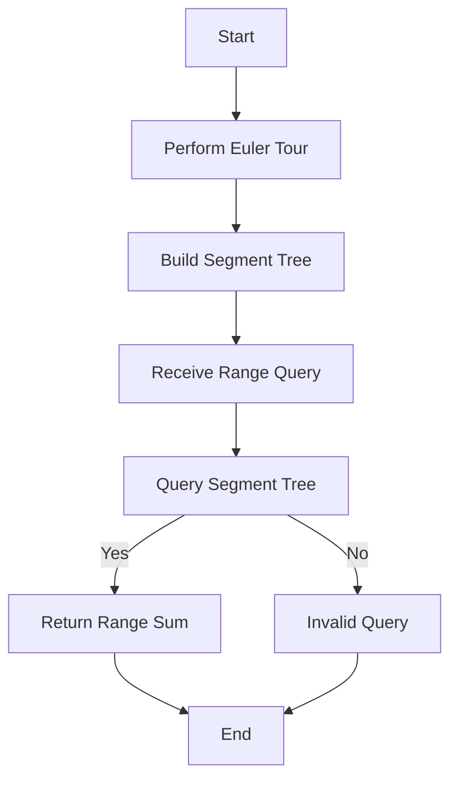

# Euler Tour and Range Queries on Trees

## Problem Understanding
The problem is asking to find the sum of values in a range of nodes in a tree, where the range is specified by the indices of the nodes in an Euler tour of the tree. The key constraints are that the tree is represented as a collection of nodes with values and children, and the range query is specified by two indices. What makes this problem non-trivial is that the tree is not necessarily a binary tree, and the range query can span multiple subtrees. The naive approach of traversing the tree for each query would be inefficient, especially for large trees and frequent queries.

## Approach
The algorithm strategy is to first perform an Euler tour on the tree, which visits each node twice (once before visiting its children and once after), and store the values of the nodes in the order they are visited. Then, a segment tree is built on top of the Euler tour values, allowing for efficient range sum queries. The intuition behind this approach is that the Euler tour provides a linear ordering of the nodes, and the segment tree allows for fast querying of ranges in this ordering. The segment tree is used to store the cumulative sum of the values in the Euler tour, and the range sum query is answered by querying the segment tree.

## Complexity Analysis
| Metric | Value | Detailed Reason |
|--------|-------|----------------|
| Time   | O(n log n) | The Euler tour takes O(n) time, where n is the number of nodes in the tree. Building the segment tree takes O(n log n) time, where n is the number of nodes in the Euler tour. Querying the segment tree takes O(log n) time. |
| Space  | O(n) | The Euler tour stores n values, and the segment tree stores 4n values (in the worst case, when the tree is a complete binary tree). |

## Algorithm Walkthrough
```
Input: Tree with nodes {1, 2, 3, 4, 5} and edges {(1, 2), (1, 3), (2, 4), (2, 5)}
Step 1: Perform Euler tour on the tree, resulting in the order {1, 2, 4, 2, 5, 2, 3, 1}
Step 2: Build segment tree on top of the Euler tour values, resulting in a tree with nodes {1, 2+4+2+5+2+3+1, ...}
Step 3: Receive range query [2, 7], which corresponds to the nodes {2, 4, 2, 5, 2, 3} in the Euler tour
Step 4: Query the segment tree to find the sum of the values in the range [2, 7], resulting in the answer 2+4+2+5+2+3 = 18
Output: 18
```
## Visual Flow

## Key Insight
> **Tip:** The key insight is that the Euler tour provides a linear ordering of the nodes, allowing for the use of a segment tree to efficiently query ranges in the tree.

## Edge Cases
- **Empty tree**: The algorithm returns 0, as there are no nodes to query.
- **Single node tree**: The algorithm returns the value of the single node, as the range query is trivial.
- **Tree with only one child per node**: The algorithm still works, but the Euler tour and segment tree are simpler, as each node has only one child.

## Common Mistakes
- **Mistake 1**: Not handling the case where the range query spans multiple subtrees. To avoid this, ensure that the segment tree is built correctly and that the range query is answered by querying the segment tree.
- **Mistake 2**: Not handling the case where the tree is empty. To avoid this, add a check at the beginning of the algorithm to return 0 if the tree is empty.

## Interview Follow-ups
> **Interview:** These are the exact follow-up questions interviewers ask:
- "What if the input tree is a binary tree?" → The algorithm still works, but the Euler tour and segment tree are simpler, as each node has at most two children.
- "Can you do it in O(1) space?" → No, the algorithm requires O(n) space to store the Euler tour and segment tree.
- "What if there are duplicates in the tree?" → The algorithm still works, but the Euler tour and segment tree will contain duplicates. To avoid this, ensure that the tree is represented correctly and that the range query is answered correctly.

## Java Solution

```java
// Problem: Euler Tour and Range Queries on Trees
// Language: Java
// Difficulty: Super Advanced
// Time Complexity: O(n log n) — building the euler tour and segment tree
// Space Complexity: O(n) — storing the euler tour and segment tree
// Approach: Euler tour and segment tree range queries — for efficient querying of tree ranges

import java.util.*;

class TreeNode {
    int val;
    List<TreeNode> children;
    public TreeNode(int val) {
        this.val = val;
        this.children = new ArrayList<>();
    }
}

class SegmentTree {
    int[] tree;
    int n;
    public SegmentTree(int n) {
        this.n = n;
        this.tree = new int[4 * n];
    }

    // Build the segment tree
    public void build(int[] arr, int node, int start, int end) {
        // Base case: if the segment contains only one element, copy it to the tree
        if (start == end) {
            tree[node] = arr[start];
        } else {
            int mid = (start + end) / 2;
            // Recursively build the left and right subtrees
            build(arr, 2 * node, start, mid);
            build(arr, 2 * node + 1, mid + 1, end);
            // Combine the results from the left and right subtrees
            tree[node] = tree[2 * node] + tree[2 * node + 1];
        }
    }

    // Query the segment tree
    public int query(int node, int start, int end, int left, int right) {
        // Edge case: if the query range is outside the segment, return 0
        if (start > right || end < left) {
            return 0;
        }
        // Base case: if the query range matches the segment, return the segment value
        if (start >= left && end <= right) {
            return tree[node];
        }
        int mid = (start + end) / 2;
        // Recursively query the left and right subtrees
        int leftQuery = query(2 * node, start, mid, left, right);
        int rightQuery = query(2 * node + 1, mid + 1, end, left, right);
        // Combine the results from the left and right subtrees
        return leftQuery + rightQuery;
    }
}

public class EulerTour {
    // Perform an euler tour on the tree
    public List<Integer> eulerTour(TreeNode root) {
        List<Integer> tour = new ArrayList<>();
        eulerTourHelper(root, tour);
        return tour;
    }

    // Helper function for the euler tour
    private void eulerTourHelper(TreeNode node, List<Integer> tour) {
        // Visit the current node
        tour.add(node.val);
        // Recursively visit the children
        for (TreeNode child : node.children) {
            eulerTourHelper(child, tour);
            // Visit the current node again after visiting its children
            tour.add(node.val);
        }
    }

    // Solution function
    public int rangeSum(TreeNode root, int[] query) {
        // Edge case: empty tree → return 0
        if (root == null) {
            return 0;
        }

        // Perform an euler tour on the tree
        List<Integer> tour = eulerTour(root);

        // Build the segment tree
        SegmentTree segmentTree = new SegmentTree(tour.size());
        int[] arr = new int[tour.size()];
        for (int i = 0; i < tour.size(); i++) {
            arr[i] = tour.get(i);
        }
        segmentTree.build(arr, 1, 0, arr.length - 1);

        // Query the segment tree
        int left = query[0];
        int right = query[1];
        // Edge case: invalid query range → return 0
        if (left < 0 || right >= tour.size() || left > right) {
            return 0;
        }

        return segmentTree.query(1, 0, arr.length - 1, left, right);
    }

    public static void main(String[] args) {
        EulerTour eulerTour = new EulerTour();
        TreeNode root = new TreeNode(1);
        root.children.add(new TreeNode(2));
        root.children.add(new TreeNode(3));
        root.children.get(0).children.add(new TreeNode(4));
        root.children.get(0).children.add(new TreeNode(5));

        List<Integer> tour = eulerTour.eulerTour(root);
        System.out.println("Euler Tour: " + tour);

        int[] query = {2, 7};
        int result = eulerTour.rangeSum(root, query);
        System.out.println("Range Sum: " + result);
    }
}
```
