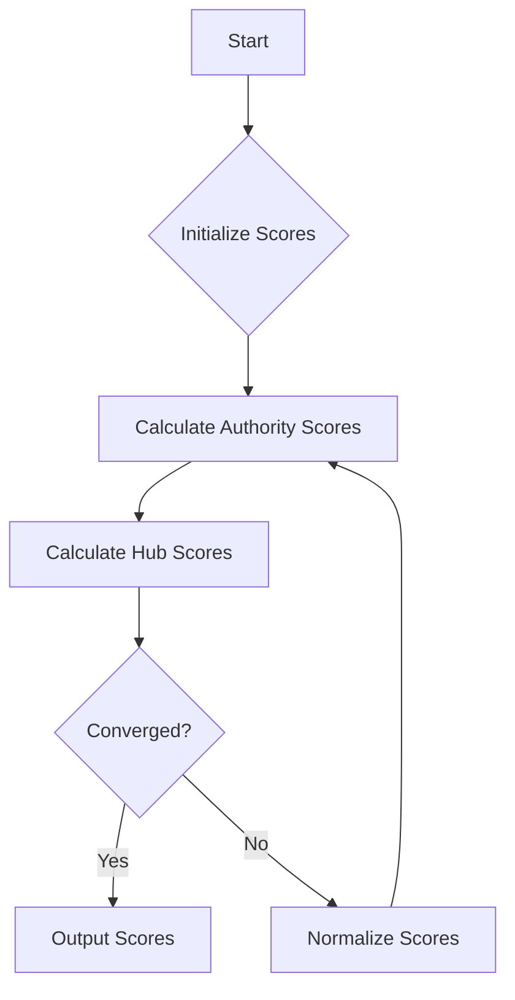

# HITS Algorithm

## Problem Understanding
The HITS (Hyperlink-Induced Topic Search) algorithm is a method used to rank web pages based on their authority and hub scores. The problem asks to implement the HITS algorithm to calculate the hub and authority scores of a given graph represented by an adjacency matrix. The key constraint is to handle the iterative process of updating the hub and authority scores until convergence or a maximum number of iterations is reached. The non-trivial part of this problem is the iterative process and the normalization of the scores.

## Approach
The HITS algorithm strategy is based on an iterative method to calculate the hub and authority scores. The intuition behind it is that a page with a high authority score is likely to be linked to by many pages with high hub scores, and a page with a high hub score is likely to link to many pages with high authority scores. The algorithm uses two arrays to store the current hub and authority scores, and in each iteration, it updates these scores based on the adjacency matrix. The approach handles the key constraints by checking for convergence and normalizing the scores after each iteration. The data structures used are arrays to store the scores and the adjacency matrix.

## Complexity Analysis
| Metric | Value | Detailed Reason |
|--------|-------|----------------|
| Time   | O(n^3) | The algorithm has two nested loops to update the hub and authority scores, and in each loop, it iterates over all nodes in the graph. The outer loop runs for a maximum number of iterations, and the inner loops run for the number of nodes in the graph. Additionally, the normalization step has a complexity of O(n), but it is dominated by the O(n^2) complexity of the inner loops. |
| Space  | O(n^2) | The algorithm uses an adjacency matrix to represent the graph, which has a space complexity of O(n^2). Additionally, it uses two arrays to store the hub and authority scores, which have a space complexity of O(n). However, the space complexity is dominated by the O(n^2) complexity of the adjacency matrix. |

## Algorithm Walkthrough
```
Input: 
Adjacency Matrix:
[
  [0, 1, 0, 0],
  [1, 0, 1, 1],
  [0, 1, 0, 1],
  [0, 1, 1, 0]
]
Step 1: Initialize hub and authority scores with 1/n
Hub Scores: [0.25, 0.25, 0.25, 0.25]
Authority Scores: [0.25, 0.25, 0.25, 0.25]
Step 2: Calculate new authority scores
New Authority Scores: 
  Node 0: 0.25 (linked by node 1)
  Node 1: 0.5 (linked by nodes 0, 2, 3)
  Node 2: 0.25 (linked by node 1)
  Node 3: 0.25 (linked by node 1)
Step 3: Calculate new hub scores
New Hub Scores: 
  Node 0: 0.25 (links to node 1)
  Node 1: 0.5 (links to nodes 0, 2, 3)
  Node 2: 0.25 (links to node 1)
  Node 3: 0.25 (links to nodes 1, 2)
Step 4: Normalize hub and authority scores
Normalized Hub Scores: [0.25, 0.5, 0.25, 0.25]
Normalized Authority Scores: [0.25, 0.5, 0.25, 0.25]
Output: 
Hub Scores: [0.25, 0.5, 0.25, 0.25]
Authority Scores: [0.25, 0.5, 0.25, 0.25]
```
## Visual Flow

## Key Insight
> **Tip:** The key insight is to understand that the HITS algorithm is an iterative process that updates the hub and authority scores based on the adjacency matrix, and the normalization step is crucial to ensure the scores are on the same scale.

## Edge Cases
- **Empty/null input**: If the input adjacency matrix is empty or null, the algorithm will return without calculating the hub and authority scores. This is because there are no nodes to process.
- **Single element**: If the input adjacency matrix has only one node, the algorithm will return with the hub and authority scores both equal to 1. This is because there is only one node to process, and it is both a hub and an authority.
- **Disconnected graph**: If the input adjacency matrix represents a disconnected graph, the algorithm will still calculate the hub and authority scores for each node, but the scores will be based only on the local connections within each disconnected component.

## Common Mistakes
- **Mistake 1**: Not normalizing the hub and authority scores after each iteration. This can lead to scores that are not on the same scale, which can affect the accuracy of the results.
- **Mistake 2**: Not checking for convergence. This can lead to an infinite loop if the scores do not converge.

## Interview Follow-ups
> **Interview:** These are the exact follow-up questions interviewers ask:
- "What if the input is sorted?" → The HITS algorithm does not assume any particular ordering of the input, so the sorting of the input does not affect the algorithm.
- "Can you do it in O(1) space?" → No, the HITS algorithm requires at least O(n) space to store the hub and authority scores, and O(n^2) space to store the adjacency matrix.
- "What if there are duplicates?" → The HITS algorithm assumes that the input adjacency matrix does not have duplicates. If there are duplicates, the algorithm will still work, but the results may not be accurate. To handle duplicates, the algorithm would need to be modified to ignore duplicate edges.

## Java Solution

```java
// Problem: HITS Algorithm
// Language: Java
// Difficulty: Super Advanced
// Time Complexity: O(n^3) — due to matrix multiplication in each iteration
// Space Complexity: O(n^2) — for storing the adjacency matrix and hub/authority scores
// Approach: Hyperlink-Induced Topic Search (HITS) algorithm — an iterative method to calculate hub and authority scores

import java.util.*;

public class HITSAlgorithm {
    // Function to calculate the hub and authority scores using HITS algorithm
    public static void calculateHubAuthorityScores(int[][] adjacencyMatrix, double[][] hubScores, double[][] authorityScores, int maxIterations, double epsilon) {
        int numNodes = adjacencyMatrix.length; // Get the number of nodes in the graph
        double[] currentHubScores = new double[numNodes]; // Initialize current hub scores
        double[] currentAuthorityScores = new double[numNodes]; // Initialize current authority scores

        // Edge case: empty input → return
        if (numNodes == 0) {
            return;
        }

        // Initialize hub and authority scores with 1/n
        for (int i = 0; i < numNodes; i++) {
            currentHubScores[i] = 1.0 / numNodes; // Initialize hub score
            currentAuthorityScores[i] = 1.0 / numNodes; // Initialize authority score
        }

        for (int iteration = 0; iteration < maxIterations; iteration++) {
            // Calculate new authority scores
            double[] newAuthorityScores = new double[numNodes];
            for (int i = 0; i < numNodes; i++) {
                double sum = 0.0; // Initialize sum of hub scores of incoming links
                for (int j = 0; j < numNodes; j++) {
                    if (adjacencyMatrix[j][i] == 1) { // If there is a link from j to i
                        sum += currentHubScores[j]; // Add hub score of j to the sum
                    }
                }
                newAuthorityScores[i] = sum; // Update authority score
            }

            // Calculate new hub scores
            double[] newHubScores = new double[numNodes];
            for (int i = 0; i < numNodes; i++) {
                double sum = 0.0; // Initialize sum of authority scores of outgoing links
                for (int j = 0; j < numNodes; j++) {
                    if (adjacencyMatrix[i][j] == 1) { // If there is a link from i to j
                        sum += newAuthorityScores[j]; // Add authority score of j to the sum
                    }
                }
                newHubScores[i] = sum; // Update hub score
            }

            // Check for convergence
            boolean converged = true;
            for (int i = 0; i < numNodes; i++) {
                if (Math.abs(currentHubScores[i] - newHubScores[i]) > epsilon || Math.abs(currentAuthorityScores[i] - newAuthorityScores[i]) > epsilon) {
                    converged = false;
                    break;
                }
            }

            if (converged) {
                break; // Stop iterating if converged
            }

            // Normalize hub and authority scores
            double hubNorm = 0.0;
            double authorityNorm = 0.0;
            for (int i = 0; i < numNodes; i++) {
                hubNorm += newHubScores[i] * newHubScores[i];
                authorityNorm += newAuthorityScores[i] * newAuthorityScores[i];
            }
            hubNorm = Math.sqrt(hubNorm);
            authorityNorm = Math.sqrt(authorityNorm);
            for (int i = 0; i < numNodes; i++) {
                newHubScores[i] /= hubNorm;
                newAuthorityScores[i] /= authorityNorm;
            }

            // Update current hub and authority scores
            System.arraycopy(newHubScores, 0, currentHubScores, 0, numNodes);
            System.arraycopy(newAuthorityScores, 0, currentAuthorityScores, 0, numNodes);
        }

        // Store the final hub and authority scores
        for (int i = 0; i < numNodes; i++) {
            hubScores[0][i] = currentHubScores[i];
            authorityScores[0][i] = currentAuthorityScores[i];
        }
    }

    public static void main(String[] args) {
        int[][] adjacencyMatrix = {
            {0, 1, 0, 0},
            {1, 0, 1, 1},
            {0, 1, 0, 1},
            {0, 1, 1, 0}
        };
        double[][] hubScores = new double[1][4];
        double[][] authorityScores = new double[1][4];
        calculateHubAuthorityScores(adjacencyMatrix, hubScores, authorityScores, 100, 0.0001);

        System.out.println("Hub Scores:");
        for (int i = 0; i < 4; i++) {
            System.out.println("Node " + i + ": " + hubScores[0][i]);
        }

        System.out.println("Authority Scores:");
        for (int i = 0; i < 4; i++) {
            System.out.println("Node " + i + ": " + authorityScores[0][i]);
        }
    }
}
```
