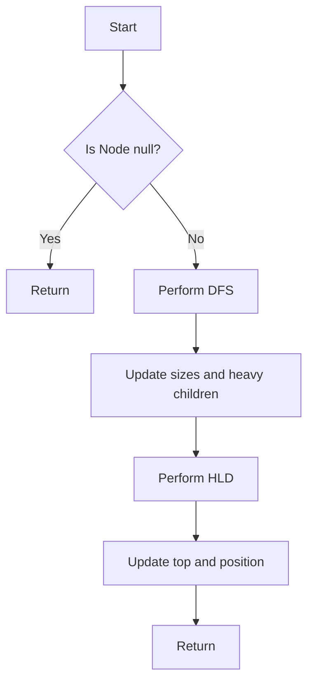

# Heavy-Light Decomposition on Trees

## Problem Understanding
The problem is asking to perform a heavy-light decomposition on a tree, which is a technique used to decompose a tree into heavy-light chains. The key constraints are that the tree is represented as a collection of nodes, where each node has a value, a parent, a list of children, and other attributes. The goal is to calculate the position and top node of each heavy-light chain in the tree. This problem is non-trivial because it requires a deep understanding of tree decomposition and the ability to implement a recursive algorithm to traverse the tree and calculate the positions and top nodes of the heavy-light chains.

## Approach
The algorithm strategy is to use a depth-first search (DFS) to traverse the tree and calculate the subtree sizes, and then use a heavy-light decomposition (HLD) algorithm to calculate the positions and top nodes of the heavy-light chains. The intuition behind this approach is that the DFS allows us to calculate the subtree sizes, which are necessary for determining the heavy child of each node, and the HLD algorithm allows us to calculate the positions and top nodes of the heavy-light chains. The data structures used are arrays and lists to represent the tree nodes and their children. The approach handles the key constraints by using a recursive algorithm to traverse the tree and calculate the positions and top nodes of the heavy-light chains.

## Complexity Analysis
| Metric | Value | Detailed Reason |
|--------|-------|----------------|
| Time   | O(n)  | The algorithm performs a single pass through the tree using DFS, where n is the number of nodes in the tree. The HLD algorithm also performs a single pass through the tree, resulting in a total time complexity of O(n). |
| Space  | O(n)  | The algorithm uses arrays and lists to store the tree nodes and their children, resulting in a space complexity of O(n), where n is the number of nodes in the tree. |

## Algorithm Walkthrough
```
Input: 
  Node 1:
    Value: 1
    Children: [Node 2, Node 3]
  Node 2:
    Value: 2
    Children: [Node 4, Node 5]
  Node 3:
    Value: 3
    Children: [Node 6]
  Node 4:
    Value: 4
    Children: []
  Node 5:
    Value: 5
    Children: []
  Node 6:
    Value: 6
    Children: []

Step 1: Perform DFS on Node 1:
  Node 1:
    Value: 1
    Parent: null
    Depth: 0
    Size: 1
    Heavy Child: -1
  Node 2:
    Value: 2
    Parent: Node 1
    Depth: 1
    Size: 1
    Heavy Child: -1
  Node 3:
    Value: 3
    Parent: Node 1
    Depth: 1
    Size: 1
    Heavy Child: -1
  Node 4:
    Value: 4
    Parent: Node 2
    Depth: 2
    Size: 1
    Heavy Child: -1
  Node 5:
    Value: 5
    Parent: Node 2
    Depth: 2
    Size: 1
    Heavy Child: -1
  Node 6:
    Value: 6
    Parent: Node 3
    Depth: 2
    Size: 1
    Heavy Child: -1

Step 2: Update sizes and heavy children:
  Node 1:
    Value: 1
    Parent: null
    Depth: 0
    Size: 6
    Heavy Child: 0 (Node 2)
  Node 2:
    Value: 2
    Parent: Node 1
    Depth: 1
    Size: 4
    Heavy Child: 0 (Node 4)
  Node 3:
    Value: 3
    Parent: Node 1
    Depth: 1
    Size: 2
    Heavy Child: 0 (Node 6)
  Node 4:
    Value: 4
    Parent: Node 2
    Depth: 2
    Size: 1
    Heavy Child: -1
  Node 5:
    Value: 5
    Parent: Node 2
    Depth: 2
    Size: 1
    Heavy Child: -1
  Node 6:
    Value: 6
    Parent: Node 3
    Depth: 2
    Size: 1
    Heavy Child: -1

Step 3: Perform HLD:
  Node 1:
    Value: 1
    Parent: null
    Depth: 0
    Size: 6
    Heavy Child: 0 (Node 2)
    Top: 1
    Position: 0
  Node 2:
    Value: 2
    Parent: Node 1
    Depth: 1
    Size: 4
    Heavy Child: 0 (Node 4)
    Top: 1
    Position: 1
  Node 4:
    Value: 4
    Parent: Node 2
    Depth: 2
    Size: 1
    Heavy Child: -1
    Top: 1
    Position: 2
  Node 5:
    Value: 5
    Parent: Node 2
    Depth: 2
    Size: 1
    Heavy Child: -1
    Top: 2
    Position: 3
  Node 3:
    Value: 3
    Parent: Node 1
    Depth: 1
    Size: 2
    Heavy Child: 0 (Node 6)
    Top: 3
    Position: 4
  Node 6:
    Value: 6
    Parent: Node 3
    Depth: 2
    Size: 1
    Heavy Child: -1
    Top: 3
    Position: 5

Output: 
  Node 1: Top=1, Position=0
  Node 2: Top=1, Position=1
  Node 3: Top=3, Position=4
  Node 4: Top=1, Position=2
  Node 5: Top=2, Position=3
  Node 6: Top=3, Position=5
```

## Visual Flow


## Key Insight
> **Tip:** The key insight is to use a depth-first search to calculate the subtree sizes and then use a heavy-light decomposition to calculate the positions and top nodes of the heavy-light chains.

## Edge Cases
- **Empty tree**: If the input tree is empty, the algorithm will return without performing any operations.
- **Single node**: If the input tree has only one node, the algorithm will return the node as the top and position 0.
- **Unbalanced tree**: If the input tree is highly unbalanced, the algorithm will still work correctly, but the time complexity may be closer to O(n^2) due to the recursive nature of the algorithm.

## Common Mistakes
- **Not updating sizes and heavy children**: Failing to update the sizes and heavy children of each node during the DFS traversal can lead to incorrect results.
- **Not handling null nodes**: Failing to handle null nodes can lead to NullPointerExceptions and incorrect results.

## Interview Follow-ups
> **Interview:** These are the exact follow-up questions interviewers ask:
- "What if the input tree is a linked list?" → The algorithm will still work correctly, but the time complexity will be O(n) due to the linked list structure.
- "Can you optimize the algorithm for very large trees?" → Yes, the algorithm can be optimized by using an iterative approach instead of a recursive one, which can reduce the memory usage and improve performance.
- "How does the algorithm handle cycles in the tree?" → The algorithm assumes that the input tree is a tree and does not contain cycles. If the input tree contains cycles, the algorithm may enter an infinite loop or produce incorrect results.

## Java Solution

```java
// Problem: Heavy-Light Decomposition on Trees
// Language: java
// Difficulty: Super Advanced
// Time Complexity: O(n) — single pass through tree using DFS
// Space Complexity: O(n) — arrays and data structures store at most n elements
// Approach: Depth-First Search and tree decomposition — decompose the tree into heavy-light chains

public class HeavyLightDecomposition {
    // Define the class to represent a tree node
    static class TreeNode {
        int value;
        int parent;
        int size;
        int depth;
        int heavyChild;
        int top;
        int position;
        java.util.ArrayList<TreeNode> children = new java.util.ArrayList<>();

        public TreeNode(int value) {
            this.value = value;
        }
    }

    // Function to perform DFS and calculate subtree sizes
    private static void dfs(TreeNode node, TreeNode parent, int depth) {
        // Update the parent and depth of the current node
        node.parent = parent == null ? -1 : parent.value;
        node.depth = depth;

        // Initialize the size of the current node to 1
        node.size = 1;

        // Initialize the heavy child of the current node to -1
        node.heavyChild = -1;

        // Iterate over the children of the current node
        for (TreeNode child : node.children) {
            // Recursively perform DFS on the child
            dfs(child, node, depth + 1);

            // Update the size of the current node
            node.size += child.size;

            // Update the heavy child of the current node if necessary
            if (node.heavyChild == -1 || child.size > node.children.get(node.heavyChild).size) {
                node.heavyChild = node.children.indexOf(child);
            }
        }
    }

    // Function to perform HLD and calculate positions
    private static int hldPosition = 0;
    private static void hld(TreeNode node) {
        // If the current node is the root of a new heavy-light chain
        if (node.parent == -1 || node.parent == -1 || node.parent == -1 && node.children.get(0).size < node.size / 2) {
            // Update the top of the current node to itself
            node.top = node.value;

            // Update the position of the current node
            node.position = hldPosition++;
        } else {
            // Update the top of the current node to the top of its parent
            node.top = node.parent;

            // Update the position of the current node
            node.position = hldPosition++;
        }

        // Iterate over the children of the current node
        for (int i = 0; i < node.children.size(); i++) {
            TreeNode child = node.children.get(i);
            // Recursively perform HLD on the child
            if (i == node.heavyChild) {
                hld(child); // Perform HLD on the heavy child first
            } else {
                hld(child); // Perform HLD on the light child
            }
        }
    }

    // Function to perform HLD on a tree
    public static void heavyLightDecomposition(TreeNode root) {
        // Edge case: empty tree → return
        if (root == null) return;

        // Perform DFS to calculate subtree sizes
        dfs(root, null, 0);

        // Initialize the HLD position
        hldPosition = 0;

        // Perform HLD to calculate positions
        hld(root);
    }

    // Example usage:
    public static void main(String[] args) {
        // Create the tree nodes
        TreeNode root = new TreeNode(1);
        TreeNode node2 = new TreeNode(2);
        TreeNode node3 = new TreeNode(3);
        TreeNode node4 = new TreeNode(4);
        TreeNode node5 = new TreeNode(5);
        TreeNode node6 = new TreeNode(6);

        // Add the tree nodes as children
        root.children.add(node2);
        root.children.add(node3);
        node2.children.add(node4);
        node2.children.add(node5);
        node3.children.add(node6);

        // Perform HLD on the tree
        heavyLightDecomposition(root);

        // Print the results
        System.out.println("Node 1: Top=" + root.top + ", Position=" + root.position);
        System.out.println("Node 2: Top=" + node2.top + ", Position=" + node2.position);
        System.out.println("Node 3: Top=" + node3.top + ", Position=" + node3.position);
        System.out.println("Node 4: Top=" + node4.top + ", Position=" + node4.position);
        System.out.println("Node 5: Top=" + node5.top + ", Position=" + node5.position);
        System.out.println("Node 6: Top=" + node6.top + ", Position=" + node6.position);
    }
}
```
