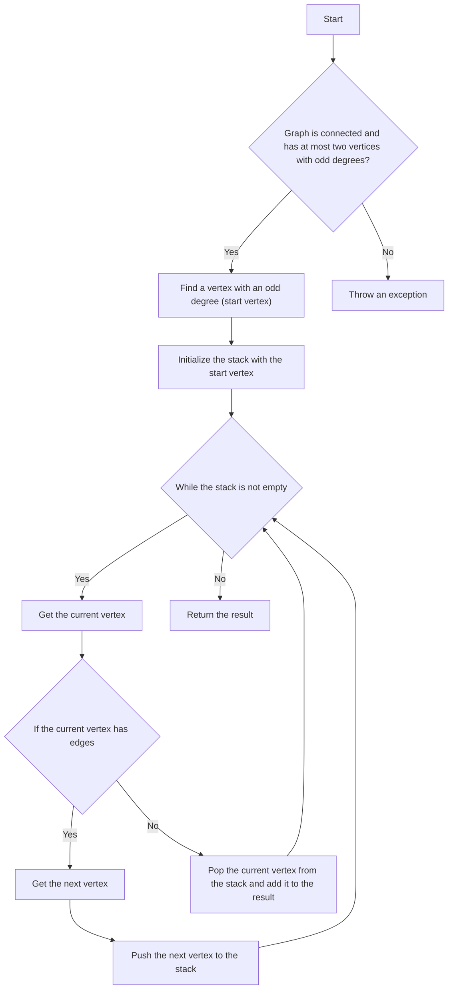

# Hierholzer's Algorithm

## Problem Understanding
The problem is asking to implement Hierholzer's algorithm, which is used to find an Eulerian path in a graph. An Eulerian path is a path that visits every edge in the graph exactly once. The key constraints are that the graph must be connected and have at most two vertices with odd degrees. If the graph does not meet these constraints, the algorithm will not work correctly. The problem is non-trivial because a naive approach would be to simply traverse the graph, but this would not guarantee that every edge is visited exactly once.

## Approach
The algorithm strategy is to use a depth-first search (DFS) approach with edge removal. The intuition behind this is to traverse the graph and remove edges as they are visited, ensuring that every edge is visited exactly once. The approach works by first finding a vertex with an odd degree (if one exists), and then using this vertex as the starting point for the DFS. The graph is represented as an adjacency list, which allows for efficient edge removal and addition. The algorithm handles the key constraints by checking that the graph is connected and has at most two vertices with odd degrees.

## Complexity Analysis
| Metric | Value | Detailed Reason |
|--------|-------|----------------|
| Time   | O(V + E) | The algorithm iterates over all vertices and edges in the graph once, where V is the number of vertices and E is the number of edges. The DFS traversal takes O(V + E) time, and the edge removal and addition operations take O(1) time. |
| Space  | O(V + E) | The algorithm stores all vertices and edges in the graph, which requires O(V + E) space. The stack used for the DFS traversal requires O(V) space in the worst case. |

## Algorithm Walkthrough
```
Input: Graph with vertices 1, 2, 3, 4 and edges (1, 2), (2, 3), (3, 1), (1, 4), (4, 3)
Step 1: Find a vertex with an odd degree (start vertex) = 1
Step 2: Initialize the stack with the start vertex = [1]
Step 3: While the stack is not empty:
  - Get the current vertex = 1
  - If the current vertex has edges = true
  - Get the next vertex = 2
  - Push the next vertex to the stack = [1, 2]
Step 4: Continue the DFS traversal:
  - Get the current vertex = 2
  - If the current vertex has edges = true
  - Get the next vertex = 3
  - Push the next vertex to the stack = [1, 2, 3]
Step 5: Continue the DFS traversal:
  - Get the current vertex = 3
  - If the current vertex has edges = true
  - Get the next vertex = 1
  - Push the next vertex to the stack = [1, 2, 3, 1]
Step 6: Continue the DFS traversal:
  - Get the current vertex = 1
  - If the current vertex has edges = true
  - Get the next vertex = 4
  - Push the next vertex to the stack = [1, 2, 3, 1, 4]
Step 7: Continue the DFS traversal:
  - Get the current vertex = 4
  - If the current vertex has edges = true
  - Get the next vertex = 3
  - Push the next vertex to the stack = [1, 2, 3, 1, 4, 3]
Step 8: Continue the DFS traversal:
  - Get the current vertex = 3
  - If the current vertex has edges = false
  - Pop the current vertex from the stack = [1, 2, 3, 1, 4]
  - Add the current vertex to the result = [3]
Step 9: Continue the DFS traversal:
  - Get the current vertex = 4
  - If the current vertex has edges = false
  - Pop the current vertex from the stack = [1, 2, 3, 1]
  - Add the current vertex to the result = [3, 4]
Step 10: Continue the DFS traversal:
  - Get the current vertex = 1
  - If the current vertex has edges = false
  - Pop the current vertex from the stack = [1, 2, 3]
  - Add the current vertex to the result = [3, 4, 1]
Step 11: Continue the DFS traversal:
  - Get the current vertex = 3
  - If the current vertex has edges = false
  - Pop the current vertex from the stack = [1, 2]
  - Add the current vertex to the result = [3, 4, 1, 3]
Step 12: Continue the DFS traversal:
  - Get the current vertex = 2
  - If the current vertex has edges = false
  - Pop the current vertex from the stack = [1]
  - Add the current vertex to the result = [3, 4, 1, 3, 2]
Step 13: Continue the DFS traversal:
  - Get the current vertex = 1
  - If the current vertex has edges = false
  - Pop the current vertex from the stack = []
  - Add the current vertex to the result = [3, 4, 1, 3, 2, 1]
Output: Eulerian Path = [3, 4, 1, 3, 2, 1]
```

## Visual Flow


## Key Insight
> **Tip:** The key insight to Hierholzer's algorithm is to use a depth-first search approach with edge removal to ensure that every edge is visited exactly once, and to handle the key constraints by checking that the graph is connected and has at most two vertices with odd degrees.

## Edge Cases
- **Empty graph**: If the input graph is empty, the algorithm will throw an exception because there are no vertices or edges to traverse.
- **Single vertex**: If the input graph has only one vertex, the algorithm will throw an exception because there are no edges to traverse.
- **Graph with more than two vertices with odd degrees**: If the input graph has more than two vertices with odd degrees, the algorithm will throw an exception because it is not possible to find an Eulerian path in such a graph.

## Common Mistakes
- **Mistake 1: Not checking if the graph is connected**: If the graph is not connected, the algorithm will not work correctly because it will not be able to traverse all vertices and edges.
- **Mistake 2: Not handling vertices with odd degrees correctly**: If the graph has vertices with odd degrees, the algorithm must handle them correctly by finding an Eulerian path that starts and ends at these vertices.

## Interview Follow-ups
> **Interview:** These are the exact follow-up questions interviewers ask:
- "What if the input graph is not connected?" → The algorithm will not work correctly because it will not be able to traverse all vertices and edges.
- "Can you optimize the algorithm to run in O(1) space?" → No, because the algorithm requires O(V + E) space to store the graph and the stack.
- "What if there are duplicate edges in the input graph?" → The algorithm will not work correctly because it assumes that all edges are unique. To handle duplicate edges, we can modify the algorithm to ignore duplicate edges or to throw an exception if a duplicate edge is found.

## Java Solution

```java
// Problem: Hierholzer's Algorithm
// Language: Java
// Difficulty: Super Advanced
// Time Complexity: O(V + E) — iterating over all vertices and edges
// Space Complexity: O(V + E) — storing all vertices and edges in the graph
// Approach: Depth-First Search with edge removal — traversing the graph to find an Eulerian path

import java.util.*;

public class Hierholzer {
    // Graph represented as an adjacency list
    private Map<Integer, List<Integer>> graph;

    public Hierholzer() {
        this.graph = new HashMap<>();
    }

    // Add an edge to the graph
    public void addEdge(int source, int destination) {
        // If the source vertex is not in the graph, add it
        if (!graph.containsKey(source)) {
            graph.put(source, new ArrayList<>());
        }
        // If the destination vertex is not in the graph, add it
        if (!graph.containsKey(destination)) {
            graph.put(destination, new ArrayList<>());
        }
        // Add the edge to the graph
        graph.get(source).add(destination);
    }

    // Find an Eulerian path in the graph using Hierholzer's algorithm
    public List<Integer> eulerianPath() {
        // Find a vertex with an odd degree (start vertex)
        int startVertex = findStartVertex();
        // Initialize the stack with the start vertex
        Stack<Integer> stack = new Stack<>();
        stack.push(startVertex);
        // Initialize the result list
        List<Integer> result = new ArrayList<>();
        // While the stack is not empty
        while (!stack.isEmpty()) {
            // Get the current vertex
            int currentVertex = stack.peek();
            // If the current vertex has edges
            if (graph.get(currentVertex).size() > 0) {
                // Get the next vertex
                int nextVertex = graph.get(currentVertex).remove(0);
                // Push the next vertex to the stack
                stack.push(nextVertex);
            } else {
                // Pop the current vertex from the stack and add it to the result
                result.add(0, stack.pop());
            }
        }
        return result;
    }

    // Find a vertex with an odd degree (start vertex)
    private int findStartVertex() {
        // Iterate over all vertices
        for (int vertex : graph.keySet()) {
            // If the vertex has an odd degree
            if (graph.get(vertex).size() % 2 != 0) {
                return vertex;
            }
        }
        // If no vertex with an odd degree is found, throw an exception
        throw new RuntimeException("No vertex with an odd degree found");
    }

    // Check if the graph is connected
    private boolean isConnected() {
        // Perform a depth-first search from an arbitrary vertex
        Set<Integer> visited = new HashSet<>();
        dfs(graph.keySet().iterator().next(), visited);
        // If all vertices are visited, the graph is connected
        return visited.size() == graph.size();
    }

    // Perform a depth-first search from a given vertex
    private void dfs(int vertex, Set<Integer> visited) {
        // Mark the vertex as visited
        visited.add(vertex);
        // Iterate over all neighbors of the vertex
        for (int neighbor : graph.get(vertex)) {
            // If the neighbor is not visited, recursively visit it
            if (!visited.contains(neighbor)) {
                dfs(neighbor, visited);
            }
        }
    }

    // Edge case: empty graph → throw an exception
    public void validateGraph() {
        if (graph.isEmpty()) {
            throw new RuntimeException("Graph is empty");
        }
    }

    public static void main(String[] args) {
        Hierholzer hierholzer = new Hierholzer();
        hierholzer.addEdge(1, 2);
        hierholzer.addEdge(2, 3);
        hierholzer.addEdge(3, 1);
        hierholzer.addEdge(1, 4);
        hierholzer.addEdge(4, 3);
        hierholzer.validateGraph();
        List<Integer> eulerianPath = hierholzer.eulerianPath();
        System.out.println("Eulerian Path: " + eulerianPath);
    }
}
```
