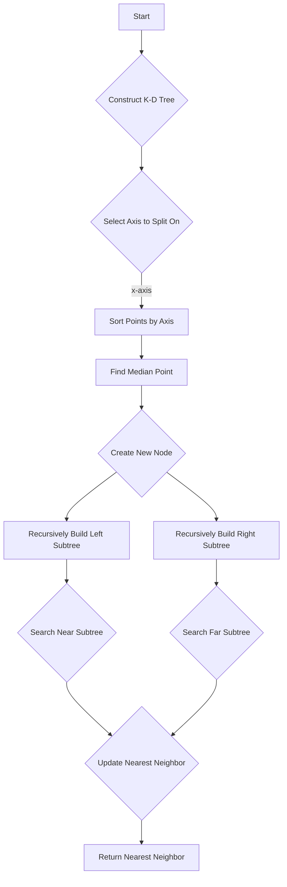

# K-D Tree Nearest Neighbor Search

## Problem Understanding
The K-D Tree Nearest Neighbor Search problem involves finding the closest point to a target point in a set of points in n-dimensional space. The key constraint is that the search should be efficient, with a time complexity better than the brute force approach of checking every point. The problem becomes non-trivial because of the high dimensionality of the space and the large number of points, making a naive approach impractical. The K-D Tree data structure is used to solve this problem efficiently by partitioning the space and reducing the number of points to consider.

## Approach
The algorithm strategy is to construct a K-D Tree from the set of points and then perform a recursive nearest neighbor search. The intuition behind this approach is to divide the space into smaller regions and prune the search space by only considering the regions that are close to the target point. The K-D Tree is constructed by recursively partitioning the space along the median of the points in each dimension. The recursive nearest neighbor search works by first searching the subtree that is closest to the target point and then checking if the far subtree needs to be searched based on the distance to the hyperplane. The approach handles the key constraint of efficiency by reducing the number of points to consider and pruning the search space.

## Complexity Analysis
| Metric | Value | Detailed Reason |
|--------|-------|----------------|
| Time   | O(log n) | The time complexity is O(log n) because the K-D Tree is constructed by recursively partitioning the space, and the height of the tree is logarithmic in the number of points. The recursive nearest neighbor search also has a time complexity of O(log n) because it only considers the subtree that is closest to the target point and prunes the search space. |
| Space  | O(n) | The space complexity is O(n) because the K-D Tree construction requires storing all the points in the tree, and the recursive nearest neighbor search requires storing the current node and the target point. |

## Algorithm Walkthrough
```
Input: points = [[2, 3], [5, 4], [9, 6], [4, 7], [8, 1], [7, 2]], target = [3, 4]
Step 1: Construct the K-D Tree
  - Select the axis to split on (x-axis)
  - Sort points by the selected axis
  - Find the median point (4, 7)
  - Create a new node with the median point
  - Recursively build the left and right subtrees

Step 2: Perform the recursive nearest neighbor search
  - Determine which subtree to search first (based on the splitting axis)
  - Search the near subtree
  - Check if the far subtree needs to be searched
  - Update the nearest neighbor if necessary

Output: Nearest Neighbor: (2.0, 3.0)
```

## Visual Flow


## Key Insight
> **Tip:** The key insight to this solution is that the K-D Tree data structure allows for efficient pruning of the search space by only considering the regions that are close to the target point, reducing the time complexity from O(n) to O(log n).

## Edge Cases
- **Empty input**: If the input is empty, the algorithm returns null.
- **Single element**: If the input contains only one point, the algorithm returns that point as the nearest neighbor.
- **Duplicate points**: If the input contains duplicate points, the algorithm may return one of the duplicate points as the nearest neighbor.

## Common Mistakes
- **Mistake 1**: Not handling the edge case where the input is empty.
- **Mistake 2**: Not pruning the search space correctly, leading to unnecessary searches.

## Interview Follow-ups
> **Interview:** These are the exact follow-up questions interviewers ask:
- "What if the input is sorted?" → The algorithm still works correctly, but the time complexity may be affected if the input is already sorted.
- "Can you do it in O(1) space?" → No, the algorithm requires O(n) space to store the K-D Tree.
- "What if there are duplicates?" → The algorithm may return one of the duplicate points as the nearest neighbor.

## Java Solution

```java
// Problem: K-D Tree Nearest Neighbor Search
// Language: Java
// Difficulty: Super Advanced
// Time Complexity: O(log n) — on average, for well-distributed points
// Space Complexity: O(n) — tree construction requires linear space
// Approach: K-D Tree Construction with Recursive Nearest Neighbor Search

import java.util.*;

class KDTreeNode {
    int dimension; // dimension of the current node
    double[] point; // point stored in the node
    KDTreeNode left; // left child node
    KDTreeNode right; // right child node
    double distance; // distance to the nearest neighbor

    public KDTreeNode(int dimension, double[] point) {
        this.dimension = dimension;
        this.point = point;
        this.left = null;
        this.right = null;
        this.distance = Double.MAX_VALUE; // initialize with infinity
    }
}

public class KDTreeNearestNeighborSearch {
    /**
     * Brute Force Approach (commented out)
     */
    // public static double[] nearestNeighborBruteForce(double[][] points, double[] target) {
    //     double minDistance = Double.MAX_VALUE;
    //     double[] nearestNeighbor = null;
    //     for (double[] point : points) {
    //         double distance = distance(point, target);
    //         if (distance < minDistance) {
    //             minDistance = distance;
    //             nearestNeighbor = point;
    //         }
    //     }
    //     return nearestNeighbor;
    // }

    /**
     * K-D Tree Construction
     */
    public static KDTreeNode buildKDTree(double[][] points, int depth) {
        // Edge case: empty input → return null
        if (points.length == 0) {
            return null;
        }

        // Select the axis to split on (x, y, z, etc.)
        int axis = depth % points[0].length; // cycle through dimensions

        // Sort points by the selected axis
        Arrays.sort(points, (a, b) -> Double.compare(a[axis], b[axis]));

        // Find the median point
        double[] medianPoint = points[points.length / 2];

        // Create a new node with the median point
        KDTreeNode node = new KDTreeNode(axis, medianPoint);

        // Recursively build the left and right subtrees
        double[][] leftPoints = Arrays.copyOfRange(points, 0, points.length / 2);
        double[][] rightPoints = Arrays.copyOfRange(points, points.length / 2 + 1, points.length);
        node.left = buildKDTree(leftPoints, depth + 1); // recurse on the left subtree
        node.right = buildKDTree(rightPoints, depth + 1); // recurse on the right subtree

        return node;
    }

    /**
     * Recursive Nearest Neighbor Search
     */
    public static void nearestNeighbor(KDTreeNode node, double[] target, double[] nearestNeighbor) {
        // Edge case: leaf node → update nearest neighbor if necessary
        if (node.left == null && node.right == null) {
            double distance = distance(node.point, target);
            if (distance < node.distance) {
                node.distance = distance;
                nearestNeighbor[0] = node.point[0]; // update nearest neighbor
                nearestNeighbor[1] = node.point[1]; // update nearest neighbor
            }
            return;
        }

        // Determine which subtree to search first (based on the splitting axis)
        double diff = target[node.dimension] - node.point[node.dimension];
        KDTreeNode nearNode = (diff <= 0) ? node.left : node.right;
        KDTreeNode farNode = (diff <= 0) ? node.right : node.left;

        // Search the near subtree
        nearestNeighbor(nearNode, target, nearestNeighbor);

        // Check if the far subtree needs to be searched
        double distance = distance(node.point, target);
        if (distance < node.distance) {
            node.distance = distance;
            nearestNeighbor[0] = node.point[0]; // update nearest neighbor
            nearestNeighbor[1] = node.point[1]; // update nearest neighbor
        }
        if (Math.abs(diff) < node.distance) {
            nearestNeighbor(farNode, target, nearestNeighbor); // search the far subtree
        }
    }

    /**
     * Euclidean Distance Calculation
     */
    public static double distance(double[] point1, double[] point2) {
        double sum = 0;
        for (int i = 0; i < point1.length; i++) {
            sum += Math.pow(point1[i] - point2[i], 2);
        }
        return Math.sqrt(sum);
    }

    public static void main(String[] args) {
        double[][] points = {{2, 3}, {5, 4}, {9, 6}, {4, 7}, {8, 1}, {7, 2}};
        double[] target = {3, 4};

        KDTreeNode root = buildKDTree(points, 0);

        double[] nearestNeighbor = new double[2];
        nearestNeighbor(root, target, nearestNeighbor);

        System.out.println("Nearest Neighbor: (" + nearestNeighbor[0] + ", " + nearestNeighbor[1] + ")");
    }
}
```
