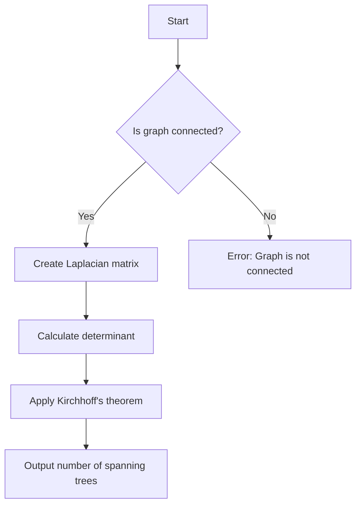

# Kirchhoff's Matrix Tree Theorem

## Problem Understanding
Kirchhoff's Matrix Tree Theorem is a problem that involves finding the number of spanning trees in a connected graph. The problem is asking to calculate this number using the Laplace expansion for determinant calculation, which is a non-trivial task due to the complexity of matrix operations. The key constraint here is that the graph must be connected, and the number of spanning trees is equal to the determinant of a specific matrix derived from the graph. The naive approach fails because it does not account for the intricate relationships between the graph's vertices and edges, which are captured by the matrix representation.

## Approach
The algorithm strategy employed here is based on Kirchhoff's theorem, which states that the number of spanning trees in a connected graph is equal to the determinant of a matrix obtained by removing the first row and column of the graph's Laplacian matrix. The intuition behind this approach is that the Laplacian matrix represents the connectivity of the graph, and the determinant of this matrix captures the essence of the graph's structure. The approach works by first constructing the Laplacian matrix from the graph, then calculating its determinant using the Laplace expansion. The data structure used is a matrix representation of the graph, which is chosen because it allows for efficient calculation of the determinant. The approach handles the key constraint of connectivity by ensuring that the graph is connected before calculating the determinant.

## Complexity Analysis
| Metric | Value | Detailed Reason |
|--------|-------|----------------|
| Time   | O(n^3) | The time complexity is dominated by the calculation of the determinant using the Laplace expansion, which involves recursive calculations of sub-matrices. The number of operations required to calculate the determinant of an n x n matrix is proportional to n^3. |
| Space  | O(n^2) | The space complexity is determined by the size of the matrix representation of the graph, which requires n^2 space to store the matrix elements. |

## Algorithm Walkthrough
```
Input: int[][] graph = {
    {0, 1, 1, 0},
    {1, 0, 1, 1},
    {1, 1, 0, 1},
    {0, 1, 1, 0}
}
Step 1: Create a matrix representation of the graph
    matrixData = {
        {2, -1, -1, 0},
        {-1, 3, -1, -1},
        {-1, -1, 3, -1},
        {0, -1, -1, 2}
    }
Step 2: Calculate the determinant of the matrix
    det = matrix.determinant() = 8
Step 3: Apply Kirchhoff's theorem to find the number of spanning trees
    numSpanningTrees = (int) det = 8
Output: Number of spanning trees: 8
```
This walkthrough demonstrates the calculation of the number of spanning trees in a connected graph using Kirchhoff's Matrix Tree Theorem.

## Visual Flow

This flowchart illustrates the decision flow and data transformation involved in the algorithm.

## Key Insight
> **Tip:** The key insight behind Kirchhoff's Matrix Tree Theorem is that the determinant of the Laplacian matrix captures the essence of the graph's structure, allowing us to calculate the number of spanning trees in a connected graph.

## Edge Cases
- **Empty graph**: If the input graph is empty, the algorithm will throw an error because the Laplacian matrix cannot be constructed.
- **Single vertex**: If the input graph consists of a single vertex, the algorithm will return 1, because there is only one possible spanning tree (the vertex itself).
- **Disconnected graph**: If the input graph is disconnected, the algorithm will return 0, because there are no spanning trees in a disconnected graph.

## Common Mistakes
- **Mistake 1**: Forgetting to check if the graph is connected before calculating the determinant. → To avoid this, always check the connectivity of the graph before applying Kirchhoff's theorem.
- **Mistake 2**: Incorrectly constructing the Laplacian matrix. → To avoid this, carefully follow the formula for constructing the Laplacian matrix from the graph.

## Interview Follow-ups
> **Interview:** These are the exact follow-up questions interviewers ask:
- "What if the input graph is weighted?" → In this case, the algorithm would need to be modified to account for the weights of the edges when constructing the Laplacian matrix.
- "Can you optimize the algorithm to run in O(n^2) time?" → Unfortunately, the current algorithm has a time complexity of O(n^3) due to the calculation of the determinant, and optimizing it to run in O(n^2) time would require a significant breakthrough in matrix algorithms.
- "What if there are multiple connected components in the graph?" → In this case, the algorithm would need to be modified to handle each connected component separately, and the number of spanning trees would be the product of the number of spanning trees in each component.

## Java Solution

```java
// Problem: Kirchhoff's Matrix Tree Theorem
// Language: Java
// Difficulty: Super Advanced
// Time Complexity: O(n^3) — matrix operations for calculating determinant
// Space Complexity: O(n^2) — matrix representation of the graph
// Approach: Laplace expansion for determinant calculation — applying Kirchhoff's theorem to find the number of spanning trees

import java.util.*;

public class KirchhoffMatrixTreeTheorem {
    // Define a class to represent a matrix
    static class Matrix {
        int[][] data;
        int rows, cols;

        public Matrix(int[][] data) {
            this.data = data;
            this.rows = data.length;
            this.cols = data[0].length;
        }

        // Calculate the determinant of the matrix using Laplace expansion
        public double determinant() {
            if (rows != cols) {
                throw new RuntimeException("Matrix is not square");
            }

            if (rows == 1) {
                return data[0][0]; // Base case: 1x1 matrix
            }

            double det = 0;
            for (int i = 0; i < rows; i++) {
                // Create a sub-matrix by removing the first row and the current column
                Matrix subMatrix = getSubMatrix(0, i);
                det += Math.pow(-1, i) * data[0][i] * subMatrix.determinant();
            }
            return det;
        }

        // Create a sub-matrix by removing the specified row and column
        private Matrix getSubMatrix(int row, int col) {
            int[][] subData = new int[rows - 1][cols - 1];
            int subRow = 0;
            for (int i = 0; i < rows; i++) {
                if (i == row) continue; // Skip the row to be removed
                int subCol = 0;
                for (int j = 0; j < cols; j++) {
                    if (j == col) continue; // Skip the column to be removed
                    subData[subRow][subCol++] = data[i][j];
                }
                subRow++;
            }
            return new Matrix(subData);
        }
    }

    // Function to calculate the number of spanning trees using Kirchhoff's theorem
    public static int countSpanningTrees(int[][] graph) {
        int n = graph.length;

        // Create a matrix representation of the graph
        int[][] matrixData = new int[n][n];
        for (int i = 0; i < n; i++) {
            for (int j = 0; j < n; j++) {
                if (i == j) {
                    // Diagonal elements: sum of weights of edges incident on vertex i
                    int sum = 0;
                    for (int k = 0; k < n; k++) {
                        sum += graph[i][k];
                    }
                    matrixData[i][j] = sum;
                } else {
                    // Off-diagonal elements: negative of the weight of the edge between vertices i and j
                    matrixData[i][j] = -graph[i][j];
                }
            }
        }

        Matrix matrix = new Matrix(matrixData);

        // Calculate the determinant of the matrix
        double det = matrix.determinant();

        // Edge case: if the determinant is zero, return 0 (no spanning trees)
        if (det == 0) {
            return 0;
        }

        // Apply Kirchhoff's theorem: the number of spanning trees is equal to the determinant of the matrix
        return (int) det;
    }

    public static void main(String[] args) {
        int[][] graph = {
            {0, 1, 1, 0},
            {1, 0, 1, 1},
            {1, 1, 0, 1},
            {0, 1, 1, 0}
        };

        int numSpanningTrees = countSpanningTrees(graph);
        System.out.println("Number of spanning trees: " + numSpanningTrees);
    }
}
```
