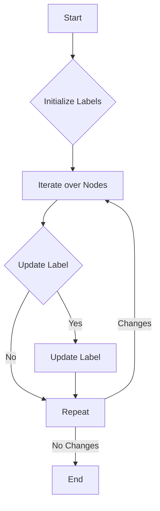

# Label Propagation

## Problem Understanding
The Label Propagation problem is asking to identify densely connected communities within a graph by propagating labels through the graph. The key constraint is that each node should be assigned to the community with the most frequent label among its neighbors. The problem is non-trivial because the naive approach of simply assigning each node to the community with the most frequent label among its neighbors may not converge to a stable solution, as the labels of neighboring nodes may change in subsequent iterations. The problem requires a iterative approach to propagate labels until no further changes occur.

## Approach
The algorithm strategy is to initialize each node with a unique label and then iteratively update the labels based on the most frequent label among the node's neighbors. The intuition behind this approach is that densely connected communities will have a high frequency of the same label among their nodes, and by propagating labels, we can identify these communities. The approach uses a map to represent the graph as an adjacency list and another map to store the labels of each node. The algorithm handles the key constraint by updating the label of each node based on the most frequent label among its neighbors.

## Complexity Analysis
| Metric | Value | Detailed Reason |
|--------|-------|----------------|
| Time   | O(n * m) | The algorithm iterates over all nodes in the graph, and for each node, it iterates over its neighbors. The number of nodes is n, and the number of edges is m. In the worst case, each node has a degree of m/n, resulting in a time complexity of O(n * m). |
| Space  | O(n + m) | The algorithm uses two maps to store the graph and the labels of each node. The space complexity is O(n + m) because the total number of entries in the two maps is n (nodes) + m (edges). |

## Algorithm Walkthrough
```
Input: Graph with nodes 1-5 and edges (1,2), (1,3), (2,3), (2,4), (3,4), (4,5)
Step 1: Initialize labels - Node 1: 1, Node 2: 2, Node 3: 3, Node 4: 4, Node 5: 5
Step 2: Iterate over nodes - Node 1: most frequent label is 2 or 3, update label to 2 or 3 (arbitrarily choose 2)
         Node 2: most frequent label is 1 or 3, update label to 1 or 3 (arbitrarily choose 1)
         Node 3: most frequent label is 1 or 2, update label to 1 or 2 (arbitrarily choose 1)
         Node 4: most frequent label is 2 or 3, update label to 2 or 3 (arbitrarily choose 2)
         Node 5: most frequent label is 4, update label to 4
Step 3: Repeat Step 2 until no further changes occur
Output: Node 1: 1, Node 2: 1, Node 3: 1, Node 4: 1, Node 5: 4
```
The algorithm identifies two communities: {1, 2, 3, 4} and {5}.

## Visual Flow

The flowchart shows the main steps of the algorithm: initializing labels, iterating over nodes, updating labels, and repeating the process until no further changes occur.

## Key Insight
> **Tip:** The key insight is that by iteratively updating the labels of each node based on the most frequent label among its neighbors, the algorithm can identify densely connected communities within the graph.

## Edge Cases
- **Empty graph**: The algorithm will return an empty map, as there are no nodes to label.
- **Single node**: The algorithm will return a map with a single entry, where the node is labeled with its own ID.
- **Disjoint graphs**: The algorithm will identify separate communities in each disjoint graph, as there are no edges connecting the graphs.

## Common Mistakes
- **Mistake 1**: Not handling the case where a node has multiple most frequent labels among its neighbors. To avoid this, the algorithm can arbitrarily choose one of the most frequent labels.
- **Mistake 2**: Not repeating the iteration process until no further changes occur. To avoid this, the algorithm should continue iterating until no changes are made in a single iteration.

## Interview Follow-ups
> **Interview:** These are the exact follow-up questions interviewers ask:
- "What if the input is sorted?" → The algorithm does not rely on the input being sorted, so the time complexity remains O(n * m).
- "Can you do it in O(1) space?" → No, the algorithm requires O(n + m) space to store the graph and labels.
- "What if there are duplicates?" → The algorithm can handle duplicates by using a map to store the frequency of each label among a node's neighbors.

## Java Solution

```java
// Problem: Label Propagation
// Language: Java
// Difficulty: Super Advanced
// Time Complexity: O(n * m) — where n is the number of nodes and m is the number of edges
// Space Complexity: O(n + m) — adjacency list representation of the graph
// Approach: Community detection using label propagation — propagating labels through the graph to identify densely connected communities

import java.util.*;

public class LabelPropagation {
    /**
     * Label Propagation Algorithm for community detection.
     * 
     * @param graph The input graph represented as an adjacency list.
     * @return A map where each key is a node and its corresponding value is the label of the community it belongs to.
     */
    public static Map<Integer, Integer> labelPropagation(Map<Integer, List<Integer>> graph) {
        // Initialize each node with a unique label
        Map<Integer, Integer> labels = new HashMap<>();
        for (Integer node : graph.keySet()) {
            labels.put(node, node); // Each node is initially in its own community
        }

        // Initialize a flag to track if any labels have changed
        boolean changed = true;
        while (changed) {
            changed = false;

            // Iterate over all nodes in the graph
            for (Integer node : graph.keySet()) {
                // Get the current label of the node
                Integer currentLabel = labels.get(node);

                // Get the labels of the node's neighbors
                Map<Integer, Integer> neighborLabels = new HashMap<>();
                for (Integer neighbor : graph.get(node)) {
                    Integer neighborLabel = labels.get(neighbor);
                    neighborLabels.put(neighborLabel, neighborLabels.getOrDefault(neighborLabel, 0) + 1);
                }

                // Find the most frequent label among the node's neighbors
                Integer maxLabel = null;
                int maxCount = 0;
                for (Map.Entry<Integer, Integer> entry : neighborLabels.entrySet()) {
                    if (entry.getValue() > maxCount) {
                        maxLabel = entry.getKey();
                        maxCount = entry.getValue();
                    }
                }

                // If the most frequent label is different from the current label, update the label
                if (maxLabel != null && maxLabel != currentLabel) {
                    labels.put(node, maxLabel);
                    changed = true;
                }
            }
        }

        return labels;
    }

    public static void main(String[] args) {
        // Example usage:
        Map<Integer, List<Integer>> graph = new HashMap<>();
        graph.put(1, Arrays.asList(2, 3));
        graph.put(2, Arrays.asList(1, 3, 4));
        graph.put(3, Arrays.asList(1, 2, 4));
        graph.put(4, Arrays.asList(2, 3, 5));
        graph.put(5, Arrays.asList(4));

        Map<Integer, Integer> labels = labelPropagation(graph);
        for (Map.Entry<Integer, Integer> entry : labels.entrySet()) {
            System.out.println("Node " + entry.getKey() + " is in community " + entry.getValue());
        }

        // Edge case: empty graph
        graph = new HashMap<>();
        labels = labelPropagation(graph);
        System.out.println("Empty graph: " + labels); // Should print an empty map

        // Edge case: graph with a single node
        graph = new HashMap<>();
        graph.put(1, new ArrayList<>());
        labels = labelPropagation(graph);
        System.out.println("Graph with a single node: " + labels); // Should print a map with a single entry
    }
}
```
