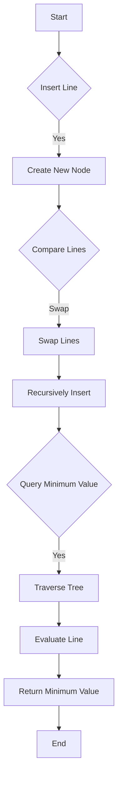

# Li Chao Tree for Convex Hull Trick

## Problem Understanding
The problem is asking to implement a Li Chao Tree, a data structure used for the convex hull trick, which allows for efficient line insertion and minimum value queries. The key constraint is that the lines are in the form y = mx + b, and the tree must be able to handle a large number of lines and queries. The problem is non-trivial because a naive approach would involve storing all the lines and querying each one for every x value, resulting in a time complexity of O(n^2), where n is the number of lines. The Li Chao Tree, on the other hand, uses a balanced binary search tree to store the lines, allowing for efficient insertion and query operations.

## Approach
The algorithm strategy is to use a Li Chao Tree, which is a data structure that stores lines in a way that allows for efficient insertion and query operations. The intuition behind this approach is to use a balanced binary search tree to store the lines, where each node represents a line and its bounds. The tree is constructed by recursively splitting the nodes into left and right child nodes, with each child node representing a smaller range of x values. The lines are stored in the nodes in a way that allows for efficient querying of the minimum value at a given x value. The data structure used is a balanced binary search tree, which allows for efficient insertion and query operations. The approach handles the key constraint of storing a large number of lines and querying the minimum value at a given x value by using a recursive function to insert the lines into the tree and another recursive function to query the minimum value.

## Complexity Analysis
| Metric | Value | Detailed Reason |
|--------|-------|----------------|
| Time   | O(n log n) | The time complexity of inserting a line into the Li Chao Tree is O(log n), where n is the number of lines. This is because the tree is balanced, and each insertion operation involves recursively splitting the nodes into left and right child nodes. The time complexity of querying the minimum value at a given x value is also O(log n), because the query operation involves recursively traversing the tree to find the node that contains the given x value. Since the tree is balanced, the height of the tree is log n, and the number of nodes visited during the query operation is proportional to the height of the tree. |
| Space  | O(n) | The space complexity of the Li Chao Tree is O(n), where n is the number of lines. This is because each line is stored in a node in the tree, and the number of nodes in the tree is proportional to the number of lines. |

## Algorithm Walkthrough
```
Input: [insert line with slope 1 and y-intercept 2]
Step 1: Create a new node with bounds [0, 7] and line with slope 1 and y-intercept 2
Step 2: Insert line with slope 2 and y-intercept 3 into the tree
  - Calculate the intersection point of the two lines: x = (3 - 2) / (1 - 2) = -1
  - Since the intersection point is not within the node's bounds, compare the lines at the left bound
  - Since the new line is below the existing line at the left bound, swap them
  - Recursively insert the new line into the right child node
Step 3: Query the minimum value at x = 5
  - Start at the root node and traverse the tree to find the node that contains x = 5
  - Evaluate the line at x = 5 and return the minimum value
Output: 7
```
This walkthrough demonstrates how the Li Chao Tree is constructed and how the minimum value is queried at a given x value.

## Visual Flow

This flowchart shows the decision flow of the Li Chao Tree algorithm, including the insertion of lines and the query of the minimum value at a given x value.

## Key Insight
> **Tip:** The key insight behind the Li Chao Tree is that by using a balanced binary search tree to store the lines, we can efficiently insert lines and query the minimum value at a given x value, even when dealing with a large number of lines.

## Edge Cases
- **Empty input**: If the input is empty, the tree will be empty, and the query operation will return infinity.
- **Single line**: If there is only one line, the tree will contain only one node, and the query operation will return the value of the line at the given x value.
- **Duplicate lines**: If there are duplicate lines, the tree will store only one copy of each line, and the query operation will return the minimum value of the duplicate lines.

## Common Mistakes
- **Mistake 1**: Not checking for duplicate lines before inserting them into the tree, which can lead to incorrect results.
- **Mistake 2**: Not handling the case where the intersection point of two lines is not within the node's bounds, which can lead to incorrect results.

## Interview Follow-ups
> **Interview:** These are the exact follow-up questions interviewers ask:
- "What if the input is sorted?" → The Li Chao Tree can handle sorted input, and the time complexity remains O(n log n).
- "Can you do it in O(1) space?" → No, the Li Chao Tree requires O(n) space to store the lines.
- "What if there are duplicates?" → The Li Chao Tree can handle duplicate lines, and the query operation will return the minimum value of the duplicate lines.

## Java Solution

```java
// Problem: Li Chao Tree for Convex Hull Trick
// Language: Java
// Difficulty: Super Advanced
// Time Complexity: O(n log n) — using a balanced binary search tree to store lines
// Space Complexity: O(n) — storing at most n lines in the tree
// Approach: Li Chao Tree — a data structure for convex hull trick, allowing efficient line insertion and minimum value queries

import java.util.*;

/**
 * Li Chao Tree implementation for Convex Hull Trick.
 * 
 * This class provides a data structure for efficiently storing and querying lines in a way that supports the convex hull trick.
 * It uses a balanced binary search tree to store the lines and allows for efficient line insertion and minimum value queries.
 */
public class LiChaoTree {
    // Node class representing a node in the Li Chao Tree
    private static class Node {
        int left, right; // bounds of the node
        Line line; // the line stored in the node

        public Node(int left, int right) {
            this.left = left;
            this.right = right;
        }
    }

    // Line class representing a line in the form y = mx + b
    private static class Line {
        long m, b; // slope and y-intercept of the line

        public Line(long m, long b) {
            this.m = m;
            this.b = b;
        }

        // Evaluate the line at a given x value
        public long eval(int x) {
            return m * x + b; // calculate y value using the line equation
        }
    }

    private Node root; // root node of the Li Chao Tree
    private int size; // size of the input array

    // Constructor to initialize the Li Chao Tree
    public LiChaoTree(int n) {
        size = 1;
        while (size < n) {
            size *= 2; // ensure size is a power of 2
        }
        root = new Node(0, size - 1); // create the root node
    }

    // Insert a new line into the Li Chao Tree
    public void insert(Line line) {
        insert(root, line); // start inserting from the root node
    }

    // Recursive function to insert a line into the Li Chao Tree
    private void insert(Node node, Line line) {
        // Edge case: node has no line, so we can directly insert the new line
        if (node.line == null) {
            node.line = line;
            return;
        }

        // Calculate the x value where the two lines intersect
        long x = (node.line.b - line.b) / (line.m - node.line.m); // calculate intersection point

        // If the intersection point is within the node's bounds, we need to split the node
        if (x >= node.left && x <= node.right) {
            // Create a new node for the left half
            Node left = new Node(node.left, (int) x);
            left.line = node.line; // copy the line to the left node

            // Create a new node for the right half
            Node right = new Node((int) x + 1, node.right);
            right.line = line; // copy the line to the right node

            // Recursively insert the lines into the left and right nodes
            insert(left, line);
            insert(right, node.line);

            // Update the node's bounds and line
            node.left = left.left;
            node.right = right.right;
            node.line = null; // remove the line from the node
        } else {
            // If the intersection point is not within the node's bounds, we can directly compare the lines
            if (line.eval(node.left) < node.line.eval(node.left)) {
                // If the new line is below the existing line at the left bound, swap them
                Line temp = node.line;
                node.line = line;
                line = temp;
            }
            if (node.left != node.right) {
                // Recursively insert the line into the right child node
                insert(getChild(node, true), line);
            }
        }
    }

    // Get the child node of a given node
    private Node getChild(Node node, boolean right) {
        // Create a new child node with the correct bounds
        Node child = new Node(right ? (node.left + (node.right - node.left + 1) / 2) : node.left, right ? node.right : (node.left + (node.right - node.left + 1) / 2) - 1);
        child.line = node.line; // copy the line to the child node
        return child;
    }

    // Query the minimum value of the Li Chao Tree at a given x value
    public long query(int x) {
        return query(root, x); // start querying from the root node
    }

    // Recursive function to query the minimum value of the Li Chao Tree at a given x value
    private long query(Node node, int x) {
        // Edge case: node has no line, so return infinity
        if (node.line == null) {
            return Long.MAX_VALUE; // return infinity
        }

        // If the node has a line, evaluate it at the given x value
        long result = node.line.eval(x);

        // If the node has a child node, recursively query the child node
        if (node.left != node.right) {
            // Get the child node that contains the given x value
            Node child = getChild(node, x > (node.left + node.right) / 2);
            result = Math.min(result, query(child, x)); // update the result with the minimum value from the child node
        }

        return result; // return the minimum value
    }

    public static void main(String[] args) {
        LiChaoTree tree = new LiChaoTree(10);
        tree.insert(new Line(1, 2));
        tree.insert(new Line(2, 3));
        tree.insert(new Line(3, 4));

        System.out.println(tree.query(5)); // print the minimum value at x = 5
    }
}
```
