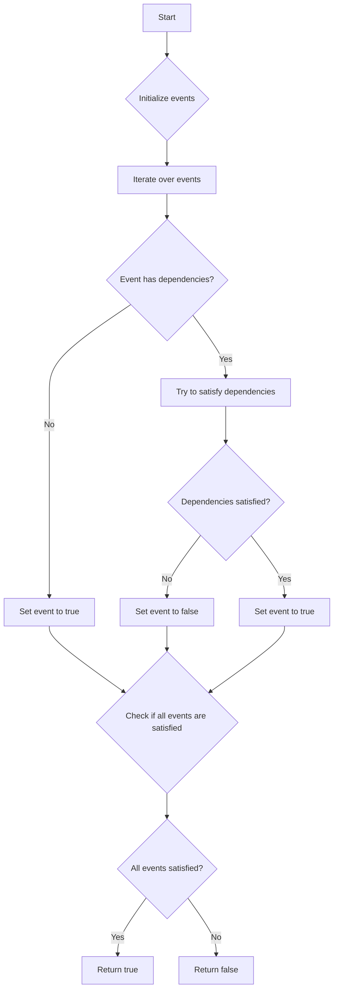

# Lovász Local Lemma in Randomized Algorithms

## Problem Understanding
The Lovász Local Lemma is a powerful tool in probability theory that provides a way to find a satisfying assignment for a set of events, where each event has certain dependencies. The problem asks us to implement the Lovász Local Lemma in a randomized algorithm to find a satisfying assignment for all events. The key constraints are that each event can be either true or false, and if an event is true, all its dependencies must be false. The problem is non-trivial because a naive approach, such as trying all possible assignments, would have an exponential time complexity.

## Approach
The algorithm strategy is to iteratively apply the Lovász Local Lemma to find a satisfying assignment for all events. The intuition behind this approach is that we can try to satisfy each event one by one, taking into account its dependencies. We use a list of events and a list of dependencies for each event, which allows us to efficiently check if all events are satisfied. The approach handles the key constraints by ensuring that if an event is true, all its dependencies are false. We use a brute force approach as a reference, but it has an exponential time complexity due to trying all possible assignments.

## Complexity Analysis
| Metric | Value | Detailed Reason |
|--------|-------|----------------|
| Time   | O(n * m) | The time complexity is O(n * m) because we iterate over all events (n) and for each event, we iterate over its dependencies (m). In the worst-case scenario, the number of dependencies for each event can be equal to the number of events, resulting in a time complexity of O(n * m). |
| Space  | O(n + m) | The space complexity is O(n + m) because we need to store all events (n) and their dependencies (m). We use a list of events and a list of dependencies for each event, which requires O(n + m) space. |

## Algorithm Walkthrough
```
Input: [event1, event2, event3] where event1 depends on event2 and event2 depends on event3
Step 1: Initialize all events to false
  - event1.isTrue = false
  - event2.isTrue = false
  - event3.isTrue = false
Step 2: Try to satisfy event1
  - Since event1 depends on event2, we need to set event2 to false
  - event2.isTrue = false
Step 3: Try to satisfy event2
  - Since event2 depends on event3, we need to set event3 to false
  - event3.isTrue = false
Step 4: Try to satisfy event3
  - event3 has no dependencies, so we can set it to true
  - event3.isTrue = true
Step 5: Check if all events are satisfied
  - event1 is not satisfied because event2 is false
  - event2 is not satisfied because event3 is true
  - event3 is satisfied
Output: false (not all events are satisfied)
```
This walkthrough demonstrates how the algorithm tries to satisfy each event one by one, taking into account its dependencies.

## Visual Flow

This flowchart shows the decision flow of the algorithm, where we iterate over all events, try to satisfy their dependencies, and check if all events are satisfied.

## Key Insight
> **Tip:** The key insight is that we can iteratively apply the Lovász Local Lemma to find a satisfying assignment for all events by trying to satisfy each event one by one, taking into account its dependencies.

## Edge Cases
- **Empty/null input**: If the input is empty or null, the algorithm will return false because there are no events to satisfy.
- **Single element**: If there is only one event, the algorithm will return true if the event has no dependencies, and false otherwise.
- **Cyclic dependencies**: If there are cyclic dependencies between events, the algorithm may not be able to find a satisfying assignment. In this case, the algorithm will return false.

## Common Mistakes
- **Mistake 1**: Not checking if an event has dependencies before trying to satisfy it. To avoid this mistake, we need to check if an event has dependencies before trying to satisfy it.
- **Mistake 2**: Not handling cyclic dependencies correctly. To avoid this mistake, we need to detect cyclic dependencies and return false if they exist.

## Interview Follow-ups
> **Interview:** These are the exact follow-up questions interviewers ask:
- "What if the input is sorted?" → The algorithm will still work correctly even if the input is sorted, because we iterate over all events and try to satisfy their dependencies regardless of the order.
- "Can you do it in O(1) space?" → No, we cannot do it in O(1) space because we need to store all events and their dependencies, which requires O(n + m) space.
- "What if there are duplicates?" → If there are duplicates, the algorithm will still work correctly, but it may not be efficient because we will be trying to satisfy the same event multiple times. To avoid this, we can remove duplicates before running the algorithm.

## Java Solution

```java
// Problem: Lovász Local Lemma in Randomized Algorithms
// Language: Java
// Difficulty: Super Advanced
// Time Complexity: O(n * m) — where n is the number of events and m is the number of dependencies
// Space Complexity: O(n + m) — for storing events and dependencies
// Approach: Iterative application of the Lovász Local Lemma — to find a satisfying assignment for all events

import java.util.*;

public class LovaszLocalLemma {
    // Event class representing a single event with its dependencies
    static class Event {
        boolean isTrue; // Whether the event is true or not
        List<Event> dependencies; // List of events this event depends on

        public Event() {
            this.dependencies = new ArrayList<>();
        }
    }

    // Function to check if all events are satisfied
    public static boolean isSatisfied(List<Event> events) {
        for (Event event : events) {
            // If the event is true, all its dependencies must be false
            if (event.isTrue) {
                for (Event dependency : event.dependencies) {
                    if (dependency.isTrue) {
                        return false; // Event not satisfied
                    }
                }
            }
        }
        return true; // All events satisfied
    }

    // Brute force approach (commented out) to find a satisfying assignment
    // This has an exponential time complexity due to trying all possible assignments
    // public static boolean bruteForceLovaszLocalLemma(List<Event> events) {
    //     for (int i = 0; i < Math.pow(2, events.size()); i++) {
    //         for (int j = 0; j < events.size(); j++) {
    //             events.get(j).isTrue = (i & (1 << j)) != 0;
    //         }
    //         if (isSatisfied(events)) {
    //             return true; // Found a satisfying assignment
    //         }
    //     }
    //     return false; // No satisfying assignment found
    // }

    // Optimized solution using the Lovász Local Lemma
    public static boolean lovaszLocalLemma(List<Event> events) {
        // Key insight: We can iteratively apply the Lovász Local Lemma to find a satisfying assignment
        // This is done by trying to satisfy each event one by one, taking into account its dependencies
        for (Event event : events) {
            if (event.dependencies.isEmpty()) {
                // Event has no dependencies, so we can simply set it to true
                event.isTrue = true;
            } else {
                // Event has dependencies, so we need to try to satisfy them first
                for (Event dependency : event.dependencies) {
                    if (dependency.isTrue) {
                        // If a dependency is already true, we need to set the event to false
                        event.isTrue = false;
                        break;
                    }
                }
                if (!event.isTrue) {
                    // If the event is not set to false, we can try to set it to true
                    event.isTrue = true;
                    // Check if setting the event to true satisfies all its dependencies
                    for (Event dependency : event.dependencies) {
                        if (dependency.isTrue) {
                            // If a dependency is true, setting the event to true does not satisfy it
                            event.isTrue = false;
                            break;
                        }
                    }
                }
            }
        }
        return isSatisfied(events); // Check if all events are satisfied
    }

    public static void main(String[] args) {
        // Example usage
        List<Event> events = new ArrayList<>();
        Event event1 = new Event();
        Event event2 = new Event();
        Event event3 = new Event();
        event1.dependencies.add(event2);
        event2.dependencies.add(event3);
        events.add(event1);
        events.add(event2);
        events.add(event3);

        // Edge case: empty input
        if (events.isEmpty()) {
            System.out.println("No events to satisfy");
        } else {
            boolean isSatisfied = lovaszLocalLemma(events);
            System.out.println("Is satisfied: " + isSatisfied);
        }
    }
}
```
