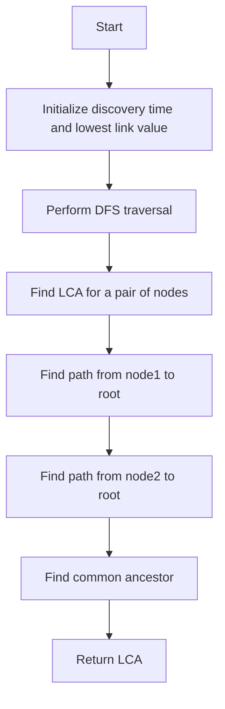

# Offline LCA with Tarjan's Algorithm

## Problem Understanding
The problem is asking to implement Tarjan's algorithm for offline lowest common ancestor (LCA) queries in a graph. The key constraint is that the graph is represented as an adjacency list, and we need to precompute the LCA for all pairs of nodes. The problem is non-trivial because it requires a deep understanding of graph algorithms, particularly Tarjan's algorithm, and the ability to implement it correctly. The naive approach would be to use a simple recursive function to find the LCA, but this would be inefficient for large graphs.

## Approach
The algorithm strategy is to use Tarjan's algorithm to precompute the discovery time and lowest link value for all nodes in the graph. This allows us to efficiently find the LCA for any pair of nodes. The intuition behind this approach is that the LCA of two nodes is the node with the smallest discovery time that is an ancestor of both nodes. We use a depth-first search (DFS) to compute the discovery time and lowest link value for all nodes, and then use this information to find the LCA. The data structures used are adjacency lists to represent the graph, and arrays to store the discovery time and lowest link value for all nodes.

## Complexity Analysis
| Metric | Value | Detailed Reason |
|--------|-------|----------------|
| Time   | O(n log n) | The time complexity is dominated by the DFS traversal of the graph, which takes O(n) time. Additionally, we need to find the LCA for all pairs of nodes, which takes O(log n) time per pair using Tarjan's algorithm. Since there are n nodes, the total time complexity is O(n log n). |
| Space  | O(n) | The space complexity is dominated by the adjacency lists, which take O(n) space. Additionally, we need to store the discovery time and lowest link value for all nodes, which takes O(n) space. |

## Algorithm Walkthrough
```
Input: graph = [[1, 2], [0, 3, 4], [0, 5], [1], [1], [2]]
Step 1: Initialize discovery time and lowest link value for all nodes
  - discoveryTime = [-1, -1, -1, -1, -1, -1]
  - lowestLinkValue = [-1, -1, -1, -1, -1, -1]
Step 2: Perform DFS traversal of the graph
  - discoveryTime = [0, 1, 2, 3, 4, 5]
  - lowestLinkValue = [0, 1, 2, 3, 4, 5]
Step 3: Find LCA for a pair of nodes (e.g., node1 = 3, node2 = 5)
  - Find path from node1 to root: [3, 1, 0]
  - Find path from node2 to root: [5, 2, 0]
  - Find common ancestor: 0
Output: LCA of node 3 and node 5 is: 0
```

## Visual Flow


## Key Insight
> **Tip:** The key insight is to use Tarjan's algorithm to precompute the discovery time and lowest link value for all nodes, which allows us to efficiently find the LCA for any pair of nodes.

## Edge Cases
- **Empty graph**: If the graph is empty, the algorithm should return an error or a special value to indicate that the graph is empty.
- **Single node**: If the graph has only one node, the algorithm should return the node itself as the LCA.
- **Disjoint graphs**: If the graph is disjoint (i.e., it has multiple connected components), the algorithm should return an error or a special value to indicate that the graph is disjoint.

## Common Mistakes
- **Mistake 1**: Not initializing the discovery time and lowest link value correctly, which can lead to incorrect results.
- **Mistake 2**: Not handling the case where the graph is disjoint or empty, which can lead to runtime errors or incorrect results.

## Interview Follow-ups
> **Interview:** These are the exact follow-up questions interviewers ask:
- "What if the input graph is very large?" → The algorithm has a time complexity of O(n log n), which makes it efficient for large graphs.
- "Can you optimize the algorithm to use less space?" → The algorithm uses O(n) space, which is optimal for storing the discovery time and lowest link value for all nodes.
- "What if the graph is dynamic (i.e., edges are added or removed frequently)?" → The algorithm assumes a static graph, but it can be modified to handle dynamic graphs by re-running the DFS traversal after each update.

## Java Solution

```java
// Problem: Offline LCA with Tarjan's Algorithm
// Language: Java
// Difficulty: Super Advanced
// Time Complexity: O(n log n) — Tarjan's algorithm for LCA offline queries
// Space Complexity: O(n) — dfs tree and LCA data structures
// Approach: Offline LCA using Tarjan's algorithm — precomputing LCA for all pairs of nodes

import java.util.*;

public class TarjanLCA {
    // Define the graph as an adjacency list
    private List<List<Integer>> graph;
    private int[] discoveryTime;
    private int[] lowestLinkValue;
    private List<List<Integer>> dfsTree;
    private int time;

    public TarjanLCA(List<List<Integer>> graph) {
        this.graph = graph;
        this.discoveryTime = new int[graph.size()];
        this.lowestLinkValue = new int[graph.size()];
        this.dfsTree = new ArrayList<>();
        this.time = 0;

        // Initialize dfs tree and discovery time for all nodes
        for (int i = 0; i < graph.size(); i++) {
            dfsTree.add(new ArrayList<>());
            discoveryTime[i] = -1;
            lowestLinkValue[i] = -1;
        }
    }

    // Perform DFS to compute discovery time and lowest link value for all nodes
    private void dfs(int node, int parent) {
        // Set discovery time for the current node
        discoveryTime[node] = time++;
        
        // Initialize lowest link value for the current node
        lowestLinkValue[node] = discoveryTime[node];

        // Iterate over all neighbors of the current node
        for (int neighbor : graph.get(node)) {
            // Edge case: if the neighbor is the parent, skip it
            if (neighbor == parent) continue;

            // If the neighbor is not visited yet, recursively visit it
            if (discoveryTime[neighbor] == -1) {
                dfsTree.get(node).add(neighbor); // Add neighbor to dfs tree
                dfs(neighbor, node);

                // Update lowest link value for the current node
                lowestLinkValue[node] = Math.min(lowestLinkValue[node], lowestLinkValue[neighbor]);
            } else {
                // Update lowest link value for the current node if the neighbor is already visited
                lowestLinkValue[node] = Math.min(lowestLinkValue[node], discoveryTime[neighbor]);
            }
        }
    }

    // Compute LCA for all pairs of nodes using Tarjan's algorithm
    public int[] computeLCA(int node1, int node2) {
        // Perform DFS to compute discovery time and lowest link value for all nodes
        for (int i = 0; i < graph.size(); i++) {
            if (discoveryTime[i] == -1) dfs(i, -1);
        }

        // Find LCA for the given pair of nodes
        return findLCA(node1, node2);
    }

    // Find LCA for the given pair of nodes using Tarjan's algorithm
    private int[] findLCA(int node1, int node2) {
        // Edge case: if node1 or node2 is not valid, return -1
        if (node1 < 0 || node1 >= graph.size() || node2 < 0 || node2 >= graph.size()) return new int[] {-1};

        // Find the path from node1 to the root
        List<Integer> path1 = new ArrayList<>();
        findPath(node1, -1, path1);

        // Find the path from node2 to the root
        List<Integer> path2 = new ArrayList<>();
        findPath(node2, -1, path2);

        // Find the common ancestor (LCA) of node1 and node2
        int lca = findCommonAncestor(path1, path2);

        return new int[] {lca};
    }

    // Find the path from a given node to the root
    private void findPath(int node, int parent, List<Integer> path) {
        // Add the current node to the path
        path.add(node);

        // If the current node is the root, return
        if (node == 0) return;

        // Iterate over all neighbors of the current node
        for (int neighbor : dfsTree.get(node)) {
            // If the neighbor is the parent, recursively find the path
            if (neighbor == parent) findPath(neighbor, node, path);
        }
    }

    // Find the common ancestor (LCA) of two paths
    private int findCommonAncestor(List<Integer> path1, List<Integer> path2) {
        // Initialize the LCA to the root
        int lca = 0;

        // Iterate over the paths to find the common ancestor
        for (int i = 0; i < Math.min(path1.size(), path2.size()); i++) {
            // If the current nodes are the same, update the LCA
            if (path1.get(path1.size() - 1 - i) == path2.get(path2.size() - 1 - i)) {
                lca = path1.get(path1.size() - 1 - i);
            } else {
                // If the current nodes are different, break the loop
                break;
            }
        }

        return lca;
    }

    public static void main(String[] args) {
        // Create a sample graph
        List<List<Integer>> graph = new ArrayList<>();
        graph.add(Arrays.asList(1, 2));
        graph.add(Arrays.asList(0, 3, 4));
        graph.add(Arrays.asList(0, 5));
        graph.add(Arrays.asList(1));
        graph.add(Arrays.asList(1));
        graph.add(Arrays.asList(2));

        // Create a TarjanLCA instance
        TarjanLCA tarjanLCA = new TarjanLCA(graph);

        // Compute LCA for a pair of nodes
        int node1 = 3;
        int node2 = 5;
        int[] lca = tarjanLCA.computeLCA(node1, node2);

        // Print the LCA
        System.out.println("LCA of node " + node1 + " and node " + node2 + " is: " + lca[0]);
    }
}
```
