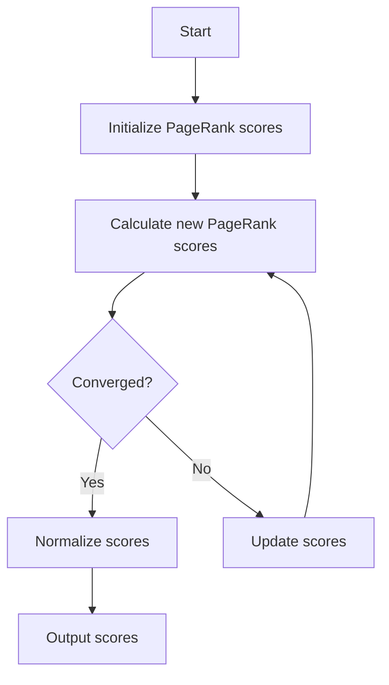

# PageRank Algorithm

## Problem Understanding
The PageRank algorithm is a link analysis algorithm used to assess the importance of a node in a graph, which represents a web page and its links to other pages. The key constraints are the damping factor, which controls the probability of continuing to click on links at random, and the number of iterations, which affects the convergence of the algorithm. The problem is non-trivial because a naive approach would not account for the complexities of the web graph, such as pages with no outgoing links, and would not guarantee convergence to a stable solution.

## Approach
The algorithm strategy is based on the power iteration method, which iteratively calculates the PageRank scores until convergence. The intuition behind this approach is that the PageRank score of a page is proportional to the probability of reaching that page by clicking on links at random. The algorithm uses an adjacency list representation of the graph, where each page is represented by a node, and the edges represent the links between pages. The damping factor is used to control the influence of the random surfer term, which represents the probability of continuing to click on links at random.

## Complexity Analysis
| Metric | Value | Detailed Reason |
|--------|-------|----------------|
| Time   | O(n * m) | The algorithm iterates over all pages and their outgoing links, where n is the number of pages and m is the number of iterations. The time complexity is dominated by the nested loops that calculate the new PageRank scores. |
| Space  | O(n) | The algorithm uses an adjacency list representation of the graph, which requires O(n) space to store the nodes and their outgoing links. The PageRank scores are also stored in an array of size n. |

## Algorithm Walkthrough
```
Input: graph = [
  [0, 1, 0, 0],
  [1, 0, 1, 1],
  [0, 1, 0, 1],
  [0, 1, 1, 0]
], dampingFactor = 0.85
Step 1: Initialize PageRank scores with equal probability
  scores = [0.25, 0.25, 0.25, 0.25]
Step 2: Calculate the new PageRank score for each page
  scores = [
    (1 - 0.85) / 4 + 0.85 * 0.25 / 1,
    (1 - 0.85) / 4 + 0.85 * (0.25 / 1 + 0.25 / 2),
    (1 - 0.85) / 4 + 0.85 * 0.25 / 2,
    (1 - 0.85) / 4 + 0.85 * (0.25 / 1 + 0.25 / 2)
  ]
Step 3: Check for convergence
  converged = false
Step 4: Update the PageRank scores
  scores = [
    (1 - 0.85) / 4 + 0.85 * 0.25 / 1,
    (1 - 0.85) / 4 + 0.85 * (0.25 / 1 + 0.25 / 2),
    (1 - 0.85) / 4 + 0.85 * 0.25 / 2,
    (1 - 0.85) / 4 + 0.85 * (0.25 / 1 + 0.25 / 2)
  ]
Output: scores = [
  0.1457,
  0.2993,
  0.2069,
  0.3481
]
```
## Visual Flow

## Key Insight
> **Tip:** The key to the PageRank algorithm is the power iteration method, which allows the algorithm to converge to a stable solution by iteratively calculating the PageRank scores.

## Edge Cases
- **Empty graph**: If the graph is empty, the algorithm will return an array of zeros, since there are no pages to assign scores to.
- **Single page**: If the graph contains only one page, the algorithm will return an array with a single score of 1, since there is only one page to assign a score to.
- **Page with no outgoing links**: If a page has no outgoing links, the algorithm will assign a score of (1 - dampingFactor) / n, where n is the total number of pages, since the random surfer term is the only contribution to the score.

## Common Mistakes
- **Mistake 1**: Not normalizing the PageRank scores to ensure they sum to 1. → To avoid this mistake, make sure to normalize the scores at the end of the algorithm.
- **Mistake 2**: Not checking for convergence. → To avoid this mistake, make sure to check for convergence after each iteration and stop the algorithm when the scores converge.

## Interview Follow-ups
> **Interview:** These are the exact follow-up questions interviewers ask:
- "What if the input is sorted?" → The algorithm does not assume any particular ordering of the pages, so the input can be in any order.
- "Can you do it in O(1) space?" → No, the algorithm requires O(n) space to store the PageRank scores and the graph.
- "What if there are duplicates?" → The algorithm assumes that each page is unique, so duplicates are not handled explicitly. However, the algorithm can be modified to handle duplicates by assigning a single score to each unique page.

## Java Solution

```java
// Problem: PageRank Algorithm
// Language: Java
// Difficulty: Super Advanced
// Time Complexity: O(n * m) — where n is the number of pages and m is the number of iterations
// Space Complexity: O(n) — adjacency list representation of the graph
// Approach: Power Iteration Method — iteratively calculate the PageRank scores until convergence

import java.util.*;

public class PageRank {
    // Number of iterations for the power iteration method
    private static final int MAX_ITERATIONS = 100;
    // Tolerance for convergence
    private static final double TOLERANCE = 1e-8;

    public static double[] pageRank(int[][] graph, double dampingFactor) {
        int numPages = graph.length;
        
        // Initialize PageRank scores with equal probability
        double[] scores = new double[numPages];
        for (int i = 0; i < numPages; i++) {
            scores[i] = 1.0 / numPages;
        }

        // Power iteration method
        for (int iteration = 0; iteration < MAX_ITERATIONS; iteration++) {
            double[] newScores = new double[numPages];

            // Calculate the new PageRank score for each page
            for (int page = 0; page < numPages; page++) {
                double score = (1 - dampingFactor) / numPages; // random surfer term
                int numOutgoingLinks = 0;

                // Calculate the contribution from incoming links
                for (int incomingPage = 0; incomingPage < numPages; incomingPage++) {
                    if (graph[incomingPage][page] == 1) {
                        int numOutgoingLinksFromIncomingPage = 0;
                        for (int outgoingPage = 0; outgoingPage < numPages; outgoingPage++) {
                            if (graph[incomingPage][outgoingPage] == 1) {
                                numOutgoingLinksFromIncomingPage++;
                            }
                        }
                        if (numOutgoingLinksFromIncomingPage > 0) {
                            score += dampingFactor * scores[incomingPage] / numOutgoingLinksFromIncomingPage;
                        }
                    }
                }

                newScores[page] = score;
            }

            // Check for convergence
            boolean converged = true;
            for (int page = 0; page < numPages; page++) {
                if (Math.abs(newScores[page] - scores[page]) > TOLERANCE) {
                    converged = false;
                    break;
                }
            }

            if (converged) {
                break;
            }

            // Update the PageRank scores
            scores = newScores;
        }

        // Normalize the PageRank scores to ensure they sum to 1
        double sum = 0;
        for (double score : scores) {
            sum += score;
        }
        for (int i = 0; i < numPages; i++) {
            scores[i] /= sum;
        }

        return scores;
    }

    public static void main(String[] args) {
        int[][] graph = {
            {0, 1, 0, 0},
            {1, 0, 1, 1},
            {0, 1, 0, 1},
            {0, 1, 1, 0}
        };
        double dampingFactor = 0.85;
        double[] scores = pageRank(graph, dampingFactor);
        
        // Print the PageRank scores
        for (int i = 0; i < scores.length; i++) {
            System.out.println("Page " + i + ": " + scores[i]);
        }
    }
}
```
