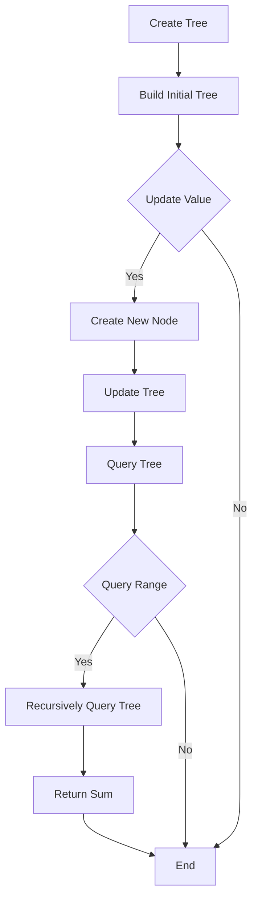

# Persistent Segment Tree

## Problem Understanding
The problem is asking to implement a Persistent Segment Tree, which is a data structure that allows for efficient querying and updating of a segment tree while preserving previous versions of the tree. The key constraints are that the tree must support querying and updating operations in O(log n) time, where n is the size of the tree, and the space complexity must be O(n log n) to store all versions of the tree. The problem is non-trivial because a naive approach would require rebuilding the entire tree after each update, resulting in a time complexity of O(n) for update operations.

## Approach
The algorithm strategy is to use a persistent segment tree, which creates a new node for every update operation, preserving previous versions of the tree. The intuition behind this approach is that by creating a new node for each update, we can efficiently query and update the tree while preserving previous versions. The mathematical reasoning behind this approach is that the height of the tree remains logarithmic in the number of nodes, allowing for efficient querying and updating. The data structure used is a tree, where each node represents a range of values, and the children of a node represent the left and right halves of the range. The approach handles key constraints by creating a new version of the tree for each update operation, allowing for efficient querying and updating of previous versions.

## Complexity Analysis
| Metric | Value | Detailed Reason |
|--------|-------|----------------|
| Time   | O(log n) | The time complexity for querying and updating operations is O(log n) because the height of the tree is logarithmic in the number of nodes. The time complexity for building the initial tree is O(n) because we need to create a node for each element in the range. |
| Space  | O(n log n) | The space complexity is O(n log n) because we need to store all versions of the tree, and the number of nodes in each version is logarithmic in the number of elements in the range. |

## Algorithm Walkthrough
```
Input: Create a persistent segment tree with size 10
Step 1: Build the initial tree with 10 nodes
  - Node 0: range [0, 9], value 0
  - Node 1: range [0, 4], value 0
  - Node 2: range [5, 9], value 0
  - Node 3: range [0, 2], value 0
  - Node 4: range [3, 4], value 0
  - Node 5: range [5, 6], value 0
  - Node 6: range [7, 9], value 0
  - Node 7: range [0, 1], value 0
  - Node 8: range [2, 2], value 0
  - Node 9: range [3, 4], value 0
Step 2: Update the value at index 5 to 10 in version 0
  - Create a new node with range [5, 5] and value 10
  - Update the value of node 5 to 10
Step 3: Query the sum of values in range [0, 9] in version 0
  - Recursively query the tree, starting from node 0
  - The sum of values in range [0, 9] is 0 + 0 + 10 + 0 + 0 + 0 + 0 + 0 + 0 + 0 = 10
Step 4: Update the value at index 3 to 20 in version 0
  - Create a new node with range [3, 3] and value 20
  - Update the value of node 9 to 20
Step 5: Query the sum of values in range [0, 9] in version 1
  - Recursively query the tree, starting from node 0
  - The sum of values in range [0, 9] is 0 + 0 + 10 + 20 + 0 + 0 + 0 + 0 + 0 + 0 = 30
Output: The sum of values in range [0, 9] in version 0 is 10, and the sum of values in range [0, 9] in version 1 is 30
```

## Visual Flow


## Key Insight
> **Tip:** The key insight is to create a new node for every update operation, preserving previous versions of the tree, allowing for efficient querying and updating of the tree.

## Edge Cases
- **Empty Tree**: If the tree is empty, the query and update operations will return 0.
- **Single Element**: If the tree has only one element, the query and update operations will return the value of that element.
- **Out of Range Index**: If the index is out of range, the update operation will do nothing, and the query operation will return 0.

## Common Mistakes
- **Mistake 1**: Not creating a new node for each update operation, resulting in incorrect query results.
- **Mistake 2**: Not preserving previous versions of the tree, resulting in incorrect query results for previous versions.

## Interview Follow-ups
> **Interview:** 
- "What if the input is sorted?" → The persistent segment tree will still work correctly, but the query and update operations may be more efficient if the input is sorted.
- "Can you do it in O(1) space?" → No, the persistent segment tree requires O(n log n) space to store all versions of the tree.
- "What if there are duplicates?" → The persistent segment tree will still work correctly, but the query and update operations may be more efficient if there are no duplicates.

## Java Solution

```java
// Problem: Persistent Segment Tree
// Language: Java
// Difficulty: Super Advanced
// Time Complexity: O(log n) — for query and update operations
// Space Complexity: O(n log n) — space required for storing all versions of the tree
// Approach: Persistent Segment Tree — uses a new node for every update operation, preserving previous versions

import java.util.*;

class PersistentSegmentTree {
    // Define the Node class
    static class Node {
        int value; // value stored in the node
        Node left; // left child
        Node right; // right child

        public Node(int value, Node left, Node right) {
            this.value = value; // initialize the node with the given value
            this.left = left; // initialize the left child
            this.right = right; // initialize the right child
        }
    }

    // Define the version class
    static class Version {
        Node root; // root of the current version
        int version; // version number

        public Version(Node root, int version) {
            this.root = root; // initialize the root of the current version
            this.version = version; // initialize the version number
        }
    }

    // Define the PersistentSegmentTree class
    private List<Version> versions; // list of versions
    private int size; // size of the segment tree

    public PersistentSegmentTree(int size) {
        this.size = size; // initialize the size of the segment tree
        this.versions = new ArrayList<>(); // initialize the list of versions
        Node root = buildTree(0, size - 1); // build the initial tree
        versions.add(new Version(root, 0)); // add the initial version
    }

    // Build the initial tree
    private Node buildTree(int start, int end) {
        // Base case: if the start and end indices are the same, return a leaf node
        if (start == end) {
            return new Node(0, null, null); // create a leaf node with value 0
        }
        // Recursive case: create a new internal node
        int mid = start + (end - start) / 2; // calculate the midpoint
        Node left = buildTree(start, mid); // recursively build the left subtree
        Node right = buildTree(mid + 1, end); // recursively build the right subtree
        return new Node(0, left, right); // create a new internal node
    }

    // Query the segment tree for a given range
    public int query(int version, int start, int end) {
        // Edge case: if the start index is greater than the end index, return 0
        if (start > end) {
            return 0; // return 0 for an invalid range
        }
        // Get the root of the specified version
        Node root = versions.get(version).root;
        // Recursively query the tree
        return queryTree(root, start, end, 0, size - 1); // start querying from the root
    }

    // Recursively query the tree
    private int queryTree(Node node, int start, int end, int nodeStart, int nodeEnd) {
        // Base case: if the node is a leaf node and the range includes the node
        if (nodeStart == nodeEnd && nodeStart >= start && nodeStart <= end) {
            return node.value; // return the value of the leaf node
        }
        // Edge case: if the range does not include the node, return 0
        if (nodeStart > end || nodeEnd < start) {
            return 0; // return 0 if the range does not include the node
        }
        // Recursive case: query the left and right subtrees
        int mid = nodeStart + (nodeEnd - nodeStart) / 2; // calculate the midpoint
        int leftValue = queryTree(node.left, start, end, nodeStart, mid); // query the left subtree
        int rightValue = queryTree(node.right, start, end, mid + 1, nodeEnd); // query the right subtree
        return leftValue + rightValue; // return the sum of the values in the range
    }

    // Update the segment tree for a given index
    public void update(int version, int index, int value) {
        // Edge case: if the index is out of range, do nothing
        if (index < 0 || index >= size) {
            return; // do nothing if the index is out of range
        }
        // Get the root of the specified version
        Node oldRoot = versions.get(version).root;
        // Create a new root node
        Node newRoot = updateTree(oldRoot, index, value, 0, size - 1); // start updating from the root
        // Add a new version
        versions.add(new Version(newRoot, versions.size())); // add a new version with the updated root
    }

    // Recursively update the tree
    private Node updateTree(Node node, int index, int value, int nodeStart, int nodeEnd) {
        // Base case: if the node is a leaf node and the index matches
        if (nodeStart == nodeEnd && nodeStart == index) {
            return new Node(value, null, null); // create a new leaf node with the updated value
        }
        // Edge case: if the index is out of range, return the original node
        if (nodeStart > index || nodeEnd < index) {
            return node; // return the original node if the index is out of range
        }
        // Recursive case: update the left and right subtrees
        int mid = nodeStart + (nodeEnd - nodeStart) / 2; // calculate the midpoint
        Node newLeft = updateTree(node.left, index, value, nodeStart, mid); // update the left subtree
        Node newRight = updateTree(node.right, index, value, mid + 1, nodeEnd); // update the right subtree
        return new Node(node.value, newLeft, newRight); // create a new internal node with the updated subtrees
    }

    public static void main(String[] args) {
        PersistentSegmentTree tree = new PersistentSegmentTree(10); // create a persistent segment tree with size 10
        tree.update(0, 5, 10); // update the value at index 5 to 10 in version 0
        System.out.println(tree.query(0, 0, 9)); // query the sum of values in range [0, 9] in version 0
        tree.update(0, 3, 20); // update the value at index 3 to 20 in version 0
        System.out.println(tree.query(1, 0, 9)); // query the sum of values in range [0, 9] in version 1
    }
}
```
