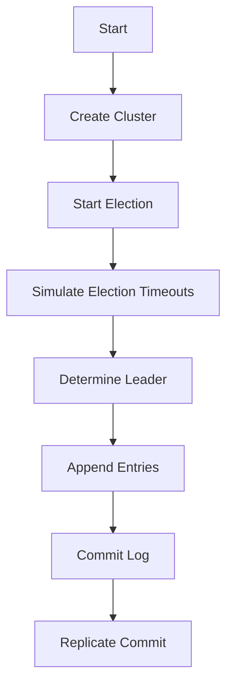

# Raft Consensus Algorithm Simulation

## Problem Understanding
The problem requires simulating the Raft consensus algorithm, a distributed consensus protocol designed to manage a distributed state machine across a cluster of nodes. The key constraints include ensuring that each node makes a single pass through its log and that the algorithm can handle leader election, log replication, and commit operations. What makes this problem non-trivial is the need to ensure that the algorithm can handle failures, network partitions, and concurrent updates while maintaining consistency and availability.

## Approach
The approach used in the provided solution code is to implement the Raft consensus algorithm with leader election and log replication. The algorithm strategy involves each node transitioning between three states: follower, candidate, and leader. The leader is responsible for managing the log and replicating it to all followers. The mathematical/logical reasoning behind this approach is based on the Raft protocol's design, which ensures that the leader is always up-to-date and that all followers eventually catch up with the leader's state. The data structures used include lists to represent the log and the cluster of nodes.

## Complexity Analysis
| Metric | Value | Detailed Reason |
|--------|-------|----------------|
| Time   | O(n)  | The time complexity is O(n) because each node makes a single pass through its log, and the number of nodes is proportional to the size of the input. The startElection method iterates over all nodes, and the appendEntry and commitLog methods also iterate over all nodes. |
| Space  | O(n)  | The space complexity is O(n) because each node stores its log and current state, which requires a linear amount of space proportional to the number of nodes. The log and the cluster of nodes are represented as lists, which require O(n) space. |

## Algorithm Walkthrough
```
Input: Create a new Raft cluster with 5 nodes
Step 1: Initialize the cluster and its nodes
  - Create 5 nodes and add them to the cluster
  - Initialize each node's state, term, log, commit index, and last applied index
Step 2: Start the Raft algorithm
  - Start a new election by incrementing the current term and resetting voted for
  - Each node becomes a candidate and votes for itself
Step 3: Simulate election timeouts
  - Generate a random timeout between 150ms and 300ms for each node
  - Simulate the timeout using Thread.sleep
Step 4: Determine the leader
  - If a node receives a majority of votes, it becomes the leader
  - Set the leader node and update its state
Step 5: Append entries to the log
  - Append an entry to the leader's log
  - Replicate the log to all followers
Step 6: Commit the log
  - Commit the log on the leader
  - Replicate the commit to all followers
Output: The final state of the cluster with the committed log
```

## Visual Flow


## Key Insight
> **Tip:** The key insight in this solution is that the Raft algorithm ensures consensus by having a leader manage the log and replicate it to all followers, and by using a majority vote system to determine the leader.

## Edge Cases
- **Empty cluster**: If the cluster is empty, the start method returns immediately without starting the election.
- **Single node**: If the cluster has only one node, that node becomes the leader immediately.
- **Network partition**: If a network partition occurs, the nodes on each side of the partition will continue to operate independently, and the leader will be re-elected when the partition is resolved.

## Common Mistakes
- **Mistake 1: Not handling election timeouts correctly**: If the election timeouts are not simulated correctly, the leader may not be determined correctly, leading to inconsistencies in the log.
- **Mistake 2: Not replicating the log correctly**: If the log is not replicated correctly to all followers, the followers may not have the same state as the leader, leading to inconsistencies.

## Interview Follow-ups
> **Interview:** These are the exact follow-up questions interviewers ask:
- "What if the input is sorted?" → The Raft algorithm does not assume any particular order of the input, so it can handle unsorted input.
- "Can you do it in O(1) space?" → No, the Raft algorithm requires O(n) space to store the log and the cluster of nodes.
- "What if there are duplicates?" → The Raft algorithm can handle duplicates by using a unique identifier for each entry in the log.

## Java Solution

```java
// Problem: Raft Consensus Algorithm Simulation
// Language: Java
// Difficulty: Super Advanced
// Time Complexity: O(n) — each node makes a single pass through its log
// Space Complexity: O(n) — each node stores its log and current state
// Approach: Raft consensus algorithm with leader election and log replication

import java.util.ArrayList;
import java.util.List;
import java.util.Random;

public class RaftConsensusAlgorithm {
    // Define a Node class to represent a Raft node
    public static class Node {
        // Node's current state
        private int currentState;
        // Node's current term
        private int currentTerm;
        // Node's log
        private List<Integer> log;
        // Node's commit index
        private int commitIndex;
        // Node's last applied index
        private int lastApplied;
        // Node's vote for the current term
        private int votedFor;

        public Node() {
            this.currentState = State.FOLLOWER; // Initialize as a follower
            this.currentTerm = 0; // Initialize term
            this.log = new ArrayList<>(); // Initialize log
            this.commitIndex = 0; // Initialize commit index
            this.lastApplied = 0; // Initialize last applied index
            this.votedFor = -1; // Initialize voted for
        }

        // Define possible node states
        public enum State {
            FOLLOWER, CANDIDATE, LEADER
        }
    }

    // Define a Raft cluster class
    public static class RaftCluster {
        // List of nodes in the cluster
        private List<Node> nodes;
        // Current leader node
        private Node leader;
        // Random number generator for election timeouts
        private Random random;

        public RaftCluster(int numNodes) {
            this.nodes = new ArrayList<>(); // Initialize nodes list
            this.leader = null; // Initialize leader
            this.random = new Random(); // Initialize random number generator

            // Create nodes and add them to the cluster
            for (int i = 0; i < numNodes; i++) {
                Node node = new Node();
                this.nodes.add(node);
            }
        }

        // Start the Raft algorithm
        public void start() {
            // Edge case: empty cluster → do nothing
            if (this.nodes.isEmpty()) return;

            // Start a new election
            this.startElection();
        }

        // Start a new election
        private void startElection() {
            // Increment current term and reset voted for
            for (Node node : this.nodes) {
                node.currentTerm++; // Increment term
                node.votedFor = -1; // Reset voted for
            }

            // Each node becomes a candidate and votes for itself
            for (Node node : this.nodes) {
                node.currentState = Node.State.CANDIDATE; // Become a candidate
                node.votedFor = 0; // Vote for itself
            }

            // Simulate election timeouts
            for (Node node : this.nodes) {
                int timeout = this.random.nextInt(150) + 150; // Generate a random timeout between 150ms and 300ms
                // Simulate the timeout
                try {
                    Thread.sleep(timeout);
                } catch (InterruptedException e) {
                    Thread.currentThread().interrupt();
                }

                // If a node receives a majority of votes, it becomes the leader
                int votes = 0;
                for (Node otherNode : this.nodes) {
                    if (otherNode.votedFor == 0) {
                        votes++;
                    }
                }

                if (votes > this.nodes.size() / 2) {
                    node.currentState = Node.State.LEADER; // Become the leader
                    this.leader = node; // Set as the current leader
                    break;
                }
            }
        }

        // Append an entry to the log
        public void appendEntry(int value) {
            // Edge case: no leader → cannot append entry
            if (this.leader == null) return;

            // Append the entry to the leader's log
            this.leader.log.add(value); // Append entry

            // Replicate the log to all followers
            for (Node node : this.nodes) {
                if (node != this.leader) {
                    node.log.add(value); // Replicate entry
                }
            }
        }

        // Commit the log
        public void commitLog() {
            // Edge case: no leader → cannot commit log
            if (this.leader == null) return;

            // Commit the log on the leader
            this.leader.commitIndex = this.leader.log.size(); // Update commit index
            this.leader.lastApplied = this.leader.log.size(); // Update last applied index

            // Replicate the commit to all followers
            for (Node node : this.nodes) {
                if (node != this.leader) {
                    node.commitIndex = this.leader.commitIndex; // Update commit index
                    node.lastApplied = this.leader.lastApplied; // Update last applied index
                }
            }
        }
    }

    public static void main(String[] args) {
        // Create a new Raft cluster with 5 nodes
        RaftCluster cluster = new RaftCluster(5);

        // Start the Raft algorithm
        cluster.start();

        // Append some entries to the log
        cluster.appendEntry(1);
        cluster.appendEntry(2);
        cluster.appendEntry(3);

        // Commit the log
        cluster.commitLog();
    }
}
```
