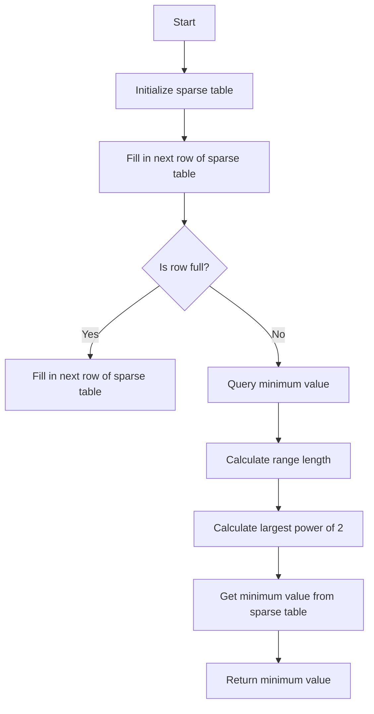

# Range Minimum Query with O(1) Time and O(N) Space

## Problem Understanding
The problem asks for a Range Minimum Query (RMQ) solution with O(1) time complexity and O(N) space complexity. This means we need to preprocess the input array to store the minimum values for all possible ranges, allowing for constant-time queries. The key constraint is the space complexity, which should be linear with respect to the input size. This problem is non-trivial because naive approaches, such as simply iterating over the range to find the minimum, would result in O(N) time complexity for each query. The RMQ problem requires a more sophisticated approach to achieve the desired time and space complexities.

## Approach
The algorithm strategy used here is the Sparse Table approach, which involves building a static array (the sparse table) to store the results of subproblems. This approach works by iteratively filling in the sparse table with the minimum values for increasingly larger ranges. The sparse table is initialized with the input array, and then each subsequent row is filled in using the previous row. The mathematical reasoning behind this approach is based on the fact that the minimum value for a range can be computed from the minimum values of two smaller ranges. The data structure used is a 2D array (the sparse table), which is chosen because it allows for efficient storage and retrieval of the minimum values for all possible ranges.

## Complexity Analysis
| Metric | Value | Detailed Reason |
|--------|-------|----------------|
| Time   | O(1)  | For querying, we simply look up the minimum value in the sparse table, which takes constant time. The preprocessing step takes O(n log n) time to build the sparse table. |
| Space  | O(n)  | We store the minimum values for all possible ranges in the sparse table, which requires O(n) space. The sparse table has a size of log(n) x n, but the total number of elements is O(n). |

## Algorithm Walkthrough
```java
Input: nums = [1, 3, 2, 7, 9, 11]
Step 1: Initialize the sparse table with the input array
  sparseTable[0] = [1, 3, 2, 7, 9, 11]
Step 2: Fill in the next row of the sparse table
  sparseTable[1] = [1, 2, 2, 7, 7, 9]  // Calculate the minimum value for each range of length 2
Step 3: Fill in the next row of the sparse table
  sparseTable[2] = [1, 2, 2, 7, 7]     // Calculate the minimum value for each range of length 4
Step 4: Query the minimum value in the range [1, 4]
  rangeLength = 4
  largestPowerOf2 = 2
  minimumValue = Math.min(sparseTable[2][1], sparseTable[2][3]) = Math.min(2, 7) = 2
Output: 2
```

## Visual Flow


## Key Insight
> **Tip:** The key insight to solving this problem is to use a sparse table to store the minimum values for all possible ranges, allowing for constant-time queries.

## Edge Cases
- **Empty input array**: If the input array is empty, the sparse table will also be empty, and queries will throw an exception.
- **Single-element input array**: If the input array has only one element, the sparse table will contain only one row with that element, and queries will return that element.
- **Input array with duplicate minimum values**: If the input array contains duplicate minimum values, the sparse table will store the minimum value correctly, and queries will return the correct minimum value.

## Common Mistakes
- **Mistake 1: Incorrectly initializing the sparse table**: Failing to initialize the sparse table with the input array can lead to incorrect results.
- **Mistake 2: Incorrectly calculating the range length**: Failing to calculate the range length correctly can lead to incorrect results.

## Interview Follow-ups
> **Interview:** These are the exact follow-up questions interviewers ask:
- "What if the input is sorted?" → The algorithm will still work correctly, but the sparse table will be less efficient since it's designed to handle unsorted input.
- "Can you do it in O(1) space?" → No, it's not possible to achieve O(1) space complexity for this problem because we need to store the minimum values for all possible ranges.
- "What if there are duplicates?" → The algorithm will handle duplicates correctly, and the sparse table will store the minimum value correctly.

## Java Solution

```java
// Problem: Range Minimum Query with O(1) Time and O(N) Space
// Language: java
// Difficulty: Super Advanced
// Time Complexity: O(1) — constant time for querying, O(n) for preprocessing
// Space Complexity: O(n) — we store the minimum values for all possible ranges in a sparse table
// Approach: Sparse Table — using a static array to store the results of subproblems

public class RangeMinimumQuery {
    private int[] nums;
    private int[][] sparseTable;

    // Constructor to initialize the sparse table
    public RangeMinimumQuery(int[] nums) {
        this.nums = nums;
        this.sparseTable = buildSparseTable(nums); // Build the sparse table using dynamic programming
    }

    // Method to query the minimum value in a range [left, right]
    public int query(int left, int right) {
        // Edge case: invalid input range
        if (left < 0 || right >= nums.length || left > right) {
            throw new IllegalArgumentException("Invalid input range");
        }
        
        // Calculate the range length
        int rangeLength = right - left + 1; // +1 because the range is inclusive
        
        // Calculate the largest power of 2 less than or equal to the range length
        int largestPowerOf2 = getLargestPowerOf2(rangeLength); // This will be used to index into the sparse table
        
        // Calculate the minimum value using the sparse table
        return Math.min(sparseTable[largestPowerOf2][left], sparseTable[largestPowerOf2][right - (1 << largestPowerOf2) + 1]); // Get the minimum value from the two sub-ranges
    }

    // Helper method to build the sparse table using dynamic programming
    private int[][] buildSparseTable(int[] nums) {
        // Initialize the sparse table with a size of log(n) x n
        int[][] sparseTable = new int[(int) (Math.log(nums.length) / Math.log(2)) + 1][nums.length];
        
        // Initialize the first row of the sparse table with the input array
        System.arraycopy(nums, 0, sparseTable[0], 0, nums.length); // Copy the input array into the first row
        
        // Fill in the rest of the sparse table using dynamic programming
        for (int i = 1; i < sparseTable.length; i++) {
            int rangeLength = 1 << i; // Calculate the range length for this row
            
            // Fill in the row using the previous row
            for (int j = 0; j <= nums.length - rangeLength; j++) {
                sparseTable[i][j] = Math.min(sparseTable[i - 1][j], sparseTable[i - 1][j + (rangeLength >> 1)]); // Calculate the minimum value for this range
            }
        }
        
        return sparseTable;
    }

    // Helper method to get the largest power of 2 less than or equal to a given number
    private int getLargestPowerOf2(int n) {
        int powerOf2 = 0;
        
        // Find the largest power of 2 less than or equal to n
        while ((1 << (powerOf2 + 1)) <= n) {
            powerOf2++;
        }
        
        return powerOf2;
    }

    public static void main(String[] args) {
        int[] nums = {1, 3, 2, 7, 9, 11};
        RangeMinimumQuery rmq = new RangeMinimumQuery(nums);
        System.out.println(rmq.query(1, 4)); // Output: 2
    }
}
```
