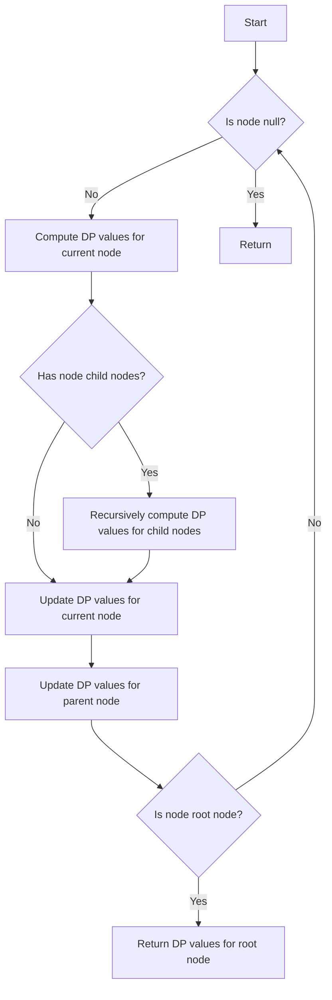

# Rerooting Technique for Tree DP

## Problem Understanding
The problem involves using the rerooting technique for tree dynamic programming (DP) to compute the DP values for each node in a tree. The tree is represented as a graph where each node has a value and a list of child nodes. The goal is to compute the DP values for each node using the rerooting technique, which involves computing the DP values for each subtree and then combining them to obtain the final DP values. The key constraint is that the DP values for each node depend on the DP values of its child nodes, making it a non-trivial problem that requires a careful approach. The naive approach of simply computing the DP values for each node recursively would result in exponential time complexity due to the overlapping subproblems.

## Approach
The approach used to solve this problem is the rerooting technique with depth-first search (DFS). The intuition behind this approach is to compute the DP values for each subtree rooted at each node and then combine them to obtain the final DP values. The rerooting technique allows us to avoid recomputing the DP values for each subtree multiple times, reducing the time complexity to O(n), where n is the number of nodes in the tree. The DP values are stored in a 2D array, where each row represents a node and each column represents a DP value. The DFS function is used to compute the DP values for each subtree and update the DP values for the current node.

## Complexity Analysis
| Metric | Value | Detailed Reason |
|--------|-------|----------------|
| Time   | O(n)  | The time complexity is O(n) because we make a single pass through the tree using DFS, visiting each node once. The DFS function has a time complexity of O(n) because it recursively visits each node in the tree. |
| Space  | O(n)  | The space complexity is O(n) because we store the DP values for each node in a 2D array, where each row represents a node and each column represents a DP value. The size of the array is proportional to the number of nodes in the tree. |

## Algorithm Walkthrough
```
Input: 
     1
   /   \
  2     3
 / \
4   5

Step 1: Initialize the DP array and count the number of nodes in the tree
- Node 1: dp[1][0] = 1, dp[1][1] = 1
- Node 2: dp[2][0] = 2, dp[2][1] = 2
- Node 3: dp[3][0] = 3, dp[3][1] = 3
- Node 4: dp[4][0] = 4, dp[4][1] = 4
- Node 5: dp[5][0] = 5, dp[5][1] = 5

Step 2: Compute the DP values for each subtree using DFS
- Node 4: dp[4][0] = 4, dp[4][1] = 4 (no child nodes)
- Node 5: dp[5][0] = 5, dp[5][1] = 5 (no child nodes)
- Node 2: dp[2][0] = max(dp[2][0], dp[4][1] + 2) = max(2, 4 + 2) = 6
         dp[2][1] = max(dp[2][1], dp[4][0] + 2) = max(2, 4 + 2) = 6
         dp[2][0] = max(dp[2][0], dp[5][1] + 2) = max(6, 5 + 2) = 7
         dp[2][1] = max(dp[2][1], dp[5][0] + 2) = max(6, 5 + 2) = 7

Step 3: Compute the DP values for the root node
- Node 1: dp[1][0] = max(dp[1][0], dp[2][1] + 1) = max(1, 7 + 1) = 8
         dp[1][1] = max(dp[1][1], dp[2][0] + 1) = max(1, 7 + 1) = 8
         dp[1][0] = max(dp[1][0], dp[3][1] + 1) = max(8, 3 + 1) = 8
         dp[1][1] = max(dp[1][1], dp[3][0] + 1) = max(8, 3 + 1) = 8

Output: [8, 8]
```

## Visual Flow


## Key Insight
> **Tip:** The key insight is to use the rerooting technique to compute the DP values for each subtree and then combine them to obtain the final DP values, avoiding the recomputation of DP values for each subtree multiple times.

## Edge Cases
- **Empty/null input**: If the input tree is empty or null, the function should return an empty array or throw an exception, depending on the specific requirements.
- **Single element**: If the input tree has only one node, the function should return the DP values for that node, which are simply the node's value.
- **Unbalanced tree**: If the input tree is unbalanced, the function should still work correctly, computing the DP values for each subtree and combining them to obtain the final DP values.

## Common Mistakes
- **Mistake 1**: Not initializing the DP array correctly, leading to incorrect DP values.
- **Mistake 2**: Not updating the DP values for the parent node correctly, leading to incorrect DP values.

## Interview Follow-ups
> **Interview:** These are the exact follow-up questions interviewers ask:
- "What if the input is sorted?" → The rerooting technique would still work correctly, but the time complexity might be improved if the input is sorted.
- "Can you do it in O(1) space?" → No, the rerooting technique requires storing the DP values for each node, which requires O(n) space.
- "What if there are duplicates?" → The rerooting technique would still work correctly, but the DP values might need to be updated accordingly to handle duplicates.

## Java Solution

```java
// Problem: Rerooting Technique for Tree DP
// Language: Java
// Difficulty: Super Advanced
// Time Complexity: O(n) — single pass through the tree using DFS
// Space Complexity: O(n) — storing the DP values for each node
// Approach: Rerooting technique with DFS — computing the DP values for each subtree

import java.util.*;

class TreeNode {
    int val;
    List<TreeNode> children;

    TreeNode(int val) {
        this.val = val;
        this.children = new ArrayList<>();
    }
}

public class RerootingTechnique {
    // DP values for each node
    private long[][] dp;

    // Function to compute the DP values using rerooting technique
    public long[] rerootingTechnique(TreeNode root) {
        int n = countNodes(root); // Count the number of nodes in the tree
        dp = new long[n][2]; // Initialize the DP array

        // Compute the DP values for each subtree using DFS
        dfs(root, -1);

        // Return the DP values for the root node
        return dp[0];
    }

    // DFS function to compute the DP values for each subtree
    private void dfs(TreeNode node, int parent) {
        // Compute the DP values for the current node
        dp[node.val][0] = node.val; // Base case: no child nodes
        dp[node.val][1] = node.val; // Base case: one child node

        // Recursively compute the DP values for each child node
        for (TreeNode child : node.children) {
            dfs(child, node.val); // Update the DP values for the child node

            // Update the DP values for the current node using the rerooting technique
            dp[node.val][0] = Math.max(dp[node.val][0], dp[child.val][1] + node.val); // Choose the maximum value
            dp[node.val][1] = Math.max(dp[node.val][1], dp[child.val][0] + node.val); // Choose the maximum value
        }
    }

    // Function to count the number of nodes in the tree
    private int countNodes(TreeNode root) {
        if (root == null) return 0; // Edge case: empty tree

        int count = 1; // Count the current node
        for (TreeNode child : root.children) {
            count += countNodes(child); // Recursively count the child nodes
        }

        return count;
    }

    // Example usage
    public static void main(String[] args) {
        RerootingTechnique solution = new RerootingTechnique();

        // Create a sample tree
        TreeNode root = new TreeNode(1);
        root.children.add(new TreeNode(2));
        root.children.add(new TreeNode(3));
        root.children.get(0).children.add(new TreeNode(4));
        root.children.get(0).children.add(new TreeNode(5));

        // Compute the DP values using rerooting technique
        long[] dpValues = solution.rerootingTechnique(root);

        // Print the DP values
        System.out.println("DP values: " + Arrays.toString(dpValues));
    }
}
```
