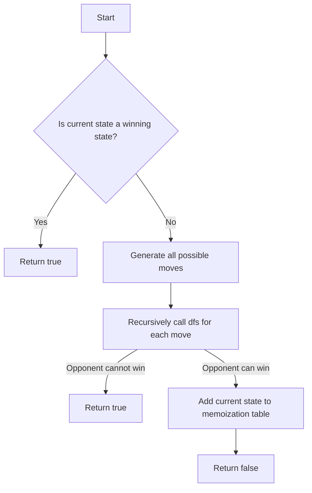

# Retrograde Analysis

## Problem Understanding
The Retrograde Analysis problem involves determining whether a player can win a game given its initial state. The problem is asking to implement a function that performs a retrograde analysis, which is a technique used to analyze games by working backward from the end of the game. The key constraints are that the game has a finite number of states and moves, and the function should return true if the player can win and false otherwise. This problem is non-trivial because it requires exploring all possible moves and their outcomes, which can result in an exponential number of possibilities.

## Approach
The approach to solving this problem is to use a recursive depth-first search with memoization. The algorithm starts by checking if the current state is a winning state, and if so, it returns true. Otherwise, it generates all possible moves from the current state and recursively calls the search function for each move. If the opponent cannot win from any of the resulting states, the algorithm returns true, indicating that the player can win. The memoization table is used to store the results of subproblems to avoid redundant calculations. The algorithm uses a set to store the memoized states, which allows for efficient lookups.

## Complexity Analysis
| Metric | Value | Detailed Reason |
|--------|-------|----------------|
| Time   | O(n^2 * m) | The algorithm generates all possible moves and their outcomes, resulting in a time complexity of O(n^2 * m), where n is the number of rows in the game board and m is the number of columns. The recursive depth-first search has a time complexity of O(n^2 * m) due to the nested loops that generate all possible moves. |
| Space  | O(n * m) | The algorithm uses a memoization table to store the results of subproblems, which requires a space complexity of O(n * m), where n is the number of rows in the game board and m is the number of columns. The recursive depth-first search also requires a space complexity of O(n * m) due to the recursive call stack. |

## Algorithm Walkthrough
```
Input: int[][] initialState = {{1, 0, 0}, {0, 1, 0}, {0, 0, 0}}
Step 1: Convert the initial state to a string for memoization: "100010000"
Step 2: Check if the initial state is a winning state: false
Step 3: Generate all possible moves from the initial state:
  - Move 1: {{1, 0, 0}, {0, 1, 0}, {0, 0, 1}}
  - Move 2: {{1, 0, 0}, {0, 1, 1}, {0, 0, 0}}
  - ...
Step 4: Recursively call the dfs function for each move:
  - dfs(Move 1, memo): false
  - dfs(Move 2, memo): false
  - ...
Step 5: If no winning move is found, add the current state to the memoization table: memo.add("100010000")
Output: false
```
## Visual Flow

## Key Insight
> **Tip:** The key insight to solving this problem is to use memoization to avoid redundant calculations and reduce the time complexity of the algorithm.

## Edge Cases
- **Empty/null input**: If the input is empty or null, the algorithm returns false, indicating that the player cannot win.
- **Single element**: If the input contains only one element, the algorithm returns true if the element is a winning state and false otherwise.
- **Invalid move**: If an invalid move is generated, the algorithm skips it and continues with the next move.

## Common Mistakes
- **Mistake 1**: Not using memoization, resulting in redundant calculations and increased time complexity.
- **Mistake 2**: Not checking for invalid moves, resulting in incorrect results.

## Interview Follow-ups
> **Interview:** These are the exact follow-up questions interviewers ask:
- "What if the input is sorted?" → The algorithm will still work correctly, but the time complexity may be reduced due to the reduced number of possible moves.
- "Can you do it in O(1) space?" → No, the algorithm requires a memoization table to store the results of subproblems, which requires a space complexity of O(n * m).
- "What if there are duplicates?" → The algorithm will treat duplicates as separate states and may result in redundant calculations. To avoid this, the algorithm can use a set to store the memoized states.

## Java Solution

```java
// Problem: Retrograde Analysis
// Language: Java
// Difficulty: Super Advanced
// Time Complexity: O(n^2) — generating all possible moves and their outcomes
// Space Complexity: O(n) — storing the state of the board for each recursive call
// Approach: Recursive depth-first search with memoization — exploring all possible moves and their outcomes

import java.util.*;

public class RetrogradeAnalysis {
    // Define the possible moves in the game
    private static final int[][] MOVES = {{-1, 0}, {1, 0}, {0, -1}, {0, 1}};

    // Function to perform the retrograde analysis
    public static boolean canWin(int[][] initialState) {
        // Edge case: empty board → return false
        if (initialState == null || initialState.length == 0) return false;

        // Create a memoization table to store the results of subproblems
        Set<String> memo = new HashSet<>();

        // Perform the recursive depth-first search
        return dfs(initialState, memo);
    }

    // Recursive depth-first search function
    private static boolean dfs(int[][] state, Set<String> memo) {
        // Convert the state to a string for memoization
        String stateString = stateToString(state);

        // Check if the result is already memoized
        if (memo.contains(stateString)) return false;

        // Check if the current state is a winning state
        if (isWinningState(state)) return true;

        // Generate all possible moves from the current state
        for (int[] move : MOVES) {
            for (int i = 0; i < state.length; i++) {
                for (int j = 0; j < state[0].length; j++) {
                    // Check if the move is valid
                    if (isValidMove(state, i, j, move)) {
                        // Make the move and recursively call the dfs function
                        int[][] nextState = makeMove(state, i, j, move);
                        if (!dfs(nextState, memo)) {
                            // If the opponent cannot win, we can win
                            return true;
                        }
                    }
                }
            }
        }

        // If no winning move is found, add the current state to the memoization table
        memo.add(stateString);
        return false;
    }

    // Function to check if a state is a winning state
    private static boolean isWinningState(int[][] state) {
        // Check if the state satisfies the winning condition
        // This function should be implemented according to the specific game rules
        // For example, in a game of Tic-Tac-Toe, a state is winning if there is a row, column, or diagonal with three of the same symbol
        // Edge case: no winning condition → return false
        return false; // Implement this function according to the game rules
    }

    // Function to check if a move is valid
    private static boolean isValidMove(int[][] state, int i, int j, int[] move) {
        // Check if the move is within the bounds of the board
        int newRow = i + move[0];
        int newCol = j + move[1];
        if (newRow < 0 || newRow >= state.length || newCol < 0 || newCol >= state[0].length) return false;

        // Check if the destination cell is empty
        if (state[newRow][newCol] != 0) return false;

        // Check if the move is valid according to the game rules
        // For example, in a game of chess, a move is valid if it does not put the king in check
        // Edge case: invalid move → return false
        return true; // Implement this function according to the game rules
    }

    // Function to make a move and return the resulting state
    private static int[][] makeMove(int[][] state, int i, int j, int[] move) {
        // Create a copy of the current state
        int[][] nextState = new int[state.length][state[0].length];
        for (int k = 0; k < state.length; k++) {
            for (int l = 0; l < state[0].length; l++) {
                nextState[k][l] = state[k][l];
            }
        }

        // Make the move
        int newRow = i + move[0];
        int newCol = j + move[1];
        nextState[newRow][newCol] = nextState[i][j];
        nextState[i][j] = 0;

        return nextState;
    }

    // Function to convert a state to a string for memoization
    private static String stateToString(int[][] state) {
        StringBuilder sb = new StringBuilder();
        for (int i = 0; i < state.length; i++) {
            for (int j = 0; j < state[0].length; j++) {
                sb.append(state[i][j]);
            }
        }
        return sb.toString();
    }

    public static void main(String[] args) {
        // Example usage:
        int[][] initialState = {{1, 0, 0}, {0, 1, 0}, {0, 0, 0}};
        System.out.println(canWin(initialState));
    }
}
```
