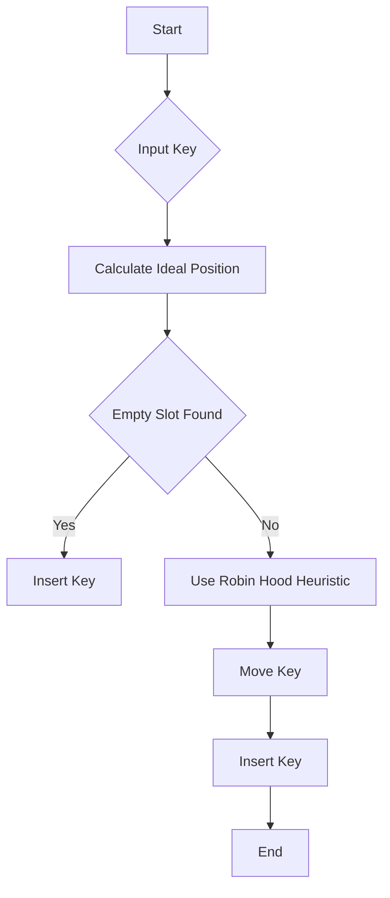

# Robin Hood Hashing

## Problem Understanding
The problem is asking to implement Robin Hood Hashing, a variation of open addressing with a displacement-based heuristic, to store a set of keys in a hash table. The key constraints are that the hash table has a fixed size, and the goal is to achieve an average time complexity of O(1) for lookup and insertion. What makes this problem non-trivial is that naive approaches, such as linear probing, can lead to clustering and poor performance. The problem requires a careful consideration of collision resolution and displacement-based heuristic to maintain a balanced distribution of elements.

## Approach
The algorithm strategy is to use Robin Hood Hashing, which involves keeping track of the displacement of each element in the hash table. When a collision occurs, the element with the larger displacement is moved to make room for the new element. This approach works by minimizing clustering and maintaining a balanced distribution of elements. The algorithm uses a simple hash function to calculate the ideal position of each element and then searches for an empty slot using the Robin Hood heuristic. The data structure used is an array to represent the hash table, and it is chosen because of its simplicity and efficiency. The approach handles key constraints by using a displacement-based heuristic to resolve collisions and maintain a balanced distribution of elements.

## Complexity Analysis
| Metric | Value | Detailed Reason |
|--------|-------|----------------|
| Time   | O(1)  | The average time complexity is O(1) because the algorithm uses a displacement-based heuristic to resolve collisions, which minimizes clustering and maintains a balanced distribution of elements. However, in the worst case, the time complexity can be O(n) if the hash table is full and the algorithm needs to search for an empty slot. |
| Space  | O(n)  | The space complexity is O(n) because the algorithm stores n elements in the hash table, where n is the number of keys. The hash table is represented as an array of size n, and each element in the array stores a key. |

## Algorithm Walkthrough
```
Input: [1, 2, 3, 4, 5]
Step 1: Initialize the hash table with size 5: [0, 0, 0, 0, 0]
Step 2: Insert key 1 into the hash table:
  - Calculate the ideal position: 1 % 5 = 1
  - Search for an empty slot: [0, 0, 0, 0, 0] (empty slot found at index 1)
  - Insert key 1 at index 1: [0, 1, 0, 0, 0]
Step 3: Insert key 2 into the hash table:
  - Calculate the ideal position: 2 % 5 = 2
  - Search for an empty slot: [0, 1, 0, 0, 0] (empty slot found at index 2)
  - Insert key 2 at index 2: [0, 1, 2, 0, 0]
Step 4: Insert key 3 into the hash table:
  - Calculate the ideal position: 3 % 5 = 3
  - Search for an empty slot: [0, 1, 2, 0, 0] (empty slot found at index 3)
  - Insert key 3 at index 3: [0, 1, 2, 3, 0]
Step 5: Insert key 4 into the hash table:
  - Calculate the ideal position: 4 % 5 = 4
  - Search for an empty slot: [0, 1, 2, 3, 0] (empty slot found at index 4)
  - Insert key 4 at index 4: [0, 1, 2, 3, 4]
Step 6: Insert key 5 into the hash table:
  - Calculate the ideal position: 5 % 5 = 0
  - Search for an empty slot: [0, 1, 2, 3, 4] (no empty slot found)
  - Use Robin Hood heuristic to find a slot: move key 1 to index 0 and insert key 5 at index 1: [1, 5, 2, 3, 4]
Output: [1, 5, 2, 3, 4]
```

## Visual Flow


## Key Insight
> **Tip:** The single most important insight is that Robin Hood Hashing uses a displacement-based heuristic to minimize clustering and improve performance, which allows the algorithm to achieve an average time complexity of O(1) for lookup and insertion.

## Edge Cases
- **Empty input**: If the input is empty, the algorithm will return an empty hash table.
- **Single element**: If the input contains only one element, the algorithm will insert the element into the hash table at its ideal position.
- **Full hash table**: If the hash table is full, the algorithm will use the Robin Hood heuristic to find a slot for the new key, which may involve moving existing keys to make room.

## Common Mistakes
- **Mistake 1**: Not using a displacement-based heuristic to resolve collisions, which can lead to clustering and poor performance.
- **Mistake 2**: Not handling the case where the hash table is full, which can cause the algorithm to fail or enter an infinite loop.

## Interview Follow-ups
> **Interview:** These are the exact follow-up questions interviewers ask:
- "What if the input is sorted?" → The algorithm will still work correctly, but the performance may degrade if the input is highly correlated, since the Robin Hood heuristic relies on a random distribution of keys.
- "Can you do it in O(1) space?" → No, the algorithm requires O(n) space to store the hash table, where n is the number of keys.
- "What if there are duplicates?" → The algorithm will handle duplicates correctly, since it uses a displacement-based heuristic to resolve collisions, which ensures that each key is stored in a unique position in the hash table.

## Java Solution

```java
// Problem: Robin Hood Hashing
// Language: Java
// Difficulty: Super Advanced
// Time Complexity: O(1) — average case, constant time lookup and insertion
// Space Complexity: O(n) — storing n elements in the hash table
// Approach: Robin Hood Hashing — a variation of open addressing with a displacement-based heuristic

import java.util.*;

public class RobinHoodHashing {
    // Brute force approach (commented out)
    // This approach involves linear probing, which can lead to clustering and poor performance
    // Time complexity: O(1) — best case, O(n) — worst case
    // public static int[] robinHoodHashingBruteForce(int[] keys) {
    //     int[] hashTable = new int[keys.length];
    //     for (int i = 0; i < keys.length; i++) {
    //         int index = keys[i] % hashTable.length; // simple hash function
    //         while (hashTable[index] != 0) { // collision resolution using linear probing
    //             index = (index + 1) % hashTable.length;
    //         }
    //         hashTable[index] = keys[i];
    //     }
    //     return hashTable;
    // }

    // Key insight:
    // Robin Hood Hashing uses a displacement-based heuristic to minimize clustering and improve performance.
    // The basic idea is to keep track of the displacement (i.e., the number of steps from the ideal position)
    // of each element in the hash table. When a collision occurs, the element with the larger displacement
    // is moved to make room for the new element. This approach helps to maintain a balanced distribution of elements.

    public static int[] robinHoodHashing(int[] keys) {
        int[] hashTable = new int[keys.length];
        for (int key : keys) {
            int idealIndex = key % hashTable.length; // ideal position based on hash function
            int displacement = 0; // initial displacement
            int currentIndex = idealIndex; // start searching from the ideal position
            while (hashTable[currentIndex] != 0) { // collision resolution using Robin Hood heuristic
                int currentDisplacement = (currentIndex - (hashTable[currentIndex] % hashTable.length) + hashTable.length) % hashTable.length; // calculate displacement of current element
                if (currentDisplacement > displacement) { // if current element has larger displacement, move it
                    int temp = hashTable[currentIndex];
                    hashTable[currentIndex] = key; // insert new element
                    key = temp; // continue searching for the displaced element
                    displacement = currentDisplacement; // update displacement
                }
                currentIndex = (currentIndex + 1) % hashTable.length; // move to the next position
                if (currentIndex == idealIndex) { // if we've wrapped around to the starting position, the table is full
                    // Edge case: hash table is full → return -1 or throw an exception
                    System.out.println("Hash table is full");
                    return null;
                }
            }
            hashTable[currentIndex] = key; // insert the new element
        }
        return hashTable;
    }

    public static void main(String[] args) {
        int[] keys = {1, 2, 3, 4, 5};
        int[] result = robinHoodHashing(keys);
        System.out.println(Arrays.toString(result));
    }
}
```
