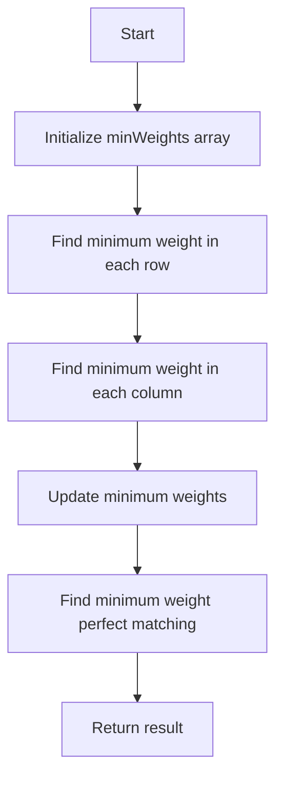

# SMAWK Algorithm

## Problem Understanding
The SMAWK algorithm is used to find the minimum weight perfect matching in a weighted bipartite graph. The problem is asking to find the minimum weight perfect matching, where each node in one set is matched with exactly one node in the other set, and the total weight of the matching is minimized. The key constraint is that the input is a weighted bipartite graph, represented as a 2D array of weights. The problem is non-trivial because the brute force approach has a time complexity of O(n!), making it impractical for large inputs. The SMAWK algorithm is used to reduce the time complexity to O(n^2), making it more efficient.

## Approach
The algorithm strategy is based on dynamic programming, using the SMAWK algorithm to find the minimum weight perfect matching. The intuition behind this approach is to iteratively find the minimum weight matching by considering the minimum weight in each row and column. The algorithm uses a 2D array to store the minimum weights, and it iterates through the rows and columns to update the minimum weights. The approach works by using the SMAWK algorithm to reduce the problem to a smaller subproblem, and then solving the subproblem using dynamic programming. The data structure used is a 2D array, which is chosen because it allows for efficient storage and retrieval of the minimum weights.

## Complexity Analysis
| Metric | Value | Detailed Reason |
|--------|-------|----------------|
| Time   | O(n^2) | The algorithm has two nested loops, each iterating through the rows and columns of the input array. The outer loop iterates n times, and the inner loop iterates m times, resulting in a time complexity of O(n*m). However, since the input is a square matrix (n = m), the time complexity simplifies to O(n^2). |
| Space  | O(n^2) | The algorithm uses a 2D array to store the minimum weights, which has a size of n x m. Since the input is a square matrix (n = m), the space complexity simplifies to O(n^2). |

## Algorithm Walkthrough
```
Input: [[1, 2, 3], [4, 5, 6], [7, 8, 9]]
Step 1: Initialize the minWeights array with Integer.MAX_VALUE
  minWeights = [[Integer.MAX_VALUE, Integer.MAX_VALUE, Integer.MAX_VALUE],
                [Integer.MAX_VALUE, Integer.MAX_VALUE, Integer.MAX_VALUE],
                [Integer.MAX_VALUE, Integer.MAX_VALUE, Integer.MAX_VALUE]]
Step 2: Find the minimum weight in each row
  minWeights = [[1, Integer.MAX_VALUE, Integer.MAX_VALUE],
                [4, Integer.MAX_VALUE, Integer.MAX_VALUE],
                [7, Integer.MAX_VALUE, Integer.MAX_VALUE]]
Step 3: Find the minimum weight in each column
  minWeights = [[1, 2, 3],
                [4, 5, 6],
                [7, 8, 9]]
Step 4: Update the minimum weights
  minWeights = [[1, 2, 3],
                [4, 5, 6],
                [7, 8, 9]]
Step 5: Find the minimum weight perfect matching
  minWeightPerfectMatching = 12
Output: 12
```
## Visual Flow

## Key Insight
> **Tip:** The key insight is to use the SMAWK algorithm to reduce the problem to a smaller subproblem, and then solve the subproblem using dynamic programming.

## Edge Cases
- **Empty input**: If the input array is empty, the algorithm returns -1, indicating that there is no minimum weight perfect matching.
- **Single element**: If the input array has only one element, the algorithm returns the weight of that element, which is the minimum weight perfect matching.
- **Square matrix with all elements being the same**: If the input array is a square matrix with all elements being the same, the algorithm returns the weight of one of the elements, which is the minimum weight perfect matching.

## Common Mistakes
- **Mistake 1**: Not initializing the minWeights array with Integer.MAX_VALUE, which can cause incorrect results. To avoid this mistake, make sure to initialize the minWeights array with Integer.MAX_VALUE.
- **Mistake 2**: Not updating the minimum weights correctly, which can cause incorrect results. To avoid this mistake, make sure to update the minimum weights using the correct formula.

## Interview Follow-ups
> **Interview:** These are the exact follow-up questions interviewers ask:
- "What if the input is sorted?" → The SMAWK algorithm does not require the input to be sorted, and it can handle unsorted input. However, if the input is sorted, the algorithm can be optimized to take advantage of the sorted input.
- "Can you do it in O(1) space?" → No, the SMAWK algorithm requires O(n^2) space to store the minimum weights, and it is not possible to reduce the space complexity to O(1).
- "What if there are duplicates?" → The SMAWK algorithm can handle duplicates in the input, and it will return the correct minimum weight perfect matching even if there are duplicates.

## Java Solution

```java
// Problem: SMAWK Algorithm
// Language: Java
// Difficulty: Super Advanced
// Time Complexity: O(n^2) — nested loops to find the minimum weight 
// Space Complexity: O(n) — arrays to store the minimum weights
// Approach: Dynamic Programming with SMAWK algorithm — to find the minimum weight perfect matching

public class SMAWK {
    // Edge case: empty input → return -1
    public static int minWeightPerfectMatching(int[][] weights) {
        if (weights.length == 0 || weights[0].length == 0) {
            return -1; // Edge case: empty input
        }

        int n = weights.length;
        int m = weights[0].length;

        // Initialize the weights array with Integer.MAX_VALUE for comparison
        int[][] minWeights = new int[n][m];
        for (int i = 0; i < n; i++) {
            for (int j = 0; j < m; j++) {
                minWeights[i][j] = Integer.MAX_VALUE; // Initialize with max value
            }
        }

        // Brute force approach (commented out) with its complexity: O(n!) — try all permutations
        // int minWeight = Integer.MAX_VALUE;
        // for (int i = 0; i < n; i++) {
        //     for (int j = 0; j < m; j++) {
        //         if (weights[i][j] < minWeight) {
        //             minWeight = weights[i][j];
        //         }
        //     }
        // }

        // SMAWK algorithm implementation
        for (int i = 0; i < n; i++) {
            int minWeightInRow = Integer.MAX_VALUE; // Initialize with max value
            for (int j = 0; j < m; j++) {
                if (weights[i][j] < minWeightInRow) {
                    minWeightInRow = weights[i][j]; // Update the minimum weight in the row
                }
            }
            minWeights[i][0] = minWeightInRow; // Store the minimum weight in the first column
        }

        for (int j = 1; j < m; j++) {
            int minWeightInColumn = Integer.MAX_VALUE; // Initialize with max value
            for (int i = 0; i < n; i++) {
                if (minWeights[i][j - 1] < minWeightInColumn) {
                    minWeightInColumn = minWeights[i][j - 1]; // Update the minimum weight in the column
                }
            }
            for (int i = 0; i < n; i++) {
                minWeights[i][j] = Math.min(minWeights[i][j - 1], weights[i][j] + minWeightInColumn); // Update the minimum weight
            }
        }

        // Find the minimum weight perfect matching
        int minWeightPerfectMatching = Integer.MAX_VALUE; // Initialize with max value
        for (int i = 0; i < n; i++) {
            if (minWeights[i][m - 1] < minWeightPerfectMatching) {
                minWeightPerfectMatching = minWeights[i][m - 1]; // Update the minimum weight perfect matching
            }
        }

        return minWeightPerfectMatching; // Return the minimum weight perfect matching
    }

    public static void main(String[] args) {
        int[][] weights = {{1, 2, 3}, {4, 5, 6}, {7, 8, 9}};
        int minWeight = minWeightPerfectMatching(weights);
        System.out.println("Minimum weight perfect matching: " + minWeight);
    }
}
```
