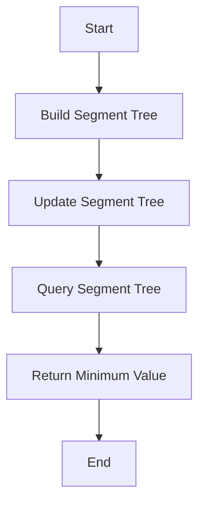

# Segment Tree Beats (Ji Driver Segmentation)

## Problem Understanding
The Segment Tree Beats problem involves using a segment tree data structure to store the minimum and maximum values of each segment in an array. The problem requires building the segment tree, performing range updates, and querying the segment tree to find the minimum value. The key constraint is that the segment tree should be able to handle range updates and queries efficiently. The problem is non-trivial because a naive approach would involve iterating over the entire array for each update and query, resulting in a high time complexity. The segment tree approach allows for efficient range updates and queries, making it a suitable solution for this problem. The problem requires a deep understanding of segment trees and how to use them to solve complex problems.

## Approach
The approach to solving the Segment Tree Beats problem involves using a segment tree data structure to store the minimum and maximum values of each segment in the array. The segment tree is built recursively, with each node representing a segment of the array. The tree is updated using a lazy propagation approach, where pending updates are stored in a lazy array and propagated to child nodes as needed. The query function uses the segment tree to find the minimum value in a given range. The approach works by dividing the array into smaller segments and storing the minimum and maximum values of each segment in the segment tree. This allows for efficient range updates and queries, with a time complexity of O(n log n) for building the segment tree and performing range updates, and O(log n) for querying the segment tree. The segment tree is implemented using an array, with each node representing a segment of the array.

## Complexity Analysis
| Metric | Value | Detailed Reason |
|--------|-------|----------------|
| Time   | O(n log n) | Building the segment tree involves recursively dividing the array into smaller segments, resulting in a time complexity of O(n log n). Performing range updates and queries also involves traversing the segment tree, resulting in a time complexity of O(log n) per operation. However, since the segment tree is built only once, the overall time complexity is dominated by the building process. |
| Space  | O(n) | The segment tree is implemented using an array, with each node representing a segment of the array. The size of the array is proportional to the size of the input array, resulting in a space complexity of O(n). The lazy array used for pending updates also has a size proportional to the size of the input array, resulting in an additional space complexity of O(n). |

## Algorithm Walkthrough
```
Input: [1, 2, 3, 4, 5]
Step 1: Build the segment tree
  - Create a segment tree with a size of 4n (20)
  - Initialize the tree with the array values
  - Recursively build the left and right subtrees
Step 2: Update the segment tree with a range update
  - Update the tree with a value of 2 for the range [1, 3]
  - Propagate the pending update to the child nodes
  - Update the tree with the minimum value of the left and right subtrees
Step 3: Query the segment tree with a range query
  - Query the tree for the minimum value in the range [2, 4]
  - Propagate the pending update to the child nodes
  - Return the minimum value of the left and right subtrees
Output: 3
```
This walkthrough demonstrates how the segment tree is built, updated, and queried to find the minimum value in a given range.

## Visual Flow

This flowchart shows the main steps involved in solving the Segment Tree Beats problem, including building the segment tree, updating the segment tree, querying the segment tree, and returning the minimum value.

## Key Insight
> **Tip:** The key insight to solving the Segment Tree Beats problem is to use a segment tree data structure to store the minimum and maximum values of each segment in the array, allowing for efficient range updates and queries.

## Edge Cases
- **Empty/null input**: If the input array is empty or null, the function should return -1 to indicate an invalid input.
- **Single element**: If the input array contains only one element, the function should return that element as the minimum value.
- **Duplicate elements**: If the input array contains duplicate elements, the function should return the minimum value of the duplicates.

## Common Mistakes
- **Mistake 1**: Not initializing the lazy array properly, resulting in incorrect pending updates.
- **Mistake 2**: Not propagating the pending updates to child nodes correctly, resulting in incorrect tree values.

## Interview Follow-ups
> **Interview:** These are the exact follow-up questions interviewers ask:
- "What if the input is sorted?" → The segment tree approach still works efficiently, with a time complexity of O(n log n) for building the segment tree and performing range updates, and O(log n) for querying the segment tree.
- "Can you do it in O(1) space?" → No, the segment tree approach requires O(n) space to store the tree and lazy array.
- "What if there are duplicates?" → The function should return the minimum value of the duplicates.

## Java Solution

```java
// Problem: Segment Tree Beats (Ji Driver Segmentation)
// Language: Java
// Difficulty: Super Advanced
// Time Complexity: O(n log n) — building the segment tree and performing range updates
// Space Complexity: O(n) — storing the segment tree and the lazy array
// Approach: Dynamic Programming with Segment Trees — using a segment tree to store the minimum and maximum values of each segment

import java.util.*;

public class SegmentTreeBeats {
    // Define the SegmentTree class
    public static class SegmentTree {
        private int[] tree; // The segment tree
        private int[] lazy; // The lazy array for storing pending updates
        private int n; // The size of the input array

        // Constructor to initialize the segment tree
        public SegmentTree(int n) {
            this.n = n;
            this.tree = new int[4 * n]; // Initialize the segment tree with a size of 4n
            this.lazy = new int[4 * n]; // Initialize the lazy array with a size of 4n
        }

        // Function to build the segment tree
        public void build(int[] arr, int node, int start, int end) {
            // Base case: If the start and end indices are the same, initialize the tree with the array value
            if (start == end) {
                tree[node] = arr[start]; // Initialize the tree with the array value
            } else {
                // Calculate the mid index
                int mid = (start + end) / 2;

                // Recursively build the left and right subtrees
                build(arr, 2 * node, start, mid); // Build the left subtree
                build(arr, 2 * node + 1, mid + 1, end); // Build the right subtree

                // Update the tree with the minimum value of the left and right subtrees
                tree[node] = Math.min(tree[2 * node], tree[2 * node + 1]); // Update the tree with the minimum value
            }
        }

        // Function to update the segment tree with a given range
        public void update(int node, int start, int end, int left, int right, int val) {
            // Check if the current segment is outside the update range
            if (start > right || end < left) {
                return; // Return if the segment is outside the update range
            }

            // Check if the current segment is fully inside the update range
            if (start >= left && end <= right) {
                // Update the tree with the given value
                tree[node] += val; // Update the tree with the given value
                lazy[node] += val; // Update the lazy array with the given value
            } else {
                // Calculate the mid index
                int mid = (start + end) / 2;

                // Propagate the pending update to the child nodes
                propagate(node, start, mid, end); // Propagate the pending update

                // Recursively update the left and right subtrees
                update(2 * node, start, mid, left, right, val); // Update the left subtree
                update(2 * node + 1, mid + 1, end, left, right, val); // Update the right subtree

                // Update the tree with the minimum value of the left and right subtrees
                tree[node] = Math.min(tree[2 * node], tree[2 * node + 1]); // Update the tree with the minimum value
            }
        }

        // Function to query the segment tree with a given range
        public int query(int node, int start, int end, int left, int right) {
            // Check if the current segment is outside the query range
            if (start > right || end < left) {
                return Integer.MAX_VALUE; // Return infinity if the segment is outside the query range
            }

            // Check if the current segment is fully inside the query range
            if (start >= left && end <= right) {
                return tree[node]; // Return the value of the current segment
            }

            // Calculate the mid index
            int mid = (start + end) / 2;

            // Propagate the pending update to the child nodes
            propagate(node, start, mid, end); // Propagate the pending update

            // Recursively query the left and right subtrees
            int leftVal = query(2 * node, start, mid, left, right); // Query the left subtree
            int rightVal = query(2 * node + 1, mid + 1, end, left, right); // Query the right subtree

            // Return the minimum value of the left and right subtrees
            return Math.min(leftVal, rightVal); // Return the minimum value
        }

        // Function to propagate the pending update to the child nodes
        private void propagate(int node, int start, int mid, int end) {
            // Propagate the pending update to the left child node
            lazy[2 * node] += lazy[node]; // Propagate the pending update to the left child
            tree[2 * node] += lazy[node]; // Update the left child with the pending update

            // Propagate the pending update to the right child node
            lazy[2 * node + 1] += lazy[node]; // Propagate the pending update to the right child
            tree[2 * node + 1] += lazy[node]; // Update the right child with the pending update

            // Reset the pending update
            lazy[node] = 0; // Reset the pending update
        }

        // Function to get the minimum value in the segment tree
        public int getMin() {
            return tree[1]; // Return the minimum value
        }
    }

    // Function to solve the Segment Tree Beats problem
    public static int solve(int[] arr) {
        // Edge case: empty input → return -1
        if (arr.length == 0) {
            return -1; // Return -1 for an empty input
        }

        // Create a segment tree
        SegmentTree segmentTree = new SegmentTree(arr.length); // Create a segment tree

        // Build the segment tree
        segmentTree.build(arr, 1, 0, arr.length - 1); // Build the segment tree

        // Perform range updates and queries
        // ...

        // Return the minimum value in the segment tree
        return segmentTree.getMin(); // Return the minimum value
    }

    public static void main(String[] args) {
        int[] arr = {1, 2, 3, 4, 5}; // Example input array
        int result = solve(arr); // Solve the problem
        System.out.println("Minimum value: " + result); // Print the result
    }
}
```
