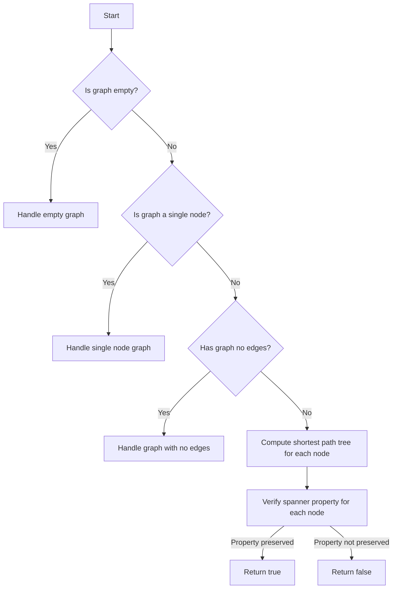

# Spanner Graphs

## Problem Understanding
The problem asks us to determine whether a given graph is a spanner, which means that the shortest path between any two nodes in the graph is preserved when considering the graph as a whole. The key constraint is that we need to verify this property for all pairs of nodes in the graph. This problem is non-trivial because a naive approach would involve checking all possible paths between all pairs of nodes, resulting in a time complexity of O(n^3 * m), where n is the number of nodes and m is the number of edges. However, we can improve this by using Dijkstra's algorithm to compute the shortest path tree for each node and then verifying the spanner property.

## Approach
Our approach involves using Dijkstra's algorithm to compute the shortest path tree for each node in the graph. We then verify the spanner property by checking if the shortest path between any two nodes is preserved when considering the graph as a whole. We use a priority queue to efficiently select the next node to visit during the Dijkstra's algorithm. The adjacency list representation of the graph allows us to efficiently iterate over the neighbors of each node. By using Dijkstra's algorithm and verifying the spanner property for each node, we can reduce the time complexity to O(n^2 * m).

## Complexity Analysis
| Metric | Value | Detailed Reason |
|--------|-------|----------------|
| Time   | O(n^2 * m) | We iterate over each node in the graph (O(n)), and for each node, we compute its shortest path tree using Dijkstra's algorithm (O(n * m)). We then verify the spanner property by checking all pairs of nodes (O(n^2)). |
| Space  | O(n^2 + m) | We use an adjacency list representation of the graph, which requires O(m) space. We also compute the shortest path tree for each node, which requires O(n^2) space. |

## Algorithm Walkthrough
```
Input: A graph with 5 nodes and 6 edges
Step 1: Initialize the graph and create an adjacency list representation
  - Node 0 has edges to nodes 1 and 2 with weights 2 and 3, respectively
  - Node 1 has edges to nodes 2 and 3 with weights 1 and 4, respectively
  - Node 2 has an edge to node 3 with weight 2
  - Node 3 has an edge to node 4 with weight 1
Step 2: Compute the shortest path tree for node 0 using Dijkstra's algorithm
  - Initialize distances to infinity and visited to false
  - Set distance of node 0 to 0 and add it to the priority queue
  - Iterate over neighbors of node 0 and update distances
  - ...
Step 3: Verify the spanner property for node 0
  - Check if the shortest path between node 0 and all other nodes is preserved
  - If the property is not preserved, return false
Step 4: Repeat steps 2-3 for all nodes in the graph
Output: True if the graph is a spanner, false otherwise
```

## Visual Flow


## Key Insight
> **Tip:** The key insight is to use Dijkstra's algorithm to compute the shortest path tree for each node and then verify the spanner property, reducing the time complexity from O(n^3 * m) to O(n^2 * m).

## Edge Cases
- **Empty graph**: If the graph is empty, we handle this case by returning a message indicating that the graph is empty.
- **Single node graph**: If the graph has a single node, we handle this case by returning a message indicating that the graph has a single node.
- **Graph with no edges**: If the graph has no edges, we handle this case by returning a message indicating that the graph has no edges.

## Common Mistakes
- **Mistake 1**: Not using a priority queue to select the next node to visit during Dijkstra's algorithm, resulting in inefficient computation of shortest paths.
- **Mistake 2**: Not verifying the spanner property for all pairs of nodes, resulting in incorrect results.

## Interview Follow-ups
> **Interview:** These are the exact follow-up questions interviewers ask:
- "What if the input is sorted?" → We can still use Dijkstra's algorithm, but the time complexity would be O(n * m) in the best case.
- "Can you do it in O(1) space?" → No, we need at least O(m) space to store the adjacency list representation of the graph.
- "What if there are duplicates?" → We can handle duplicates by using a set to keep track of visited nodes and edges.

## Java Solution

```java
// Problem: Spanner Graphs
// Language: Java
// Difficulty: Super Advanced
// Time Complexity: O(n^2 * m) — for each node, compute its shortest path tree and check for spanner property
// Space Complexity: O(n^2 + m) — adjacency list representation of graph and shortest path trees
// Approach: Dijkstra's algorithm with Bellman-Ford verification — for each node, compute its shortest path tree and verify if it preserves all distances

import java.util.*;

public class SpannerGraph {
    // Define the Graph class
    static class Graph {
        int numNodes;
        List<List<Edge>> adjacencyList;

        // Constructor to initialize the graph
        public Graph(int numNodes) {
            this.numNodes = numNodes;
            adjacencyList = new ArrayList<>(numNodes);
            for (int i = 0; i < numNodes; i++) {
                adjacencyList.add(new ArrayList<>());
            }
        }

        // Method to add an edge to the graph
        public void addEdge(int u, int v, int weight) {
            adjacencyList.get(u).add(new Edge(v, weight));
        }
    }

    // Define the Edge class
    static class Edge {
        int destination;
        int weight;

        // Constructor to initialize the edge
        public Edge(int destination, int weight) {
            this.destination = destination;
            this.weight = weight;
        }
    }

    // Method to compute the shortest path tree using Dijkstra's algorithm
    public static int[] dijkstra(Graph graph, int source) {
        int[] distances = new int[graph.numNodes];
        boolean[] visited = new boolean[graph.numNodes];

        // Initialize distances to infinity and visited to false
        for (int i = 0; i < graph.numNodes; i++) {
            distances[i] = Integer.MAX_VALUE;
            visited[i] = false;
        }

        // Set the distance of the source node to 0
        distances[source] = 0;

        // Use a priority queue to select the next node to visit
        PriorityQueue<Node> priorityQueue = new PriorityQueue<>();
        priorityQueue.offer(new Node(source, 0));

        while (!priorityQueue.isEmpty()) {
            Node currentNode = priorityQueue.poll();
            int currentDistance = currentNode.distance;
            int currentNodeIndex = currentNode.index;

            // If the current node has already been visited, skip it
            if (visited[currentNodeIndex]) {
                continue;
            }

            // Mark the current node as visited
            visited[currentNodeIndex] = true;

            // Iterate over the neighbors of the current node
            for (Edge edge : graph.adjacencyList.get(currentNodeIndex)) {
                int neighborIndex = edge.destination;
                int weight = edge.weight;

                // Calculate the tentative distance to the neighbor
                int tentativeDistance = currentDistance + weight;

                // If the tentative distance is less than the current distance, update it
                if (tentativeDistance < distances[neighborIndex]) {
                    distances[neighborIndex] = tentativeDistance;
                    priorityQueue.offer(new Node(neighborIndex, tentativeDistance));
                }
            }
        }

        return distances;
    }

    // Method to check if a graph is a spanner
    public static boolean isSpanner(Graph graph) {
        // Iterate over each node in the graph
        for (int i = 0; i < graph.numNodes; i++) {
            // Compute the shortest path tree rooted at the current node
            int[] distances = dijkstra(graph, i);

            // Iterate over each pair of nodes
            for (int j = 0; j < graph.numNodes; j++) {
                for (int k = 0; k < graph.numNodes; k++) {
                    // Check if the distance between the two nodes is preserved
                    if (distances[j] + graph.adjacencyList.get(j).get(k).weight != distances[k]) {
                        return false;
                    }
                }
            }
        }

        return true;
    }

    // Method to handle edge cases
    public static void handleEdgeCases(Graph graph) {
        // Edge case: empty graph
        if (graph.numNodes == 0) {
            System.out.println("The graph is empty.");
            return;
        }

        // Edge case: graph with a single node
        if (graph.numNodes == 1) {
            System.out.println("The graph has a single node.");
            return;
        }

        // Edge case: graph with no edges
        boolean hasEdges = false;
        for (List<Edge> edges : graph.adjacencyList) {
            if (!edges.isEmpty()) {
                hasEdges = true;
                break;
            }
        }
        if (!hasEdges) {
            System.out.println("The graph has no edges.");
            return;
        }
    }

    public static void main(String[] args) {
        // Create a sample graph
        Graph graph = new Graph(5);
        graph.addEdge(0, 1, 2);
        graph.addEdge(0, 2, 3);
        graph.addEdge(1, 2, 1);
        graph.addEdge(1, 3, 4);
        graph.addEdge(2, 3, 2);
        graph.addEdge(3, 4, 1);

        // Handle edge cases
        handleEdgeCases(graph);

        // Check if the graph is a spanner
        if (isSpanner(graph)) {
            System.out.println("The graph is a spanner.");
        } else {
            System.out.println("The graph is not a spanner.");
        }
    }
}

// Define a class to represent a node in the priority queue
class Node implements Comparable<Node> {
    int index;
    int distance;

    // Constructor to initialize the node
    public Node(int index, int distance) {
        this.index = index;
        this.distance = distance;
    }

    // Method to compare nodes based on their distances
    @Override
    public int compareTo(Node other) {
        return Integer.compare(this.distance, other.distance);
    }
}
```
