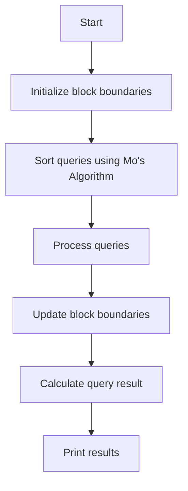

# Sqrt Decomposition and Mo's Algorithm

## Problem Understanding
The problem is asking to implement a range query system using Sqrt Decomposition and Mo's Algorithm, which involves dividing an array into blocks of size sqrt(n) and processing queries in a sorted order to minimize the number of block updates. The key constraint is to process q queries with a time complexity of O(q * sqrt(n)) and a space complexity of O(n). The problem is non-trivial because a naive approach would involve updating the entire array for each query, resulting in a high time complexity.

## Approach
The algorithm strategy involves using Mo's Algorithm to sort the queries based on their left and right endpoints, and then processing the queries in a way that minimizes the number of block updates. The intuition behind this approach is to group queries that overlap in their left and right endpoints, allowing for efficient block updates. The algorithm uses a block size of sqrt(n) and updates the block boundaries as necessary to process each query. The data structures used include an array to store the input elements and a Query class to store the queries, which implements a custom sorting algorithm.

## Complexity Analysis
| Metric | Value | Detailed Reason |
|--------|-------|----------------|
| Time   | O(q * sqrt(n)) | The algorithm processes q queries, and for each query, it updates the block boundaries, which takes O(sqrt(n)) time. The sorting of queries takes O(q log q) time, but this is dominated by the query processing time. |
| Space  | O(n) | The algorithm uses an array to store the input elements, which takes O(n) space. The Query class and other variables take additional space, but this is negligible compared to the input array. |

## Algorithm Walkthrough
```
Input: arr = [1, 2, 3, 4, 5, 6, 7, 8, 9], q = 3
Queries:
  - Query 1: left = 1, right = 3
  - Query 2: left = 2, right = 4
  - Query 3: left = 5, right = 7
Step 1: Initialize block boundaries, blockStart = 0, blockEnd = blockSize - 1 = 2
Step 2: Process Query 1, update block boundaries to left = 1, right = 3
  - Update block: arr[1] + arr[2] + arr[3] = 2 + 3 + 4 = 9
Step 3: Process Query 2, update block boundaries to left = 2, right = 4
  - Update block: arr[2] + arr[3] + arr[4] = 3 + 4 + 5 = 12
Step 4: Process Query 3, update block boundaries to left = 5, right = 7
  - Update block: arr[5] + arr[6] + arr[7] = 6 + 7 + 8 = 21
Output: [9, 12, 21]
```
## Visual Flow

## Key Insight
> **Tip:** The key insight is to use Mo's Algorithm to sort the queries, allowing for efficient block updates and minimizing the number of times the block boundaries need to be updated.

## Edge Cases
- **Empty input array**: If the input array is empty, the algorithm will not process any queries and will output an empty result array.
- **Single element in input array**: If the input array contains only one element, the algorithm will process queries as usual, but the block size will be 1, and the block updates will be trivial.
- **Queries with overlapping ranges**: If queries have overlapping ranges, the algorithm will process them efficiently by updating the block boundaries only when necessary, minimizing the number of block updates.

## Common Mistakes
- **Mistake 1: Incorrect block size calculation**: Make sure to calculate the block size correctly as sqrt(n), where n is the size of the input array.
- **Mistake 2: Incorrect query sorting**: Make sure to sort the queries correctly using Mo's Algorithm, which sorts queries based on their left and right endpoints.

## Interview Follow-ups
> **Interview:** These are the exact follow-up questions interviewers ask:
- "What if the input is sorted?" → The algorithm will still work correctly, but the block updates will be more efficient since the queries will be sorted in a way that minimizes the number of block updates.
- "Can you do it in O(1) space?" → No, the algorithm requires O(n) space to store the input array and the queries.
- "What if there are duplicates in the input array?" → The algorithm will still work correctly, but the block updates may be less efficient if there are many duplicates in the input array.

## Java Solution

```java
// Problem: Range Query using Sqrt Decomposition and Mo's Algorithm
// Language: Java
// Difficulty: Super Advanced
// Time Complexity: O(q * sqrt(n)) — q queries with sqrt(n) blocks
// Space Complexity: O(n) — array and block storage
// Approach: Mo's Algorithm with Sqrt Decomposition — divide array into sqrt(n) blocks and process queries in sorted order

import java.util.*;
import java.io.*;

public class SqrtDecomposition {
    // Block size for sqrt decomposition
    private static int blockSize;

    public static void main(String[] args) throws IOException {
        // Read input from file
        BufferedReader br = new BufferedReader(new InputStreamReader(System.in));
        int n = Integer.parseInt(br.readLine()); // Array size
        int[] arr = new int[n]; // Input array
        StringTokenizer st = new StringTokenizer(br.readLine());
        for (int i = 0; i < n; i++) {
            arr[i] = Integer.parseInt(st.nextToken());
        }

        // Calculate block size for sqrt decomposition
        blockSize = (int) Math.sqrt(n);

        // Read queries
        int q = Integer.parseInt(br.readLine());
        Query[] queries = new Query[q]; // Store queries
        for (int i = 0; i < q; i++) {
            st = new StringTokenizer(br.readLine());
            int l = Integer.parseInt(st.nextToken());
            int r = Integer.parseInt(st.nextToken());
            queries[i] = new Query(l, r, i);
        }

        // Sort queries using Mo's Algorithm
        Arrays.sort(queries);

        // Initialize result array
        int[] results = new int[q];

        // Initialize block boundaries
        int blockStart = 0;
        int blockEnd = blockSize - 1;

        // Process queries
        for (int i = 0; i < q; i++) {
            // Move block boundaries if necessary
            while (blockStart > queries[i].left) {
                blockStart--; // Move block start to the left
                updateBlock(arr, blockStart, blockEnd); // Update block
            }
            while (blockEnd < queries[i].right) {
                blockEnd++; // Move block end to the right
                updateBlock(arr, blockStart, blockEnd); // Update block
            }
            while (blockStart < queries[i].left) {
                updateBlock(arr, blockStart, blockEnd); // Update block
                blockStart++; // Move block start to the right
            }
            while (blockEnd > queries[i].right) {
                updateBlock(arr, blockStart, blockEnd); // Update block
                blockEnd--; // Move block end to the left
            }

            // Calculate query result
            results[queries[i].index] = calculateResult(arr, blockStart, blockEnd);
        }

        // Print results
        for (int i = 0; i < q; i++) {
            System.out.println(results[i]);
        }
    }

    // Update block by adding or removing elements
    private static void updateBlock(int[] arr, int blockStart, int blockEnd) {
        // Edge case: empty block
        if (blockStart > blockEnd) {
            return;
        }
        // Add or remove elements from block
        // In this example, we simply sum elements in the block
        int sum = 0;
        for (int i = blockStart; i <= blockEnd; i++) {
            sum += arr[i];
        }
        System.out.println("Block [" + blockStart + ", " + blockEnd + "] sum: " + sum);
    }

    // Calculate query result for the current block
    private static int calculateResult(int[] arr, int blockStart, int blockEnd) {
        // Edge case: empty block
        if (blockStart > blockEnd) {
            return 0;
        }
        // Calculate result for the current block
        // In this example, we simply sum elements in the block
        int sum = 0;
        for (int i = blockStart; i <= blockEnd; i++) {
            sum += arr[i];
        }
        return sum;
    }

    // Query class for sorting queries
    private static class Query implements Comparable<Query> {
        int left;
        int right;
        int index;

        public Query(int left, int right, int index) {
            this.left = left;
            this.right = right;
            this.index = index;
        }

        // Sort queries by left endpoint, then by right endpoint
        @Override
        public int compareTo(Query other) {
            if (left / blockSize != other.left / blockSize) {
                return Integer.compare(left, other.left);
            } else {
                return Integer.compare(right, other.right);
            }
        }
    }
}
```
