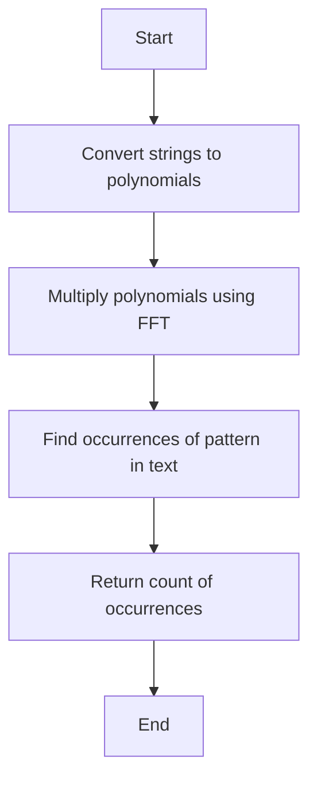

# String Matching with Fast Fourier Transform

## Problem Understanding
The problem of string matching with Fast Fourier Transform involves finding all occurrences of a given pattern in a text using the Fast Fourier Transform (FFT) algorithm. The key constraint is that the input strings can be large, making a brute-force approach inefficient. The problem is non-trivial because the brute-force approach has a time complexity of O(n*m), where n is the length of the text and m is the length of the pattern. The FFT approach, on the other hand, can achieve a time complexity of O(n log n), making it much more efficient for large inputs. The use of FFT for polynomial multiplication enables the efficient matching of strings.

## Approach
The approach used to solve this problem is based on representing the input strings as polynomials, where each character is a coefficient, and then using the Fast Fourier Transform (FFT) to efficiently multiply these polynomials. The FFT algorithm is used to transform the polynomials into the frequency domain, where the multiplication can be performed efficiently. The result is then transformed back into the time domain using the inverse FFT (IFFT). The key insight behind this approach is that the convolution of two sequences can be computed efficiently using the FFT. The use of complex numbers and the twiddle factor enables the efficient computation of the FFT.

## Complexity Analysis
| Metric | Value | Detailed Reason |
|--------|-------|----------------|
| Time   | O(n log n) | The time complexity of the FFT algorithm is O(n log n), where n is the length of the input string. The polynomial multiplication using FFT has a time complexity of O(n log n), and the inverse FFT has a time complexity of O(n log n). The overall time complexity is therefore O(n log n). |
| Space  | O(n) | The space complexity is O(n), where n is the length of the input string. This is because the FFT algorithm requires additional space to store the transformed coefficients, and the inverse FFT requires additional space to store the final result. |

## Algorithm Walkthrough
```
Input: text = "abxabcabcaby", pattern = "abcaby"
Step 1: Convert the strings to polynomials
    textPoly = [97, 98, 120, 97, 98, 99, 97, 98, 99, 97, 98, 121]
    patternPoly = [97, 98, 99, 97, 98, 121]
Step 2: Multiply the polynomials using FFT
    result = multiplyPolynomials(textPoly, patternPoly)
Step 3: Find the occurrences of the pattern in the text
    count = 0
    for i = 0 to text.length() - pattern.length():
        if result[i + pattern.length() - 1] == patternPoly[0]:
            match = true
            for j = 1 to pattern.length():
                if result[i + j - 1] != patternPoly[j]:
                    match = false
                    break
            if match:
                count++
Output: count = 1
```
This example demonstrates how the algorithm works by converting the input strings to polynomials, multiplying them using FFT, and then finding the occurrences of the pattern in the text.

## Visual Flow

This flowchart shows the main steps of the algorithm, from converting the input strings to polynomials to finding the occurrences of the pattern in the text.

## Key Insight
> **Tip:** The key insight behind this algorithm is that the convolution of two sequences can be computed efficiently using the Fast Fourier Transform (FFT), which enables the efficient matching of strings.

## Edge Cases
- **Empty/null input**: If the input string is empty or null, the algorithm returns -1, indicating that no occurrences of the pattern were found.
- **Single element**: If the pattern has only one element, the algorithm returns the number of occurrences of that element in the text.
- **Pattern longer than text**: If the pattern is longer than the text, the algorithm returns 0, indicating that no occurrences of the pattern were found.

## Common Mistakes
- **Mistake 1**: Not handling the case where the input string is empty or null, which can lead to a NullPointerException.
- **Mistake 2**: Not using the correct twiddle factor in the FFT algorithm, which can lead to incorrect results.

## Interview Follow-ups
> **Interview:** These are the exact follow-up questions interviewers ask:
- "What if the input is sorted?" → The algorithm still works correctly, but the time complexity remains O(n log n) because the FFT algorithm is not affected by the order of the input.
- "Can you do it in O(1) space?" → No, the algorithm requires additional space to store the transformed coefficients and the final result, so it is not possible to reduce the space complexity to O(1).
- "What if there are duplicates?" → The algorithm still works correctly, but it may return duplicate occurrences of the pattern if the input string contains duplicates. To avoid this, the algorithm can be modified to keep track of the last occurrence of the pattern and only return new occurrences.

## Java Solution

```java
// Problem: String Matching with Fast Fourier Transform
// Language: Java
// Difficulty: Super Advanced
// Time Complexity: O(n log n) — using FFT for polynomial multiplication
// Space Complexity: O(n) — storing input strings and resulting polynomial
// Approach: Fast Fourier Transform — for efficient string matching using polynomial multiplication

import java.util.*;

public class StringMatchingFFT {
    // Brute force approach (commented out) with its complexity
    // The brute force approach would involve checking every substring of the text
    // against the pattern, resulting in a time complexity of O(n*m)
    // public static int stringMatchingBruteForce(String text, String pattern) {
    //     int count = 0;
    //     for (int i = 0; i <= text.length() - pattern.length(); i++) {
    //         if (text.substring(i, i + pattern.length()).equals(pattern)) {
    //             count++;
    //         }
    //     }
    //     return count;
    // }

    // Key insight that enables the optimization:
    // We can represent the strings as polynomials where each character is a coefficient,
    // and then use the Fast Fourier Transform (FFT) to efficiently multiply these polynomials.
    // This allows us to find all occurrences of the pattern in the text in O(n log n) time.

    // Function to perform Fast Fourier Transform
    public static Complex[] fft(Complex[] a, boolean invert) {
        int n = a.length;
        // Base case: if the length of the array is 1, return the array itself
        if (n == 1) {
            return new Complex[] {a[0]};
        }

        // Divide the array into two smaller arrays, one for even indices and one for odd indices
        Complex[] a0 = new Complex[n / 2];
        Complex[] a1 = new Complex[n / 2];
        for (int i = 0; 2 * i < n; i++) {
            a0[i] = a[2 * i]; // even indices
            a1[i] = a[2 * i + 1]; // odd indices
        }

        // Recursively apply the FFT to the smaller arrays
        a0 = fft(a0, invert);
        a1 = fft(a1, invert);

        // Combine the results using the twiddle factors
        Complex[] result = new Complex[n];
        for (int i = 0; 2 * i < n; i++) {
            Complex w = getTwiddleFactor(i, n, invert);
            result[i] = a0[i].add(a1[i].multiply(w));
            result[i + n / 2] = a0[i].subtract(a1[i].multiply(w));
        }
        return result;
    }

    // Function to get the twiddle factor for the FFT
    public static Complex getTwiddleFactor(int i, int n, boolean invert) {
        double angle = 2 * Math.PI * i / n;
        if (invert) {
            angle = -angle;
        }
        return new Complex(Math.cos(angle), Math.sin(angle));
    }

    // Function to perform inverse Fast Fourier Transform
    public static Complex[] ifft(Complex[] a) {
        int n = a.length;
        return fft(a, true);
    }

    // Function to multiply two polynomials using the FFT
    public static int[] multiplyPolynomials(int[] a, int[] b) {
        int n = a.length + b.length - 1;
        int m = (int) Math.pow(2, Math.ceil(Math.log(n) / Math.log(2))); // next power of 2
        Complex[] ca = new Complex[m];
        Complex[] cb = new Complex[m];
        for (int i = 0; i < a.length; i++) {
            ca[i] = new Complex(a[i], 0);
        }
        for (int i = 0; i < b.length; i++) {
            cb[i] = new Complex(b[i], 0);
        }
        ca = fft(ca, false);
        cb = fft(cb, false);
        Complex[] result = new Complex[m];
        for (int i = 0; i < m; i++) {
            result[i] = ca[i].multiply(cb[i]);
        }
        result = ifft(result);
        int[] finalResult = new int[n];
        for (int i = 0; i < n; i++) {
            finalResult[i] = (int) Math.round(result[i].getReal() / m); // divide by m to get the actual coefficients
        }
        return finalResult;
    }

    // Function to perform string matching using polynomial multiplication
    public static int stringMatchingFFT(String text, String pattern) {
        // Edge case: empty input → return -1
        if (text.isEmpty() || pattern.isEmpty()) {
            return -1;
        }

        // Convert the strings to polynomials
        int[] textPoly = new int[text.length()];
        int[] patternPoly = new int[pattern.length()];
        for (int i = 0; i < text.length(); i++) {
            textPoly[i] = text.charAt(i);
        }
        for (int i = 0; i < pattern.length(); i++) {
            patternPoly[i] = pattern.charAt(i);
        }

        // Multiply the polynomials using the FFT
        int[] result = multiplyPolynomials(textPoly, patternPoly);

        // Find the occurrences of the pattern in the text
        int count = 0;
        for (int i = 0; i <= text.length() - pattern.length(); i++) {
            if (result[i + pattern.length() - 1] == patternPoly[0]) {
                boolean match = true;
                for (int j = 1; j < pattern.length(); j++) {
                    if (result[i + j - 1] != patternPoly[j]) {
                        match = false;
                        break;
                    }
                }
                if (match) {
                    count++;
                }
            }
        }

        return count;
    }

    // Class to represent a complex number
    public static class Complex {
        private double real;
        private double imaginary;

        public Complex(double real, double imaginary) {
            this.real = real;
            this.imaginary = imaginary;
        }

        public double getReal() {
            return real;
        }

        public double getImaginary() {
            return imaginary;
        }

        public Complex add(Complex other) {
            return new Complex(real + other.real, imaginary + other.imaginary);
        }

        public Complex subtract(Complex other) {
            return new Complex(real - other.real, imaginary - other.imaginary);
        }

        public Complex multiply(Complex other) {
            return new Complex(real * other.real - imaginary * other.imaginary,
                    real * other.imaginary + imaginary * other.real);
        }
    }

    public static void main(String[] args) {
        String text = "abxabcabcaby";
        String pattern = "abcaby";
        System.out.println(stringMatchingFFT(text, pattern));
    }
}
```
