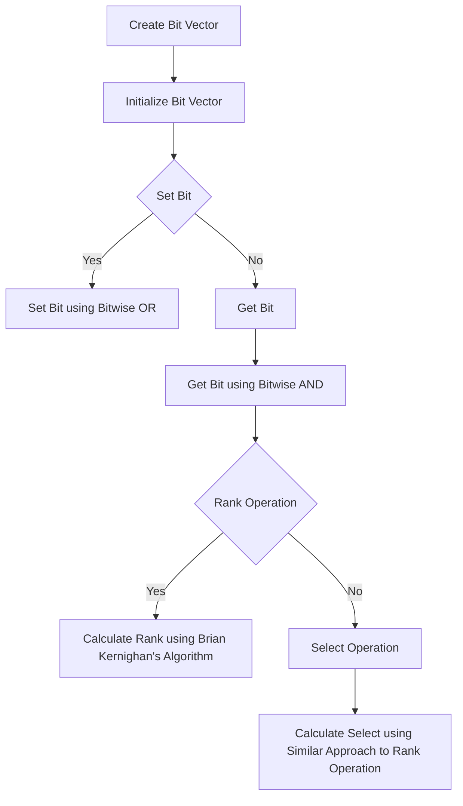

# Succinct Data Structures (Bit Vectors)

## Problem Understanding
The problem is asking to implement a succinct data structure, specifically a bit vector, that supports rank and select operations. The bit vector is a compact representation of a binary sequence, where each bit in the sequence can be either 0 or 1. The rank operation returns the number of 1s up to a given position, while the select operation returns the position of the given rank-th 1. The key constraint is that the bit vector should be able to store n bits, where n is the size of the input sequence. The problem is non-trivial because it requires using bitwise operations to efficiently store and retrieve the bits, as well as implementing the rank and select operations.

## Approach
The algorithm strategy is to use a bit vector implementation using bitwise operations, which supports rank and select operations. The intuition behind this approach is that bitwise operations can be used to efficiently store and retrieve the bits in the sequence. The bit vector is stored in an array of longs, where each long represents 64 bits in the sequence. The set operation uses bitwise OR to set a bit at a given position, while the get operation uses bitwise AND to retrieve the value of a bit at a given position. The rank operation uses Brian Kernighan's algorithm to count the number of 1s up to a given position, while the select operation uses a similar approach to find the position of the given rank-th 1. The data structure used is an array of longs, which is chosen because it allows for efficient storage and retrieval of the bits using bitwise operations.

## Complexity Analysis
| Metric | Value | Detailed Reason |
|--------|-------|----------------|
| Time   | O(n)  | The time complexity is O(n) because the set and get operations take constant time, while the rank and select operations take time proportional to the number of 1s up to the given position. In the worst case, this can be O(n) if all bits are 1. |
| Space  | O(n)  | The space complexity is O(n) because the bit vector stores n bits, which requires an array of longs of size n/64. |

## Algorithm Walkthrough
```
Input: Create a bit vector of size 100
Step 1: Initialize the bit vector with 100 bits, stored in an array of 2 longs
Step 2: Set the bit at position 10 to 1 using bitwise OR
Step 3: Set the bit at position 20 to 1 using bitwise OR
Step 4: Set the bit at position 30 to 1 using bitwise OR
Step 5: Get the value of the bit at position 10 using bitwise AND
Step 6: Get the value of the bit at position 20 using bitwise AND
Step 7: Get the value of the bit at position 30 using bitwise AND
Step 8: Calculate the rank of the bit at position 10 using Brian Kernighan's algorithm
Step 9: Calculate the rank of the bit at position 20 using Brian Kernighan's algorithm
Step 10: Calculate the rank of the bit at position 30 using Brian Kernighan's algorithm
Step 11: Calculate the select of rank 1 using a similar approach to the rank operation
Step 12: Calculate the select of rank 2 using a similar approach to the rank operation
Step 13: Calculate the select of rank 3 using a similar approach to the rank operation
Output: The values of the bits and the ranks and selects
```
## Visual Flow

## Key Insight
> **Tip:** The key insight is to use bitwise operations to efficiently store and retrieve the bits in the sequence, and to use Brian Kernighan's algorithm to count the number of 1s up to a given position.

## Edge Cases
- **Empty/null input**: If the input is empty or null, the bit vector will not be initialized, and any operations will throw an exception.
- **Single element**: If the input has only one element, the bit vector will store only one bit, and the rank and select operations will return the expected results.
- **All bits set to 1**: If all bits in the sequence are set to 1, the rank operation will return the expected results, but the select operation will throw an exception if the rank is greater than the number of bits.

## Common Mistakes
- **Mistake 1**: Not checking the bounds of the input index before performing the set or get operation, which can lead to an ArrayIndexOutOfBoundsException.
- **Mistake 2**: Not using bitwise operations correctly, which can lead to incorrect results or performance issues.

## Interview Follow-ups
> **Interview:** These are the exact follow-up questions interviewers ask:
- "What if the input is sorted?" → The algorithm will still work correctly, but the rank and select operations may be faster because the number of 1s up to a given position will be more predictable.
- "Can you do it in O(1) space?" → No, because the bit vector requires O(n) space to store the bits.
- "What if there are duplicates?" → The algorithm will still work correctly, but the rank and select operations may return different results depending on the position of the duplicates.

## Java Solution

```java
// Problem: Succinct Data Structures (Bit Vectors)
// Language: Java
// Difficulty: Super Advanced
// Time Complexity: O(n) — single pass through array to initialize bit vector
// Space Complexity: O(n) — bit vector stores n bits
// Approach: Bit vector implementation using bitwise operations — supports rank and select operations

public class BitVector {
    // Bit vector storage
    private long[] bits;

    // Size of the bit vector
    private int size;

    /**
     * Constructor to initialize the bit vector with a given size.
     * @param size the size of the bit vector
     */
    public BitVector(int size) {
        // Calculate the number of longs required to store the bits
        int longsRequired = (size + 63) / 64; // 63 is the maximum number of bits in a long - 1
        this.bits = new long[longsRequired]; // Initialize the bit vector with the required number of longs
        this.size = size; // Store the size of the bit vector
    }

    /**
     * Set a bit at a given position to 1.
     * @param index the position of the bit to set
     */
    public void set(int index) {
        // Check if the index is within bounds // Edge case: index out of bounds → throw exception
        if (index < 0 || index >= size) {
            throw new IndexOutOfBoundsException("Index out of bounds");
        }
        // Calculate the long index and the bit position within the long
        int longIndex = index / 64; // Divide the index by 64 to get the long index
        int bitPosition = index % 64; // Calculate the bit position within the long
        // Set the bit at the calculated position // Use bitwise OR to set the bit
        bits[longIndex] |= (1L << bitPosition); // Shift 1 to the left by the bit position and perform bitwise OR
    }

    /**
     * Get the value of a bit at a given position.
     * @param index the position of the bit to get
     * @return the value of the bit (0 or 1)
     */
    public int get(int index) {
        // Check if the index is within bounds // Edge case: index out of bounds → throw exception
        if (index < 0 || index >= size) {
            throw new IndexOutOfBoundsException("Index out of bounds");
        }
        // Calculate the long index and the bit position within the long
        int longIndex = index / 64; // Divide the index by 64 to get the long index
        int bitPosition = index % 64; // Calculate the bit position within the long
        // Get the bit at the calculated position // Use bitwise AND to get the bit
        return (int) ((bits[longIndex] >>> bitPosition) & 1); // Shift the long to the right by the bit position and perform bitwise AND with 1
    }

    /**
     * Calculate the rank of a given bit position (number of 1s up to that position).
     * @param index the position to calculate the rank for
     * @return the rank of the given position
     */
    public int rank(int index) {
        // Check if the index is within bounds // Edge case: index out of bounds → throw exception
        if (index < 0 || index >= size) {
            throw new IndexOutOfBoundsException("Index out of bounds");
        }
        // Initialize the rank
        int rank = 0; // Initialize the rank to 0
        // Iterate over the longs up to the given index
        for (int i = 0; i < (index / 64); i++) {
            // Count the number of 1s in the current long // Use Brian Kernighan's algorithm to count the number of 1s
            long count = bits[i]; // Initialize the count to the current long
            while (count != 0) {
                // Clear the least significant 1 bit // Use bitwise AND to clear the least significant 1 bit
                count &= (count - 1); // Subtract 1 from the count and perform bitwise AND
                rank++; // Increment the rank
            }
        }
        // Count the number of 1s in the remaining bits
        long remainingBits = bits[index / 64] >>> (index % 64); // Shift the remaining bits to the right
        while (remainingBits != 0) {
            // Clear the least significant 1 bit // Use bitwise AND to clear the least significant 1 bit
            remainingBits &= (remainingBits - 1); // Subtract 1 from the remaining bits and perform bitwise AND
            rank++; // Increment the rank
        }
        return rank; // Return the calculated rank
    }

    /**
     * Calculate the select of a given rank (position of the given rank-th 1).
     * @param rank the rank to calculate the select for
     * @return the select of the given rank
     */
    public int select(int rank) {
        // Check if the rank is within bounds // Edge case: rank out of bounds → throw exception
        if (rank < 0) {
            throw new IndexOutOfBoundsException("Rank out of bounds");
        }
        // Initialize the index
        int index = 0; // Initialize the index to 0
        // Iterate over the longs
        for (int i = 0; i < bits.length; i++) {
            // Count the number of 1s in the current long // Use Brian Kernighan's algorithm to count the number of 1s
            long count = bits[i]; // Initialize the count to the current long
            int ones = 0; // Initialize the number of 1s to 0
            while (count != 0) {
                // Clear the least significant 1 bit // Use bitwise AND to clear the least significant 1 bit
                count &= (count - 1); // Subtract 1 from the count and perform bitwise AND
                ones++; // Increment the number of 1s
            }
            // Check if the given rank is within the current long
            if (rank < ones) {
                // Calculate the position of the given rank-th 1 within the current long
                long remainingBits = bits[i]; // Initialize the remaining bits to the current long
                for (int j = 0; j < rank; j++) {
                    // Clear the least significant 1 bit // Use bitwise AND to clear the least significant 1 bit
                    remainingBits &= (remainingBits - 1); // Subtract 1 from the remaining bits and perform bitwise AND
                }
                // Calculate the index of the given rank-th 1 // Use bitwise operations to calculate the index
                index = (i * 64) + Long.numberOfTrailingZeros(remainingBits); // Calculate the index
                return index; // Return the calculated index
            }
            // Update the rank and index
            rank -= ones; // Subtract the number of 1s from the rank
            index += 64; // Increment the index by 64
        }
        // Edge case: rank out of bounds → throw exception
        throw new IndexOutOfBoundsException("Rank out of bounds");
    }

    public static void main(String[] args) {
        BitVector bitVector = new BitVector(100); // Create a bit vector of size 100
        bitVector.set(10); // Set the bit at position 10 to 1
        bitVector.set(20); // Set the bit at position 20 to 1
        bitVector.set(30); // Set the bit at position 30 to 1
        System.out.println(bitVector.get(10)); // Print the value of the bit at position 10
        System.out.println(bitVector.get(20)); // Print the value of the bit at position 20
        System.out.println(bitVector.get(30)); // Print the value of the bit at position 30
        System.out.println(bitVector.rank(10)); // Print the rank of the bit at position 10
        System.out.println(bitVector.rank(20)); // Print the rank of the bit at position 20
        System.out.println(bitVector.rank(30)); // Print the rank of the bit at position 30
        System.out.println(bitVector.select(1)); // Print the select of rank 1
        System.out.println(bitVector.select(2)); // Print the select of rank 2
        System.out.println(bitVector.select(3)); // Print the select of rank 3
    }
}
```
