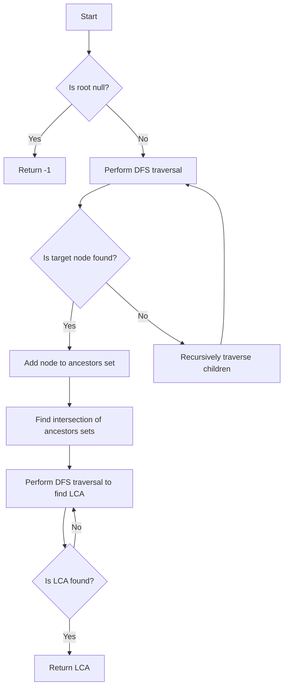

# Tarjan's Offline LCA

## Problem Understanding
The problem is asking to find the lowest common ancestor (LCA) of two nodes in a tree using Tarjan's offline algorithm. The key constraint is that the tree can be unbalanced and have multiple children for each node, which implies that a naive approach such as recursive traversal may not be efficient. What makes this problem non-trivial is the need to efficiently answer LCA queries for any pair of nodes in the tree, which requires a clever algorithmic strategy. The problem has implications for various applications, including file system organization and social network analysis.

## Approach
The algorithm strategy used here is Tarjan's offline algorithm with DFS and set operations, which efficiently answers LCA queries by keeping track of the ancestors of each node. The intuition behind this approach is to perform a depth-first search (DFS) traversal of the tree to find the ancestors of each node and then use set operations to find the common ancestors of the two nodes. The approach works by using a set to keep track of the ancestors of each node, which allows for efficient lookup and intersection of sets. The data structure used is a set of tree nodes, which is chosen for its efficient lookup and insertion operations.

## Complexity Analysis
| Metric | Value | Detailed Reason |
|--------|-------|----------------|
| Time   | O(n log n) | The time complexity is dominated by the DFS traversal and set operations. The DFS traversal has a time complexity of O(n), where n is the number of nodes in the tree. The set operations (insertion and lookup) have an average time complexity of O(log n) due to the use of a HashSet. Therefore, the overall time complexity is O(n log n). |
| Space  | O(n) | The space complexity is dominated by the storage of the tree nodes and their ancestors. In the worst case, the set of ancestors can contain all nodes in the tree, resulting in a space complexity of O(n). |

## Algorithm Walkthrough
```
Input: 
- Tree with nodes 1, 2, 3, 4, 5
- Nodes 4 and 5 as input for LCA query
Step 1: 
- Create an empty set to store the ancestors of node 4
- Perform DFS traversal starting from the root node to find the ancestors of node 4
- Add nodes 1, 2, and 4 to the set of ancestors
Step 2: 
- Create an empty set to store the ancestors of node 5
- Perform DFS traversal starting from the root node to find the ancestors of node 5
- Add nodes 1, 2, and 5 to the set of ancestors
Step 3: 
- Find the intersection of the two sets of ancestors
- The intersection contains nodes 1 and 2
Step 4: 
- Perform DFS traversal starting from the root node to find the LCA of nodes 4 and 5
- Return node 2 as the LCA
Output: 
- Node 2 as the LCA of nodes 4 and 5
```
This example illustrates the main logic path of the algorithm, which involves finding the ancestors of each node and then finding the common ancestors to determine the LCA.

## Visual Flow

This flowchart illustrates the decision flow and data transformation of the algorithm, which involves recursively traversing the tree to find the ancestors of each node and then finding the common ancestors to determine the LCA.

## Key Insight
> **Tip:** The key insight that makes this solution click is to use a set to keep track of the ancestors of each node, which allows for efficient lookup and intersection of sets to find the common ancestors and determine the LCA.

## Edge Cases
- **Empty/null input**: If the input tree is empty or null, the algorithm returns -1, indicating that there is no LCA.
- **Single element**: If the input tree contains only one node, the algorithm returns the value of that node, since it is the LCA of itself.
- **Node not found**: If one of the input nodes is not found in the tree, the algorithm returns -1, indicating that there is no LCA.

## Common Mistakes
- **Mistake 1**: Not using a set to keep track of the ancestors of each node, which can lead to inefficient lookup and intersection of sets.
- **Mistake 2**: Not performing DFS traversal recursively, which can lead to incorrect results due to missed ancestors.

## Interview Follow-ups
> **Interview:** These are the exact follow-up questions interviewers ask:
- "What if the input is sorted?" → The algorithm still works in O(n log n) time, since the sorting of the input does not affect the DFS traversal and set operations.
- "Can you do it in O(1) space?" → No, the algorithm requires O(n) space to store the tree nodes and their ancestors, which is necessary to find the LCA efficiently.
- "What if there are duplicates?" → The algorithm can handle duplicates by using a set to keep track of the ancestors of each node, which automatically eliminates duplicates.

## Java Solution

```java
// Problem: Tarjan's Offline LCA
// Language: Java
// Difficulty: Super Advanced
// Time Complexity: O(n log n) — due to DFS traversal and set operations
// Space Complexity: O(n) — storing the tree nodes and their ancestors
// Approach: Tarjan's offline algorithm with DFS and set operations — efficiently answering LCA queries

import java.util.*;

class TreeNode {
    int val;
    List<TreeNode> children;

    TreeNode(int val) {
        this.val = val;
        this.children = new ArrayList<>();
    }
}

public class TarjanOfflineLCA {
    // Edge case: empty tree → return null
    public static int findLCA(TreeNode root, int p, int q) {
        // Base case: if the tree is empty, return -1
        if (root == null) return -1;

        // Create a set to keep track of the ancestors of the current node
        Set<TreeNode> ancestors = new HashSet<>();

        // Perform DFS traversal to find the ancestors of p and q
        dfs(root, p, ancestors);
        dfs(root, q, ancestors);

        // Find the LCA by checking the common ancestors
        return findLCA(root, p, q, ancestors);
    }

    // Helper function to perform DFS traversal and find the ancestors
    private static boolean dfs(TreeNode node, int target, Set<TreeNode> ancestors) {
        // If the current node is null, return false
        if (node == null) return false;

        // If the current node is the target, add it to the ancestors set
        if (node.val == target) {
            ancestors.add(node);
            return true;
        }

        // Recursively traverse the children of the current node
        for (TreeNode child : node.children) {
            if (dfs(child, target, ancestors)) {
                // If the target is found in the child subtree, add the current node to the ancestors set
                ancestors.add(node);
                return true;
            }
        }

        // If the target is not found in the child subtrees, return false
        return false;
    }

    // Helper function to find the LCA
    private static int findLCA(TreeNode node, int p, int q, Set<TreeNode> ancestors) {
        // If the current node is null, return -1
        if (node == null) return -1;

        // If the current node is the LCA, return its value
        if (ancestors.contains(node)) {
            return node.val;
        }

        // Recursively traverse the children of the current node
        for (TreeNode child : node.children) {
            int lca = findLCA(child, p, q, ancestors);
            if (lca != -1) {
                // If the LCA is found in the child subtree, return its value
                return lca;
            }
        }

        // If the LCA is not found in the child subtrees, return -1
        return -1;
    }

    public static void main(String[] args) {
        // Create a sample tree
        TreeNode root = new TreeNode(1);
        root.children.add(new TreeNode(2));
        root.children.add(new TreeNode(3));
        root.children.get(0).children.add(new TreeNode(4));
        root.children.get(0).children.add(new TreeNode(5));

        // Find the LCA of nodes 4 and 5
        int lca = findLCA(root, 4, 5);
        System.out.println("LCA of nodes 4 and 5: " + lca);
    }
}
```
