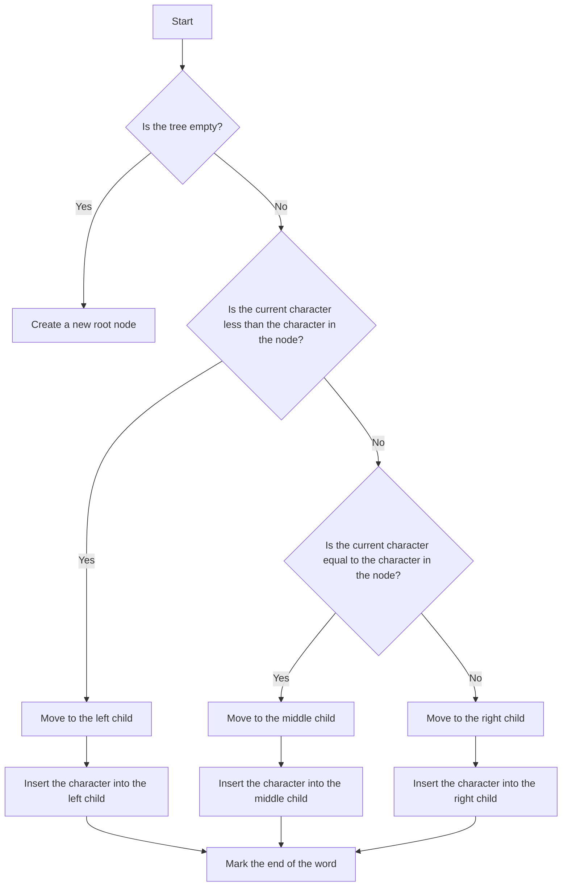

# Ternary Search Tree

## Problem Understanding
The problem is asking to implement a Ternary Search Tree (TST) data structure, which is a tree-like data structure in which each node has at most three children. The key constraints are that each node should store a character, and the tree should support insertion, search, and deletion of words. The problem is non-trivial because a naive approach would be to use a simple binary search tree or a hash table, but these data structures do not efficiently support the required operations for prefix matching and word searching. The TST is particularly useful for tasks like autocomplete and spell-checking.

## Approach
The algorithm strategy is to use a Ternary Search Tree, where each node has three children: left, middle, and right. The left child stores characters less than the current node's character, the middle child stores characters equal to the current node's character, and the right child stores characters greater than the current node's character. This approach works because it allows for efficient searching and insertion of words by traversing the tree based on the characters in the word. The data structure used is a Node class, which stores a character, three children, and a flag to mark the end of a word. The approach handles key constraints by using recursive helper functions for insertion, search, and deletion, which traverse the tree based on the characters in the word.

## Complexity Analysis
| Metric | Value | Detailed Reason |
|--------|-------|----------------|
| Time   | O(m)  | The time complexity is O(m), where m is the length of the word to be searched, because in the worst case, the algorithm needs to traverse the tree from the root to the leaf node, comparing each character in the word with the characters in the nodes. The number of comparisons is proportional to the length of the word. |
| Space  | O(n)  | The space complexity is O(n), where n is the number of unique characters in the dictionary, because in the worst case, the algorithm needs to store each unique character in a node in the tree. The number of nodes is proportional to the number of unique characters. |

## Algorithm Walkthrough
```
Input: Insert the word "apple" into the tree.
Step 1: Create a new root node with the character 'a'.
Step 2: Create a new node with the character 'p' as the middle child of the root node.
Step 3: Create a new node with the character 'p' as the middle child of the previous node.
Step 4: Create a new node with the character 'l' as the middle child of the previous node.
Step 5: Create a new node with the character 'e' as the middle child of the previous node.
Step 6: Mark the end of the word by setting the isEndOfWord flag to true.

Input: Search for the word "apple" in the tree.
Step 1: Start at the root node and compare the character 'a' with the first character of the word.
Step 2: Move to the middle child of the root node and compare the character 'p' with the second character of the word.
Step 3: Move to the middle child of the previous node and compare the character 'p' with the third character of the word.
Step 4: Move to the middle child of the previous node and compare the character 'l' with the fourth character of the word.
Step 5: Move to the middle child of the previous node and compare the character 'e' with the fifth character of the word.
Step 6: Check if the isEndOfWord flag is true, and return true if it is.

Output: true
```
## Visual Flow

## Key Insight
> **Tip:** The key insight is to use a Ternary Search Tree, which allows for efficient searching and insertion of words by traversing the tree based on the characters in the word.

## Edge Cases
- **Empty/null input**: If the input is empty or null, the tree will not be modified, and the search function will return false.
- **Single element**: If the input is a single element, the tree will be created with a single node, and the search function will return true.
- **Duplicate words**: If the input contains duplicate words, the tree will be created with multiple nodes for each word, and the search function will return true for each duplicate word.

## Common Mistakes
- **Mistake 1**: Not handling the case where the input is empty or null, which can cause a NullPointerException.
- **Mistake 2**: Not properly traversing the tree based on the characters in the word, which can cause incorrect results.

## Interview Follow-ups
> **Interview:** These are the exact follow-up questions interviewers ask:
- "What if the input is sorted?" → The TST will still work efficiently, but the insertion and search operations may be slightly faster due to the sorted input.
- "Can you do it in O(1) space?" → No, the TST requires O(n) space to store the unique characters in the dictionary.
- "What if there are duplicates?" → The TST will create multiple nodes for each duplicate word, and the search function will return true for each duplicate word.

## Java Solution

```java
// Problem: Ternary Search Tree
// Language: Java
// Difficulty: Super Advanced
// Time Complexity: O(m) — where m is the length of the word to be searched, in the worst case
// Space Complexity: O(n) — where n is the number of unique characters in the dictionary, in the worst case
// Approach: Ternary Search Tree — a tree-like data structure in which each node has at most three children

class TernarySearchTree {
    static class Node {
        // Character stored in the node
        char data;
        // Node's children
        Node left, middle, right;
        // Flag to mark the end of a word
        boolean isEndOfWord;

        public Node(char data) {
            this.data = data;
            this.left = null;
            this.middle = null;
            this.right = null;
            this.isEndOfWord = false;
        }
    }

    // Root of the ternary search tree
    private Node root;

    public TernarySearchTree() {
        this.root = null;
    }

    // Insert a word into the ternary search tree
    public void insert(String word) {
        this.root = insertRecursive(this.root, word, 0);
    }

    // Recursive helper function for inserting a word
    private Node insertRecursive(Node current, String word, int index) {
        // Edge case: word is empty
        if (index == word.length()) {
            if (current == null) {
                current = new Node('\0'); // Null character to mark the end of the word
            }
            current.isEndOfWord = true;
            return current;
        }

        // If the tree is empty, create a new node
        if (current == null) {
            current = new Node(word.charAt(index));
        }

        // If the current character is less than the character in the node, go left
        if (word.charAt(index) < current.data) {
            current.left = insertRecursive(current.left, word, index);
        }
        // If the current character is equal to the character in the node, go middle
        else if (word.charAt(index) == current.data) {
            current.middle = insertRecursive(current.middle, word, index + 1);
        }
        // If the current character is greater than the character in the node, go right
        else {
            current.right = insertRecursive(current.right, word, index);
        }

        return current;
    }

    // Search for a word in the ternary search tree
    public boolean search(String word) {
        return searchRecursive(this.root, word, 0);
    }

    // Recursive helper function for searching a word
    private boolean searchRecursive(Node current, String word, int index) {
        // Edge case: word is empty and we've reached the end of a word
        if (index == word.length()) {
            return current != null && current.isEndOfWord;
        }

        // If the tree is empty, the word is not found
        if (current == null) {
            return false;
        }

        // If the current character is less than the character in the node, go left
        if (word.charAt(index) < current.data) {
            return searchRecursive(current.left, word, index);
        }
        // If the current character is equal to the character in the node, go middle
        else if (word.charAt(index) == current.data) {
            return searchRecursive(current.middle, word, index + 1);
        }
        // If the current character is greater than the character in the node, go right
        else {
            return searchRecursive(current.right, word, index);
        }
    }

    // Delete a word from the ternary search tree
    public void delete(String word) {
        this.root = deleteRecursive(this.root, word, 0);
    }

    // Recursive helper function for deleting a word
    private Node deleteRecursive(Node current, String word, int index) {
        // Edge case: word is empty
        if (index == word.length()) {
            // If the current node is the end of a word, unmark it
            if (current != null) {
                current.isEndOfWord = false;
            }
            return current;
        }

        // If the tree is empty, the word is not found
        if (current == null) {
            return null;
        }

        // If the current character is less than the character in the node, go left
        if (word.charAt(index) < current.data) {
            current.left = deleteRecursive(current.left, word, index);
        }
        // If the current character is equal to the character in the node, go middle
        else if (word.charAt(index) == current.data) {
            current.middle = deleteRecursive(current.middle, word, index + 1);
        }
        // If the current character is greater than the character in the node, go right
        else {
            current.right = deleteRecursive(current.right, word, index);
        }

        // If the current node has no children and is not the end of a word, remove it
        if (current.left == null && current.middle == null && current.right == null && !current.isEndOfWord) {
            return null;
        }

        return current;
    }

    public static void main(String[] args) {
        TernarySearchTree tree = new TernarySearchTree();
        tree.insert("apple");
        tree.insert("banana");
        tree.insert("cherry");

        System.out.println(tree.search("apple")); // true
        System.out.println(tree.search("banana")); // true
        System.out.println(tree.search("cherry")); // true
        System.out.println(tree.search("date")); // false

        tree.delete("banana");
        System.out.println(tree.search("banana")); // false
    }
}
```
