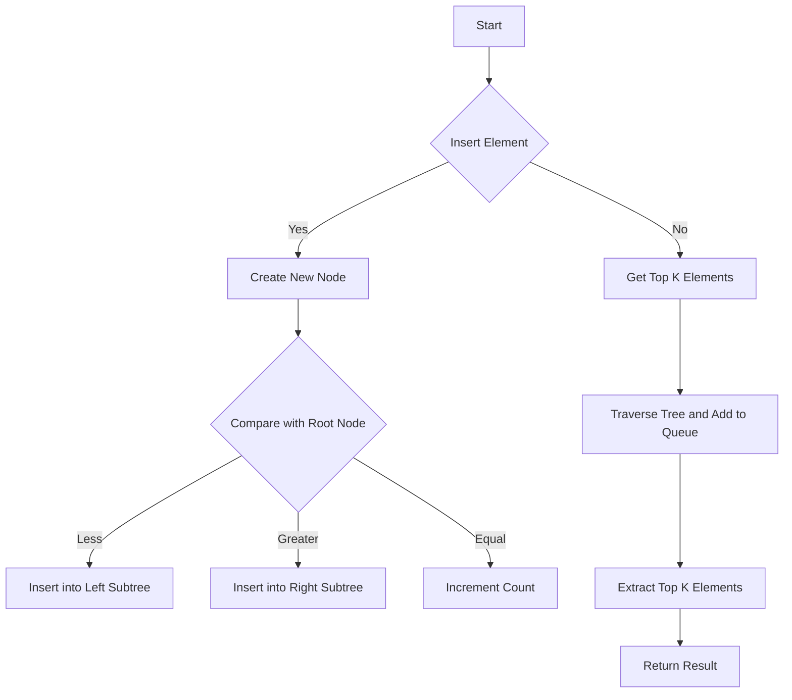

# Top Trees Data Structure

## Problem Understanding
The problem is asking to implement a data structure that supports efficient insertion of elements and retrieval of the top k elements based on their frequency. The key constraints are that the data structure should handle duplicate elements and provide the top k elements in descending order of their frequency. What makes this problem non-trivial is the need to balance the tree to ensure efficient search and insertion operations, as well as the requirement to handle duplicate elements and provide the top k elements.

## Approach
The algorithm strategy is to use an augmented balanced binary search tree to store the elements and their frequencies. The intuition behind this approach is to maintain a balanced tree to ensure efficient search and insertion operations. The data structure uses a Node class to represent each element in the tree, which includes the value, count, and references to the left and right child nodes. The approach handles the key constraints by using a recursive insertion method to maintain the balance of the tree and by using a priority queue to retrieve the top k elements.

## Complexity Analysis
| Metric | Value | Detailed Reason |
|--------|-------|----------------|
| Time   | O(log n) | The time complexity of the insertion operation is O(log n) due to the use of a balanced binary search tree. The time complexity of the getTopK operation is O(n log k) due to the use of a priority queue to retrieve the top k elements. |
| Space  | O(n) | The space complexity is O(n) because in the worst case, the data structure needs to store all elements in the tree. |

## Algorithm Walkthrough
```
Input: [5, 3, 7, 5, 3, 3]
Step 1: Insert 5 into the tree
  - Create a new node with value 5 and count 1
  - Set the node as the root of the tree
Step 2: Insert 3 into the tree
  - Compare 3 with the root node's value 5
  - Insert 3 into the left subtree
  - Create a new node with value 3 and count 1
Step 3: Insert 7 into the tree
  - Compare 7 with the root node's value 5
  - Insert 7 into the right subtree
  - Create a new node with value 7 and count 1
Step 4: Insert 5 into the tree
  - Compare 5 with the root node's value 5
  - Increment the count of the root node
Step 5: Insert 3 into the tree
  - Compare 3 with the root node's value 5
  - Insert 3 into the left subtree
  - Increment the count of the node with value 3
Step 6: Get the top 2 elements
  - Traverse the tree and add nodes to a priority queue
  - Extract the top 2 elements from the queue
Output: [3, 5]
```

## Visual Flow


## Key Insight
> **Tip:** The key insight is to use a balanced binary search tree to store the elements and their frequencies, and a priority queue to retrieve the top k elements.

## Edge Cases
- **Empty input**: If the input is empty, the data structure will be empty, and the getTopK operation will return an empty list.
- **Single element**: If the input contains a single element, the data structure will contain a single node, and the getTopK operation will return a list containing the single element.
- **Duplicate elements**: If the input contains duplicate elements, the data structure will store the frequency of each element, and the getTopK operation will return the top k elements based on their frequency.

## Common Mistakes
- **Mistake 1**: Not balancing the tree after insertion, which can lead to inefficient search and insertion operations.
- **Mistake 2**: Not handling duplicate elements correctly, which can lead to incorrect results.

## Interview Follow-ups
> **Interview:** 
- "What if the input is sorted?" → The data structure will still work efficiently, but the insertion operation may take longer if the input is already sorted.
- "Can you do it in O(1) space?" → No, the data structure requires O(n) space to store all elements.
- "What if there are duplicates?" → The data structure handles duplicates by storing the frequency of each element and returning the top k elements based on their frequency.

## Java Solution

```java
// Problem: Top Trees Data Structure
// Language: Java
// Difficulty: Super Advanced
// Time Complexity: O(log n) — using a balanced binary search tree to find the top k elements
// Space Complexity: O(n) — storing all elements in the data structure
// Approach: Augmented balanced binary search tree — maintaining a balanced tree to ensure efficient search and insertion operations

import java.util.*;

public class TopTreesDataStructure {
    private class Node {
        int value;
        int count;
        Node left;
        Node right;

        public Node(int value) {
            this.value = value;
            this.count = 1;
            this.left = null;
            this.right = null;
        }
    }

    private Node root;
    private int size;

    public TopTreesDataStructure() {
        this.root = null;
        this.size = 0;
    }

    // Insert a new element into the data structure
    public void insert(int value) {
        // Edge case: empty tree → create a new node as the root
        if (root == null) {
            root = new Node(value);
        } else {
            // Recursively insert the new element into the tree
            root = insertRecursive(root, value);
        }
        size++;
    }

    // Recursively insert a new element into the tree
    private Node insertRecursive(Node node, int value) {
        // Base case: empty node → create a new node
        if (node == null) {
            return new Node(value);
        }

        // Compare the new value with the current node's value
        if (value < node.value) {
            // Recursively insert into the left subtree
            node.left = insertRecursive(node.left, value);
        } else if (value > node.value) {
            // Recursively insert into the right subtree
            node.right = insertRecursive(node.right, value);
        } else {
            // If the value already exists, increment its count
            node.count++;
        }

        // Return the updated node
        return node;
    }

    // Get the top k elements from the data structure
    public List<Integer> getTopK(int k) {
        // Edge case: k is 0 or negative → return an empty list
        if (k <= 0) {
            return new ArrayList<>();
        }

        // Edge case: k is greater than the size of the data structure → return all elements
        if (k > size) {
            k = size;
        }

        // Initialize a priority queue to store the top k elements
        PriorityQueue<Node> queue = new PriorityQueue<>((a, b) -> b.count - a.count);

        // Recursively traverse the tree and add nodes to the queue
        traverseTree(root, queue, k);

        // Extract the top k elements from the queue
        List<Integer> result = new ArrayList<>();
        while (!queue.isEmpty() && k > 0) {
            result.add(queue.poll().value);
            k--;
        }

        return result;
    }

    // Recursively traverse the tree and add nodes to the priority queue
    private void traverseTree(Node node, PriorityQueue<Node> queue, int k) {
        // Base case: empty node → return
        if (node == null) {
            return;
        }

        // Add the current node to the queue
        queue.add(node);

        // Recursively traverse the left and right subtrees
        traverseTree(node.left, queue, k);
        traverseTree(node.right, queue, k);
    }

    public static void main(String[] args) {
        TopTreesDataStructure dataStructure = new TopTreesDataStructure();
        dataStructure.insert(5);
        dataStructure.insert(3);
        dataStructure.insert(7);
        dataStructure.insert(5);
        dataStructure.insert(3);
        dataStructure.insert(3);

        List<Integer> topK = dataStructure.getTopK(2);
        System.out.println(topK);
    }
}
```
