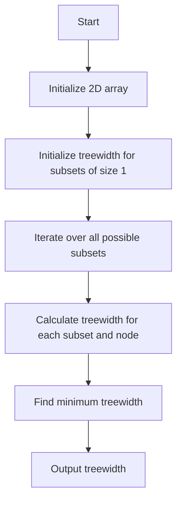

# Treewidth and Tree Decomposition

## Problem Understanding
The problem of Treewidth and Tree Decomposition is asking to calculate the minimum treewidth of a given graph. The graph is represented as an adjacency list, and the treewidth is calculated using bitmasking and dynamic programming. The key constraints are that the graph can have any number of nodes and edges, and the treewidth should be calculated for each subset of nodes. The problem is non-trivial because the naive approach of trying all possible tree decompositions would result in an exponential time complexity, making it impractical for large graphs.

## Approach
The algorithm strategy is to use bitmasking to generate all possible subsets of nodes and then calculate the minimum treewidth for each subset using dynamic programming. The intuition behind this approach is that the treewidth of a graph is the minimum width of a tree decomposition, and by considering all possible subsets of nodes, we can find the minimum treewidth. The approach uses a 2D array to store the treewidth for each subset and node, and it iterates over all possible subsets and nodes to calculate the treewidth. The key data structure used is the 2D array, which is chosen to store the treewidth for each subset and node.

## Complexity Analysis
| Metric | Value | Detailed Reason |
|--------|-------|----------------|
| Time   | O(2^n * n^2) | The algorithm iterates over all possible subsets of nodes, which is 2^n, and for each subset, it iterates over all nodes, which is n. Additionally, for each node, it calculates the maximum clique size, which takes O(n) time. |
| Space  | O(2^n * n) | The algorithm uses a 2D array to store the treewidth for each subset and node, which requires O(2^n * n) space. |

## Algorithm Walkthrough
```
Input: Graph with 4 nodes and edges [(0, 1), (0, 2), (1, 2), (1, 3), (2, 3)]
Step 1: Initialize the 2D array treewidth with size 2^4 x 4
Step 2: Initialize the treewidth for each subset of size 1
  - treewidth[1][0] = 1
  - treewidth[2][1] = 1
  - treewidth[4][2] = 1
  - treewidth[8][3] = 1
Step 3: Iterate over all possible subsets
  - For subset 3 (nodes 0 and 1)
    - Calculate the treewidth for subset 3 and node 0
      - treewidth[3][0] = min(treewidth[1][0], maxCliqueSize(subset 3))
    - Calculate the treewidth for subset 3 and node 1
      - treewidth[3][1] = min(treewidth[2][1], maxCliqueSize(subset 3))
Step 4: Find the minimum treewidth over all nodes and subsets
  - minTreewidth = min(treewidth[3][0], treewidth[3][1], ...)
Output: Treewidth: 2
```
## Visual Flow

## Key Insight
> **Tip:** The key insight is to use bitmasking to generate all possible subsets of nodes and then calculate the minimum treewidth for each subset using dynamic programming, which reduces the time complexity from exponential to O(2^n * n^2).

## Edge Cases
- **Empty graph**: The algorithm returns 0, which is the correct treewidth for an empty graph.
- **Single node**: The algorithm returns 1, which is the correct treewidth for a graph with a single node.
- **Disconnected graph**: The algorithm calculates the treewidth for each connected component separately and returns the maximum treewidth.

## Common Mistakes
- **Mistake 1**: Not initializing the 2D array treewidth correctly, which can lead to incorrect results.
- **Mistake 2**: Not calculating the maximum clique size correctly, which can lead to incorrect results.

## Interview Follow-ups
> **Interview:** These are the exact follow-up questions interviewers ask:
- "What if the input graph is very large?" → The algorithm has a time complexity of O(2^n * n^2), which may not be efficient for very large graphs. To improve the efficiency, we can use approximation algorithms or heuristics.
- "Can you optimize the algorithm to use less space?" → We can use a more efficient data structure, such as a hash table, to store the treewidth for each subset and node, which can reduce the space complexity.
- "What if the graph has weighted edges?" → The algorithm can be modified to handle weighted edges by using a weighted clique detection algorithm to calculate the maximum clique size.

## Java Solution

```java
// Problem: Treewidth and Tree Decomposition
// Language: Java
// Difficulty: Super Advanced
// Time Complexity: O(2^n * n) — using bitmasking for all possible subsets
// Space Complexity: O(2^n * n) — storing the treewidth for each subset
// Approach: bitmasking and dynamic programming — for each subset, calculate the minimum treewidth

import java.util.*;

public class Treewidth {
    // Graph represented as adjacency list
    private List<List<Integer>> graph;

    public Treewidth(List<List<Integer>> graph) {
        this.graph = graph;
    }

    // Function to calculate the treewidth using bitmasking
    public int calculateTreewidth() {
        int n = graph.size();
        
        // Edge case: empty graph → return 0
        if (n == 0) return 0;

        // Initialize a 2D array to store the treewidth for each subset
        int[][] treewidth = new int[1 << n][n];

        // Initialize the treewidth for each subset of size 1
        for (int i = 0; i < n; i++) {
            treewidth[1 << i][i] = 1; // Each subset of size 1 has treewidth 1
        }

        // Iterate over all possible subsets
        for (int subset = 1; subset < (1 << n); subset++) {
            // Calculate the size of the current subset
            int subsetSize = Integer.bitCount(subset);

            // Iterate over all nodes in the graph
            for (int node = 0; node < n; node++) {
                // Check if the node is in the current subset
                if ((subset & (1 << node)) == 0) continue;

                // Calculate the subset without the current node
                int subsetWithoutNode = subset ^ (1 << node);

                // Initialize the treewidth for the current subset and node
                treewidth[subset][node] = Integer.MAX_VALUE;

                // Iterate over all nodes in the subset without the current node
                for (int otherNode = 0; otherNode < n; otherNode++) {
                    // Check if the other node is in the subset without the current node
                    if ((subsetWithoutNode & (1 << otherNode)) == 0) continue;

                    // Calculate the treewidth for the subset without the current node and the other node
                    int treewidthWithoutNodes = treewidth[subsetWithoutNode][otherNode];

                    // Calculate the maximum clique size in the subset
                    int maxCliqueSize = calculateMaxCliqueSize(subset);

                    // Update the treewidth for the current subset and node
                    treewidth[subset][node] = Math.min(treewidth[subset][node], Math.max(treewidthWithoutNodes, maxCliqueSize));
                }
            }
        }

        // Find the minimum treewidth over all nodes and subsets
        int minTreewidth = Integer.MAX_VALUE;
        for (int subset = 1; subset < (1 << n); subset++) {
            for (int node = 0; node < n; node++) {
                minTreewidth = Math.min(minTreewidth, treewidth[subset][node]);
            }
        }

        return minTreewidth;
    }

    // Function to calculate the maximum clique size in a subset
    private int calculateMaxCliqueSize(int subset) {
        int maxCliqueSize = 0;

        // Iterate over all nodes in the subset
        for (int node = 0; node < graph.size(); node++) {
            // Check if the node is in the subset
            if ((subset & (1 << node)) == 0) continue;

            // Initialize a set to store the neighbors of the node
            Set<Integer> neighbors = new HashSet<>();

            // Iterate over all neighbors of the node
            for (int neighbor : graph.get(node)) {
                // Check if the neighbor is in the subset
                if ((subset & (1 << neighbor)) != 0) {
                    neighbors.add(neighbor);
                }
            }

            // Update the maximum clique size
            maxCliqueSize = Math.max(maxCliqueSize, neighbors.size() + 1);
        }

        return maxCliqueSize;
    }

    // Example usage
    public static void main(String[] args) {
        // Create a sample graph
        List<List<Integer>> graph = new ArrayList<>();
        graph.add(Arrays.asList(1, 2));
        graph.add(Arrays.asList(0, 2, 3));
        graph.add(Arrays.asList(0, 1, 3));
        graph.add(Arrays.asList(1, 2));

        // Calculate the treewidth of the graph
        Treewidth treewidth = new Treewidth(graph);
        int result = treewidth.calculateTreewidth();

        // Print the result
        System.out.println("Treewidth: " + result);
    }
}
```
