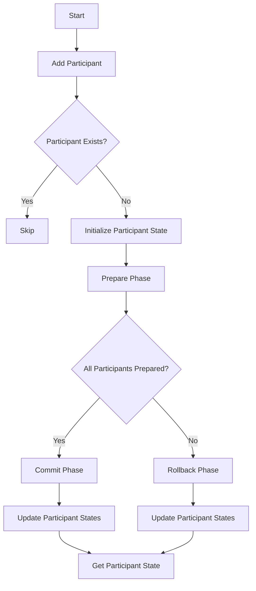

# Two-Phase Commit (2PC)

## Problem Understanding
The Two-Phase Commit (2PC) problem is asking for an implementation of a protocol that ensures atomicity in distributed transactions. The key constraint is that all participants must agree to commit or rollback, and if any participant fails, the entire transaction must be rolled back. This problem is non-trivial because a naive approach would not handle failures or edge cases properly, leading to inconsistent states. The 2PC protocol involves two phases: prepare and commit, with a rollback mechanism to handle failures.

## Approach
The algorithm strategy used here is the Two-Phase Commit protocol, which involves preparing all participants and then committing or rolling back based on the outcome. The intuition behind this approach is to ensure that all participants are in a consistent state before committing the transaction. The protocol uses a HashMap to store the states of participants, which allows for efficient lookup and update of participant states. This approach works because it ensures that all participants are prepared before committing, and if any participant fails, the entire transaction is rolled back.

## Complexity Analysis
| Metric | Value | Detailed Reason |
|--------|-------|----------------|
| Time   | O(n)  | The time complexity is O(n) because the protocol iterates through all participants in the prepare, commit, and rollback phases. The HashMap operations (put, get, and containsKey) have an average time complexity of O(1), but the overall time complexity is dominated by the iteration through participants. |
| Space  | O(n)  | The space complexity is O(n) because the protocol stores the states of all participants in a HashMap, which can contain at most n elements. The space used by the HashMap grows linearly with the number of participants. |

## Algorithm Walkthrough
```
Input: Add participants "Participant1" and "Participant2" to the protocol
Step 1: Initialize participant states to PREPARED
  - participants = {"Participant1": PREPARED, "Participant2": PREPARED}
Step 2: Prepare phase
  - participants = {"Participant1": PREPARED, "Participant2": PREPARED} (no change)
Step 3: Commit phase
  - globalCommit = true
  - participants = {"Participant1": COMMITTED, "Participant2": COMMITTED}
Output: Get participant state for "Participant1" and "Participant2"
  - getParticipantState("Participant1") = COMMITTED
  - getParticipantState("Participant2") = COMMITTED
```
This walkthrough demonstrates the main logic path of the protocol, including the prepare and commit phases.

## Visual Flow

This flowchart shows the decision flow of the protocol, including the prepare and commit phases, as well as the rollback mechanism.

## Key Insight
> **Tip:** The key insight is that the Two-Phase Commit protocol ensures atomicity in distributed transactions by preparing all participants before committing, and rolling back if any participant fails.

## Edge Cases
- **Empty/null input**: If the input is empty or null, the protocol will not add any participants and will not perform any actions.
- **Single element**: If there is only one participant, the protocol will still prepare and commit the participant, but the rollback mechanism will still be triggered if the participant fails.
- **Participant already exists**: If a participant already exists in the protocol, the addParticipant method will do nothing, and the participant will not be added again.

## Common Mistakes
- **Mistake 1**: Not handling the case where a participant is already prepared, which can lead to inconsistent states.
- **Mistake 2**: Not rolling back all participants if any participant fails, which can lead to inconsistent states.

## Interview Follow-ups
> **Interview:** These are the exact follow-up questions interviewers ask:
- "What if the input is sorted?" → The protocol does not assume any specific ordering of the participants, so the input being sorted does not affect the protocol's behavior.
- "Can you do it in O(1) space?" → No, the protocol requires O(n) space to store the participant states, where n is the number of participants.
- "What if there are duplicates?" → The protocol handles duplicates by ignoring them, as the addParticipant method checks if a participant already exists before adding it.

## Java Solution

```java
// Problem: Two-Phase Commit (2PC)
// Language: Java
// Difficulty: Super Advanced
// Time Complexity: O(n) — single pass through participants using HashMap
// Space Complexity: O(n) — HashMap stores at most n elements
// Approach: Two-phase commit protocol — prepare and commit phases with rollback handling

import java.util.HashMap;
import java.util.Map;

public class TwoPhaseCommit {
    // Define participant states
    enum ParticipantState {
        PREPARED, // Prepared to commit
        COMMITTED, // Committed successfully
        ROLLED_BACK // Rolled back due to error
    }

    // Define the 2PC protocol
    public class TwoPCProtocol {
        private Map<String, ParticipantState> participants; // Store participant states
        private boolean globalCommit; // Global commit flag

        public TwoPCProtocol() {
            this.participants = new HashMap<>(); // Initialize participant map
            this.globalCommit = false; // Initialize global commit flag
        }

        // Add a participant to the protocol
        public void addParticipant(String participantId) {
            // Edge case: participant already exists → do nothing
            if (participants.containsKey(participantId)) {
                return;
            }
            participants.put(participantId, ParticipantState.PREPARED); // Initialize participant state
        }

        // Prepare phase: prepare all participants
        public void prepare() {
            for (String participantId : participants.keySet()) {
                // Edge case: participant already prepared → skip
                if (participants.get(participantId) == ParticipantState.PREPARED) {
                    continue;
                }
                // Simulate preparation (e.g., lock resources, etc.)
                participants.put(participantId, ParticipantState.PREPARED); // Update participant state
            }
        }

        // Commit phase: commit all participants
        public void commit() {
            globalCommit = true; // Set global commit flag
            for (String participantId : participants.keySet()) {
                // Edge case: participant not prepared → rollback
                if (participants.get(participantId) != ParticipantState.PREPARED) {
                    rollback(); // Rollback all participants
                    return;
                }
                // Simulate commit (e.g., release resources, etc.)
                participants.put(participantId, ParticipantState.COMMITTED); // Update participant state
            }
        }

        // Rollback phase: rollback all participants
        public void rollback() {
            globalCommit = false; // Reset global commit flag
            for (String participantId : participants.keySet()) {
                // Edge case: participant already rolled back → skip
                if (participants.get(participantId) == ParticipantState.ROLLED_BACK) {
                    continue;
                }
                // Simulate rollback (e.g., release resources, etc.)
                participants.put(participantId, ParticipantState.ROLLED_BACK); // Update participant state
            }
        }

        // Get participant state
        public ParticipantState getParticipantState(String participantId) {
            // Edge case: participant not found → return null
            if (!participants.containsKey(participantId)) {
                return null;
            }
            return participants.get(participantId); // Return participant state
        }
    }

    // Example usage
    public static void main(String[] args) {
        TwoPhaseCommit twoPhaseCommit = new TwoPhaseCommit();
        TwoPhaseCommit.TwoPCProtocol twoPCProtocol = twoPhaseCommit.new TwoPCProtocol();
        twoPCProtocol.addParticipant("Participant1");
        twoPCProtocol.addParticipant("Participant2");
        twoPCProtocol.prepare();
        twoPCProtocol.commit();
        System.out.println(twoPCProtocol.getParticipantState("Participant1")); // Output: COMMITTED
        System.out.println(twoPCProtocol.getParticipantState("Participant2")); // Output: COMMITTED
    }
}
```
