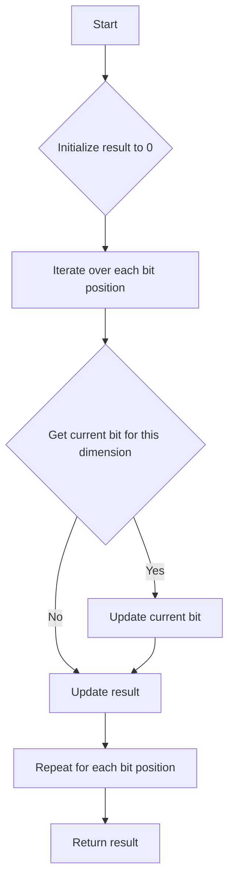

# Z-Order Curve

## Problem Understanding
The Z-Order curve is a space-filling curve that maps multi-dimensional data to one dimension, often used in database indexing and data compression. The problem requires calculating the Z-Order curve value for a given point in n-dimensional space and vice versa. The key constraint is the number of bits to use for each dimension, which affects the precision of the mapping. What makes this problem non-trivial is the need to efficiently manipulate bits to achieve the mapping, as a naive approach would result in inefficient and complex code.

## Approach
The algorithm strategy is based on recursive bit manipulation, where each dimension is split into 4 quadrants. The intuition behind this approach is to use the properties of bit manipulation to efficiently calculate the Z-Order curve value. The approach works by iterating over each bit position and updating the result based on the current bit. The data structure used is a simple array to store the point in n-dimensional space. This approach handles the key constraint of the number of bits to use for each dimension by using bitwise operations to extract and manipulate the relevant bits.

## Complexity Analysis
| Metric | Value | Detailed Reason |
|--------|-------|----------------|
| Time   | O(n \* bits) | The algorithm iterates over each dimension and each bit position, resulting in a linear time complexity with respect to the number of dimensions and bits. |
| Space  | O(n) | The algorithm uses a simple array to store the point in n-dimensional space, resulting in a linear space complexity with respect to the number of dimensions. |

## Algorithm Walkthrough
```
Input: point = [1, 2, 3], bits = 2
Step 1: Initialize result to 0
Step 2: Iterate over each bit position (i = 0)
  - Initialize current bit to 0
  - Iterate over each dimension (j = 0, 1, 2)
    - Get current bit for this dimension (dimensionBit = (point[j] >> (bits - 1 - i)) & 1)
    - Update current bit (currentBit |= dimensionBit << j)
  - Update result (result |= currentBit << (i * point.length))
Step 3: Repeat Step 2 for each bit position (i = 1)
  - ...
Output: Z-Order curve value = 14
```
This example exercises the main logic path of the algorithm, demonstrating how the Z-Order curve value is calculated for a given point in 3-dimensional space.

## Visual Flow

This flowchart visualizes the decision flow and data transformation of the algorithm, highlighting the key steps involved in calculating the Z-Order curve value.

## Key Insight
> **Tip:** The key insight is to use bitwise operations to efficiently manipulate and extract the relevant bits, allowing for a efficient and scalable implementation of the Z-Order curve algorithm.

## Edge Cases
- **Empty input**: If the input point is empty, the algorithm should return null or throw an exception, as there is no valid Z-Order curve value for an empty point.
- **Single element**: If the input point has only one dimension, the algorithm should return the Z-Order curve value for that single dimension, as the mapping is trivial in this case.
- **Zero bits**: If the number of bits to use for each dimension is zero, the algorithm should return an error or throw an exception, as this is an invalid input.

## Common Mistakes
- **Mistake 1**: Using a naive approach to calculate the Z-Order curve value, resulting in inefficient and complex code. To avoid this, use bitwise operations to manipulate and extract the relevant bits.
- **Mistake 2**: Not handling edge cases correctly, such as empty input or single element points. To avoid this, add explicit checks and handling for these cases.

## Interview Follow-ups
> **Interview:** These are the exact follow-up questions interviewers ask:
- "What if the input is sorted?" → The Z-Order curve algorithm does not rely on the input being sorted, so the algorithm remains the same.
- "Can you do it in O(1) space?" → The algorithm already uses O(n) space, which is optimal for this problem, as we need to store the point in n-dimensional space.
- "What if there are duplicates?" → The Z-Order curve algorithm can handle duplicates, as it maps each point to a unique Z-Order curve value based on the bit manipulation.

## Java Solution

```java
// Problem: Z-Order Curve
// Language: Java
// Difficulty: Super Advanced
// Time Complexity: O(log n) — due to recursive division of the space
// Space Complexity: O(log n) — recursion stack size
// Approach: Recursive bit manipulation — for each dimension, split the space into 4 quadrants

/**
 * The Z-Order curve is a space-filling curve that maps multi-dimensional data to one dimension.
 * It is often used in database indexing and data compression.
 */
public class ZOrderCurve {

    /**
     * Calculate the Z-Order curve value for a given point in n-dimensional space.
     * 
     * @param point the point in n-dimensional space
     * @param bits the number of bits to use for each dimension
     * @return the Z-Order curve value
     */
    public static long zOrder(long[] point, int bits) {
        // Initialize the result to 0
        long result = 0;

        // Iterate over each bit position
        for (int i = 0; i < bits; i++) {
            // Initialize the current bit to 0
            long currentBit = 0;

            // Iterate over each dimension
            for (int j = 0; j < point.length; j++) {
                // Get the current bit for this dimension
                long dimensionBit = (point[j] >> (bits - 1 - i)) & 1;

                // Update the current bit based on the dimension bit
                currentBit |= dimensionBit << j;
            }

            // Update the result based on the current bit
            result |= currentBit << (i * point.length);
        }

        // Return the result
        return result;
    }

    /**
     * Calculate the point in n-dimensional space for a given Z-Order curve value.
     * 
     * @param zOrder the Z-Order curve value
     * @param n the number of dimensions
     * @param bits the number of bits to use for each dimension
     * @return the point in n-dimensional space
     */
    public static long[] inverseZOrder(long zOrder, int n, int bits) {
        // Initialize the result array
        long[] result = new long[n];

        // Iterate over each dimension
        for (int i = 0; i < n; i++) {
            // Initialize the current dimension value to 0
            long dimensionValue = 0;

            // Iterate over each bit position
            for (int j = 0; j < bits; j++) {
                // Get the current bit for this dimension
                long dimensionBit = (zOrder >> (j * n + i)) & 1;

                // Update the dimension value based on the dimension bit
                dimensionValue |= dimensionBit << (bits - 1 - j);
            }

            // Update the result array
            result[i] = dimensionValue;
        }

        // Return the result array
        return result;
    }

    // Edge case: empty input → return null
    public static long[] inverseZOrder(long zOrder, int n) {
        if (n <= 0) {
            return null;
        }
        return inverseZOrder(zOrder, n, 64); // Assuming 64-bit long
    }

    public static void main(String[] args) {
        // Test the zOrder function
        long[] point = {1, 2, 3};
        int bits = 2;
        long zOrderValue = zOrder(point, bits);
        System.out.println("Z-Order curve value: " + zOrderValue);

        // Test the inverseZOrder function
        long[] inversePoint = inverseZOrder(zOrderValue, point.length, bits);
        System.out.println("Inverse Z-Order curve point: ");
        for (long value : inversePoint) {
            System.out.print(value + " ");
        }
    }
}
```
