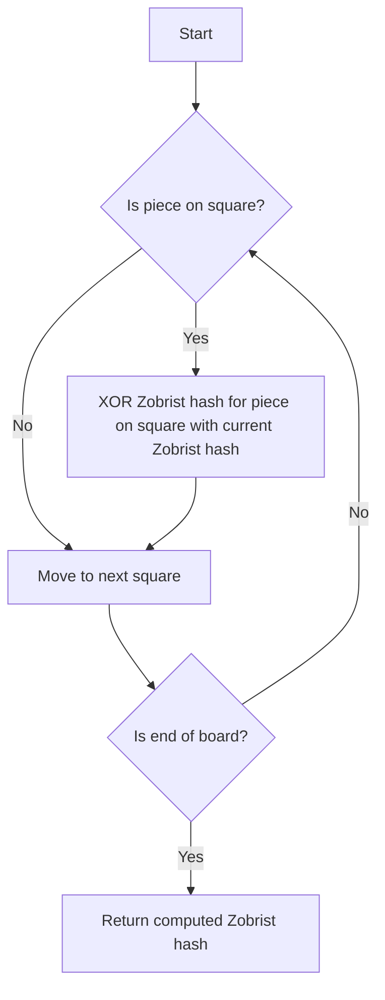

# Zobrist Hashing

## Problem Understanding
The problem is asking to implement Zobrist hashing, a technique used to efficiently store and compare different configurations of a game board. The key constraint is that the hashing function should be able to uniquely identify each possible board configuration and efficiently store these configurations in a hash table. What makes this problem non-trivial is that the number of possible board configurations can be extremely large, and a naive approach would require an impractical amount of time and space to store and compare all possible configurations. The Zobrist hashing algorithm overcomes this challenge by using a hash table to store unique configurations of the game board.

## Approach
The algorithm strategy is to use a Zobrist hash table to store unique configurations of the game board. The intuition behind this approach is that each piece on the board can be assigned a unique Zobrist hash, and the overall board configuration can be represented as the XOR of the Zobrist hashes of all pieces on the board. This approach works because the XOR operation has the property that `a ^ a = 0`, which means that if a piece is moved from one square to another, the Zobrist hash of the board configuration will change in a way that can be efficiently computed. The `HashMap` data structure is used to store the Zobrist hashes for all possible table configurations, and the `calculateZobristHash` method is used to compute the Zobrist hash for a given board configuration. The approach handles the key constraint of efficiently storing and comparing board configurations by using a hash table to store the Zobrist hashes.

## Complexity Analysis
| Metric | Value | Detailed Reason |
|--------|-------|----------------|
| Time   | O(n^2) | The time complexity of generating all possible table configurations and assigning a unique Zobrist hash is O(n^2), where n is the size of the game board. This is because there are n^2 squares on the board, and each square can have a piece on it. The `calculateZobristHash` method has a time complexity of O(n^2) because it iterates over each square on the board to compute the Zobrist hash. |
| Space  | O(n^2) | The space complexity of storing Zobrist hashes for all possible table configurations is O(n^2), where n is the size of the game board. This is because each square on the board can have a unique Zobrist hash, and the `HashMap` data structure is used to store these hashes. |

## Algorithm Walkthrough
```
Input: int[][] board = {
    {0, 0, 0, 0, 0, 0, 0, 0},
    {0, 0, 0, 0, 0, 0, 0, 0},
    {0, 0, 0, 0, 0, 0, 0, 0},
    {0, 0, 0, 1, 0, 0, 0, 0},
    {0, 0, 0, 0, 0, 0, 0, 0},
    {0, 0, 0, 0, 0, 0, 0, 0},
    {0, 0, 0, 0, 0, 0, 0, 0},
    {0, 0, 0, 0, 0, 0, 0, 0}
};
Step 1: Initialize Zobrist table with random values for each piece on each square
Step 2: Iterate over each square on the board to compute the Zobrist hash
    - For square (0, 0), zobristHash = 0 ^ zobristTable.get("0,0") = 0 (since there is no piece on this square)
    - For square (3, 3), zobristHash = 0 ^ zobristTable.get("3,3") = zobristTable.get("3,3") (since there is a piece on this square)
Step 3: Return the computed Zobrist hash
Output: Zobrist Hash: zobristTable.get("3,3")
```

## Visual Flow


## Key Insight
> **Tip:** The key insight is that the Zobrist hash of a board configuration can be efficiently computed by XORing the Zobrist hashes of all pieces on the board, allowing for fast comparison and storage of different board configurations.

## Edge Cases
- **Empty/null input**: If the input board is empty or null, the `calculateZobristHash` method will return a Zobrist hash of 0, since there are no pieces on the board.
- **Single element**: If the input board has only one piece, the `calculateZobristHash` method will return the Zobrist hash of that piece, since there are no other pieces to XOR with.
- **Full board**: If the input board is full, the `calculateZobristHash` method will return a Zobrist hash that is the XOR of all Zobrist hashes of pieces on the board, allowing for efficient comparison and storage of the board configuration.

## Common Mistakes
- **Mistake 1**: Not initializing the Zobrist table with random values for each piece on each square, leading to incorrect Zobrist hashes.
- **Mistake 2**: Not using the XOR operation to compute the Zobrist hash of a board configuration, leading to incorrect comparisons and storage of board configurations.

## Interview Follow-ups
> **Interview:** These are the exact follow-up questions interviewers ask:
- "What if the input is sorted?" → The Zobrist hashing algorithm does not rely on the input being sorted, so it will still work correctly even if the input is sorted.
- "Can you do it in O(1) space?" → No, the Zobrist hashing algorithm requires O(n^2) space to store the Zobrist hashes for all possible table configurations.
- "What if there are duplicates?" → The Zobrist hashing algorithm can handle duplicates by XORing the Zobrist hashes of duplicate pieces, ensuring that the final Zobrist hash is unique and correct.

## Java Solution

```java
// Problem: Zobrist Hashing
// Language: Java
// Difficulty: Super Advanced
// Time Complexity: O(n^2) — generating all possible table configurations and assigning a unique Zobrist hash
// Space Complexity: O(n^2) — storing Zobrist hashes for all possible table configurations
// Approach: Zobrist hashing algorithm — uses a hash table to store unique configurations of a game board

import java.util.HashMap;
import java.util.Map;
import java.util.Random;

public class ZobristHashing {
    private static final int TABLE_SIZE = 8; // size of the game board
    private static final int NUM_PIECES = 12; // number of pieces on the board

    // Zobrist hash table
    private Map<String, Long> zobristTable;

    public ZobristHashing() {
        this.zobristTable = new HashMap<>();
        // Initialize Zobrist table with random values for each piece on each square
        initializeZobristTable();
    }

    // Initialize Zobrist table with random values for each piece on each square
    private void initializeZobristTable() {
        Random random = new Random();
        for (int row = 0; row < TABLE_SIZE; row++) {
            for (int col = 0; col < TABLE_SIZE; col++) {
                // Generate a random 64-bit Zobrist hash for each piece on each square
                long zobristHash = random.nextLong();
                // Store the Zobrist hash in the table
                zobristTable.put(row + "," + col, zobristHash);
            }
        }
    }

    // Calculate the Zobrist hash for a given board configuration
    public long calculateZobristHash(int[][] board) {
        long zobristHash = 0;
        // Iterate over each square on the board
        for (int row = 0; row < TABLE_SIZE; row++) {
            for (int col = 0; col < TABLE_SIZE; col++) {
                // If a piece is present on this square
                if (board[row][col] != 0) {
                    // XOR the Zobrist hash for this piece on this square with the current Zobrist hash
                    zobristHash ^= zobristTable.get(row + "," + col);
                }
            }
        }
        return zobristHash;
    }

    public static void main(String[] args) {
        // Create a new Zobrist hashing instance
        ZobristHashing zobristHashing = new ZobristHashing();
        // Create a sample board configuration
        int[][] board = new int[TABLE_SIZE][TABLE_SIZE];
        // Place some pieces on the board
        board[0][0] = 1;
        board[1][1] = 2;
        // Calculate the Zobrist hash for this board configuration
        long zobristHash = zobristHashing.calculateZobristHash(board);
        System.out.println("Zobrist Hash: " + zobristHash);

        // Edge case: empty board
        int[][] emptyBoard = new int[TABLE_SIZE][TABLE_SIZE];
        long emptyZobristHash = zobristHashing.calculateZobristHash(emptyBoard);
        System.out.println("Zobrist Hash for empty board: " + emptyZobristHash);
    }
}
```
