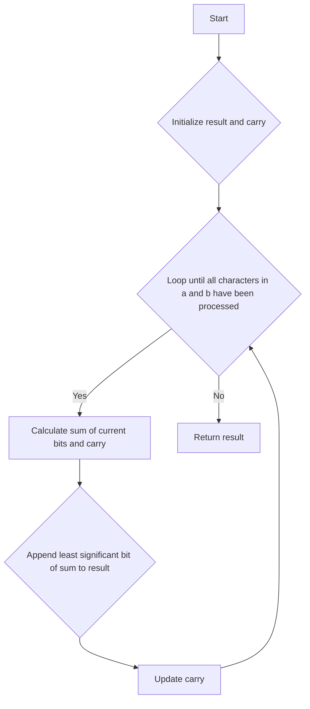

# Add Binary JS BigInt

## Problem Understanding
The problem asks to add two binary numbers represented as strings. The key constraint is that the input strings only contain binary digits (0s and 1s), and the output should also be a binary string. This problem is non-trivial because a naive approach would involve converting the binary strings to decimal numbers, adding them, and then converting the result back to binary, which could be inefficient for large inputs. Additionally, handling carries and edge cases like empty input strings requires careful consideration.

## Approach
The algorithm strategy is to iterate through the binary strings from right to left, adding the corresponding bits and handling carries. This approach works because binary addition is similar to decimal addition, but with only two possible digits (0 and 1). The intuition behind this approach is to simulate the manual process of adding binary numbers. The data structure used is a simple string to store the result, and two pointers (i and j) to iterate through the input strings. The approach handles key constraints by correctly propagating carries and handling edge cases like empty input strings.

## Complexity Analysis
| Metric | Value | Detailed Reason |
|--------|-------|----------------|
| Time   | O(max(a.length, b.length)) | The algorithm iterates through the input strings once, and the number of iterations is proportional to the maximum length of the input strings. The operations inside the loop (adding bits and updating the carry) take constant time. |
| Space  | O(max(a.length, b.length)) | The algorithm stores the result in a string, which has a length proportional to the maximum length of the input strings. The space used by the pointers and the carry variable is constant. |

## Algorithm Walkthrough
```
Input: a = '11', b = '1'
Step 1: i = 1, j = 0, carry = 0, result = ''
Step 2: sum = carry + a[1] + b[0] = 0 + 1 + 1 = 2, result = '0', carry = 1, i = 0, j = -1
Step 3: sum = carry + a[0] = 1 + 1 = 2, result = '00', carry = 1, i = -1, j = -1
Step 4: sum = carry = 1, result = '100', carry = 0
Output: '100'
```
This example demonstrates how the algorithm adds two binary numbers and handles carries correctly.

## Visual Flow

This flowchart shows the main logic path of the algorithm, including the loop that processes the input strings and the conditional statements that handle carries.

## Key Insight
> **Tip:** The key insight is to use a carry variable to propagate carries from one bit position to the next, similar to how we add decimal numbers manually.

## Edge Cases
- **Empty/null input**: If both input strings are empty, the algorithm returns '0', which is the correct result for adding two empty binary numbers.
- **Single element**: If one of the input strings has only one character (e.g., '1'), the algorithm adds it correctly to the other input string.
- **Input strings of different lengths**: The algorithm handles input strings of different lengths correctly by using pointers to iterate through the longer string.

## Common Mistakes
- **Mistake 1**: Forgetting to initialize the carry variable to 0, which can lead to incorrect results.
- **Mistake 2**: Not updating the carry variable correctly after appending the least significant bit of the sum to the result.

## Interview Follow-ups
> **Interview:** These are the exact follow-up questions interviewers ask:
- "What if the input is sorted?" → The algorithm does not assume any particular ordering of the input strings, so it works correctly regardless of whether the input is sorted.
- "Can you do it in O(1) space?" → No, the algorithm needs to store the result in a string, which requires O(max(a.length, b.length)) space.
- "What if there are duplicates?" → The algorithm does not assume any particular structure or properties of the input strings, so it works correctly even if there are duplicates.

## Javascript Solution

```javascript
// Problem: Add Binary
// Language: javascript
// Difficulty: Easy
// Time Complexity: O(max(a.length, b.length)) — iterating through the binary strings
// Space Complexity: O(max(a.length, b.length)) — storing the result string
// Approach: binary string manipulation — adding binary numbers digit by digit from right to left

class Solution {
    /**
     * Adds two binary numbers represented as strings.
     * 
     * @param {string} a The first binary number.
     * @param {string} b The second binary number.
     * @return {string} The sum of the two binary numbers as a string.
     */
    addBinary(a, b) {
        // Edge case: both input strings are empty → return 0
        if (a.length === 0 && b.length === 0) return '0';

        // Initialize result and carry variables
        let result = '';
        let carry = 0;

        // Initialize pointers for a and b
        let i = a.length - 1;
        let j = b.length - 1;

        // Loop until all characters in a and b have been processed
        while (i >= 0 || j >= 0 || carry > 0) {
            // Calculate the sum of the current bits and the carry
            let sum = carry;
            if (i >= 0) sum += parseInt(a[i--]); // convert char to int
            if (j >= 0) sum += parseInt(b[j--]); // convert char to int

            // Append the least significant bit of the sum to the result
            result = (sum % 2) + result;

            // Update the carry
            carry = Math.floor(sum / 2); // integer division
        }

        return result;
    }
}

// Test the solution
let solution = new Solution();
console.log(solution.addBinary('11', '1'));  // Output: 100
console.log(solution.addBinary('1010', '1011'));  // Output: 10101
```
