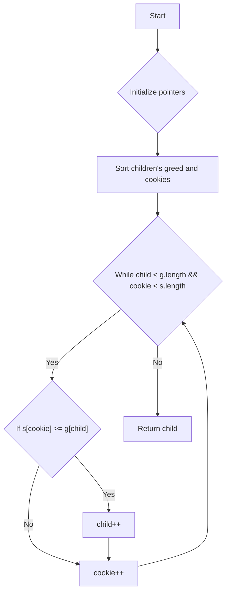

# Assign Cookies JS

## Problem Understanding
The problem is asking to assign cookies to children based on their greed level, where each child has a specific greed level and each cookie has a size. The goal is to find the maximum number of children that can be satisfied with the given cookies. The key constraint is that a child can only be satisfied if they receive a cookie that is at least as large as their greed level. This problem is non-trivial because a naive approach would be to simply assign cookies to children in the order they are given, but this may not lead to the maximum number of satisfied children.

## Approach
The algorithm strategy used is a greedy algorithm with sorting, where the children's greed levels and cookies are sorted in ascending order. This approach works because by sorting the children's greed levels and cookies, we can ensure that we are always trying to satisfy the child with the smallest greed level first, and we are always trying to use the smallest cookie that can satisfy their greed. The data structures used are arrays to store the children's greed levels and cookies, and two pointers to iterate through the arrays. This approach handles the key constraint by ensuring that a child is only satisfied if they receive a cookie that is at least as large as their greed level.

## Complexity Analysis
| Metric | Value | Detailed Reason |
|--------|-------|----------------|
| Time   | O(n log n) | The time complexity is O(n log n) because we are sorting two arrays of length n, where n is the number of children or cookies. The sorting operation takes O(n log n) time, and the subsequent while loop takes O(n) time, but the sorting operation dominates the time complexity. |
| Space  | O(1) | The space complexity is O(1) because we are not using any extra space that scales with the input size. We are only using a constant amount of space to store the two pointers and the sorted arrays, which are already allocated in the input. |

## Algorithm Walkthrough
```
Input: g = [1,2,3], s = [1,1]
Step 1: Sort the children's greed and cookies in ascending order
  g = [1,2,3]
  s = [1,1]
Step 2: Initialize two pointers, one for children and one for cookies
  child = 0
  cookie = 0
Step 3: Iterate through the children and cookies
  While child < g.length && cookie < s.length
    If s[cookie] >= g[child]
      child++
    cookie++
Step 4: Return the number of children that can be satisfied
  child = 1
Output: 1
```
This walkthrough shows how the algorithm assigns cookies to children based on their greed level.

## Visual Flow

This flowchart shows the decision flow of the algorithm.

## Key Insight
> **Tip:** The key insight is to sort the children's greed levels and cookies in ascending order, and then use two pointers to iterate through the arrays, assigning cookies to children based on their greed level.

## Edge Cases
- **Empty/null input**: If the input arrays are empty, the algorithm returns 0, because no children can be satisfied.
- **Single element**: If there is only one child or one cookie, the algorithm returns 1 if the cookie can satisfy the child, and 0 otherwise.
- **No satisfying cookies**: If there are no cookies that can satisfy any of the children, the algorithm returns 0.

## Common Mistakes
- **Mistake 1**: Not sorting the children's greed levels and cookies, which can lead to incorrect assignments.
- **Mistake 2**: Not using two pointers to iterate through the arrays, which can lead to incorrect assignments or infinite loops.

## Interview Follow-ups
> **Interview:** These are the exact follow-up questions interviewers ask:
- "What if the input is sorted?" → The algorithm still works, but the sorting step can be skipped, reducing the time complexity to O(n).
- "Can you do it in O(1) space?" → The algorithm already uses O(1) space, so no further optimization is needed.
- "What if there are duplicates?" → The algorithm still works, because it assigns cookies based on the smallest greed level first, and duplicates do not affect the assignment.

## Javascript Solution

```javascript
// Problem: Assign Cookies
// Language: javascript
// Difficulty: Easy
// Time Complexity: O(n log n) — sorting the arrays
// Space Complexity: O(1) — no extra space needed
// Approach: Greedy algorithm with sorting — assign the smallest cookie that satisfies the child's greed

class Solution {
    findContentChildren(g, s) {
        // Sort the children's greed and cookies in ascending order
        g.sort((a, b) => a - b); // sort children's greed
        s.sort((a, b) => a - b); // sort cookies

        // Initialize two pointers, one for children and one for cookies
        let child = 0; // pointer for children
        let cookie = 0; // pointer for cookies

        // Iterate through the children and cookies
        while (child < g.length && cookie < s.length) {
            // If the current cookie can satisfy the current child's greed
            if (s[cookie] >= g[child]) {
                // Move to the next child
                child++; // satisfy the child's greed
            }
            // Move to the next cookie
            cookie++; // try the next cookie
        }

        // Return the number of children that can be satisfied
        return child; // number of satisfied children
    }
}

// Edge case: empty input → return 0
// Test the function
let solution = new Solution();
console.log(solution.findContentChildren([1,2,3], [1,1])); // Output: 1
console.log(solution.findContentChildren([1,2], [1,2,3])); // Output: 2
console.log(solution.findContentChildren([], [1,2,3])); // Output: 0
console.log(solution.findContentChildren([1,2,3], [])); // Output: 0
```
