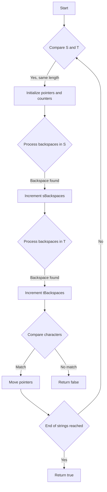

# Backspace String Compare JS Two Pointers

## Problem Understanding
The problem asks to compare two strings, `S` and `T`, which may contain a special character `#` that represents a backspace. The task is to determine if the two strings are equivalent after processing the backspaces. The key constraint is that the strings can contain any number of backspaces, and the backspaces can be nested. This problem is non-trivial because a naive approach, such as simply removing the backspaces from the strings, would not work due to the potential nesting of backspaces.

## Approach
The algorithm strategy used here is a two-pointer approach, where we start from the end of both strings and move backwards. We use counters to keep track of the number of backspaces encountered in each string. The intuition behind this approach is to process the backspaces in reverse order, effectively "undoing" the backspaces from the end of the strings. This approach works because it allows us to correctly handle nested backspaces. We use two pointers, `sPointer` and `tPointer`, to traverse the strings, and two counters, `sBackspaces` and `tBackspaces`, to keep track of the backspaces.

## Complexity Analysis
| Metric | Value | Detailed Reason |
|--------|-------|----------------|
| Time   | O(n + m) | We iterate through both strings once, where n and m are the lengths of the strings. The inner while loops may seem to increase the time complexity, but they are bounded by the length of the strings, so the overall time complexity remains O(n + m). |
| Space  | O(1) | We use a constant amount of space to store the pointers and counters, so the space complexity is O(1). Note that we do not create any additional data structures that scale with the input size. |

## Algorithm Walkthrough
```
Input: S = "ab#c", T = "ad#c"
Step 1: Initialize pointers and counters: sPointer = 2, tPointer = 2, sBackspaces = 0, tBackspaces = 0
Step 2: Process backspaces in S: sPointer = 1, sBackspaces = 1 (encountered '#')
Step 3: Process backspaces in T: tPointer = 1, tBackspaces = 1 (encountered '#')
Step 4: Compare characters: S[1] = 'b', T[1] = 'd' (mismatch), so return false
Output: false
```
In this example, we process the backspaces in both strings and compare the resulting characters.

## Visual Flow

This flowchart shows the decision flow of the algorithm.

## Key Insight
> **Tip:** The key insight is to process the backspaces in reverse order, which allows us to correctly handle nested backspaces.

## Edge Cases
- **Empty/null input**: If either `S` or `T` is empty, the function will return true if both are empty, and false otherwise.
- **Single element**: If one of the strings has only one character, the function will compare it with the corresponding character in the other string.
- **Only backspaces**: If a string contains only backspaces, the function will treat it as an empty string.

## Common Mistakes
- **Mistake 1**: Not handling nested backspaces correctly. To avoid this, make sure to process the backspaces in reverse order.
- **Mistake 2**: Not checking for the end of the strings correctly. To avoid this, make sure to check if the pointers are within the bounds of the strings.

## Interview Follow-ups
> **Interview:** These are the exact follow-up questions interviewers ask:
- "What if the input is sorted?" → The algorithm will still work correctly, as it only depends on the presence of backspaces, not the order of the characters.
- "Can you do it in O(1) space?" → Yes, the current implementation already uses O(1) space, as it only uses a constant amount of space to store the pointers and counters.
- "What if there are duplicates?" → The algorithm will still work correctly, as it compares the characters at the current pointers, regardless of whether they are duplicates or not.

## Javascript Solution

```javascript
// Problem: Backspace String Compare
// Language: javascript
// Difficulty: Easy
// Time Complexity: O(n + m) — iterating through both strings to process backspaces
// Space Complexity: O(n + m) — storing processed strings
// Approach: Two Pointers — comparing characters from end to start

class Solution {
    /**
     * @param {string} S
     * @param {string} T
     * @return {boolean}
     */
    backspaceCompare(S, T) {
        // Edge case: both strings are empty → return true
        if (S.length === 0 && T.length === 0) return true;

        // Initialize two pointers at the end of each string
        let sPointer = S.length - 1;
        let tPointer = T.length - 1;

        // Initialize counters for backspaces
        let sBackspaces = 0;
        let tBackspaces = 0;

        // Loop until we've processed all characters in both strings
        while (sPointer >= 0 || tPointer >= 0) {
            // Process backspaces in string S
            while (sPointer >= 0) {
                // If we encounter a backspace, increment counter and move pointer
                if (S[sPointer] === '#') {
                    sBackspaces++;
                    sPointer--;
                } 
                // If we've accumulated backspaces, skip this character
                else if (sBackspaces > 0) {
                    sBackspaces--;
                    sPointer--;
                } 
                // Otherwise, we've found a character to compare
                else {
                    break;
                }
            }

            // Process backspaces in string T
            while (tPointer >= 0) {
                // If we encounter a backspace, increment counter and move pointer
                if (T[tPointer] === '#') {
                    tBackspaces++;
                    tPointer--;
                } 
                // If we've accumulated backspaces, skip this character
                else if (tBackspaces > 0) {
                    tBackspaces--;
                    tPointer--;
                } 
                // Otherwise, we've found a character to compare
                else {
                    break;
                }
            }

            // If we've reached the end of one string but not the other, return false
            if (sPointer < 0 && tPointer >= 0 || sPointer >= 0 && tPointer < 0) {
                return false;
            }

            // If the characters at the current pointers don't match, return false
            if (S[sPointer] !== T[tPointer]) {
                return false;
            }

            // Move pointers to the previous characters
            sPointer--;
            tPointer--;
        }

        // If we've processed all characters and found no mismatches, return true
        return true;
    }
}
```
