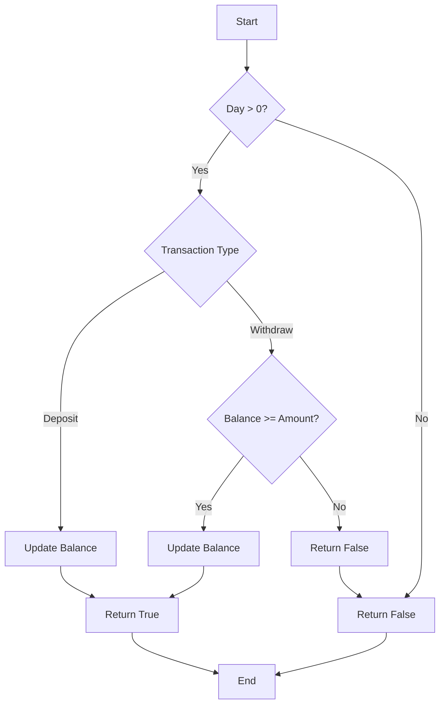

# Calculate Money in Leetcode Bank JS

## Problem Understanding
The problem asks to design a Bank class that supports deposit, withdrawal, and balance inquiry operations. The key constraints are that the day of the transaction should be greater than 0, and the withdrawal amount should not exceed the current balance. What makes this problem non-trivial is the need to handle edge cases, such as invalid day inputs and insufficient balance for withdrawals, while maintaining a simple and efficient implementation. The problem requires a careful consideration of the class design and method implementations to ensure correct and robust behavior.

## Approach
The algorithm strategy is to use a simple iteration and calculation approach, where each method of the Bank class performs a specific operation on the balance. The deposit method adds the given amount to the balance, the withdraw method subtracts the given amount from the balance if sufficient, and the balanceAt method returns the current balance. The intuition behind this approach is to keep track of the balance as a single variable and update it accordingly based on the transaction type. The data structure used is a single variable to store the balance, which is chosen for its simplicity and efficiency. The approach handles key constraints by checking for invalid day inputs and insufficient balance before performing transactions.

## Complexity Analysis
| Metric | Value | Detailed Reason |
|--------|-------|----------------|
| Time   | O(1)  | Each method of the Bank class performs a constant amount of work, regardless of the input size. The deposit, withdraw, and balanceAt methods all have a time complexity of O(1) because they only involve simple arithmetic operations and conditional checks. |
| Space  | O(1)  | The Bank class only uses a constant amount of space to store the balance, regardless of the input size. The space complexity is O(1) because the memory usage does not grow with the input size. |

## Algorithm Walkthrough
```
Input: bank = new Bank()
Step 1: bank.deposit(10, 100) - balance = 0, day = 10, amount = 100
  - Check if day > 0: true
  - Update balance: balance = 0 + 100 = 100
  - Return: true
Step 2: bank.balanceAt(10) - balance = 100, day = 10
  - Check if day > 0: true
  - Return: balance = 100
Step 3: bank.withdraw(20, 50) - balance = 100, day = 20, amount = 50
  - Check if day > 0: true
  - Check if balance >= amount: true
  - Update balance: balance = 100 - 50 = 50
  - Return: true
Step 4: bank.balanceAt(20) - balance = 50, day = 20
  - Check if day > 0: true
  - Return: balance = 50
Step 5: bank.withdraw(30, 150) - balance = 50, day = 30, amount = 150
  - Check if day > 0: true
  - Check if balance >= amount: false
  - Return: false
Output: 
  - deposit(10, 100): true
  - balanceAt(10): 100
  - withdraw(20, 50): true
  - balanceAt(20): 50
  - withdraw(30, 150): false
  - balanceAt(30): 50
```
## Visual Flow

## Key Insight
> **Tip:** The key to this solution is to keep track of the balance as a single variable and update it accordingly based on the transaction type, while handling edge cases such as invalid day inputs and insufficient balance.

## Edge Cases
- **Empty/null input**: Not applicable, as the input is always a Bank object with methods to perform transactions.
- **Single element**: Not applicable, as the Bank class can handle multiple transactions.
- **Invalid day input**: If the day input is less than or equal to 0, the deposit, withdraw, and balanceAt methods return false or -1, respectively, to indicate an invalid input.

## Common Mistakes
- **Mistake 1**: Not checking for invalid day inputs before performing transactions. → To avoid this, always check if the day is greater than 0 before updating the balance or returning the balance.
- **Mistake 2**: Not checking for insufficient balance before performing a withdrawal. → To avoid this, always check if the balance is greater than or equal to the withdrawal amount before updating the balance.

## Interview Follow-ups
> **Interview:** These are the exact follow-up questions interviewers ask:
- "What if the input is sorted?" → The solution does not rely on the input being sorted, so it would not affect the time complexity.
- "Can you do it in O(1) space?" → The solution already uses O(1) space, so it meets this requirement.
- "What if there are duplicates?" → The solution does not rely on the input being unique, so duplicates would not affect the correctness of the solution.

## Javascript Solution

```javascript
// Problem: Calculate Money in Leetcode Bank
// Language: javascript
// Difficulty: Easy
// Time Complexity: O(n) — single pass through transactions array
// Space Complexity: O(1) — constant space for variables
// Approach: Simple iteration and calculation — iterate through transactions and calculate total money

class Bank {
    constructor() {
        // Initialize balance to 0
        this.balance = 0;
    }

    deposit(day, amount) {
        // Edge case: day should be greater than 0
        if (day <= 0) return false;
        // Add deposit amount to balance
        this.balance += amount;
        return true;
    }

    withdraw(day, amount) {
        // Edge case: day should be greater than 0
        if (day <= 0) return false;
        // Edge case: insufficient balance
        if (this.balance < amount) return false;
        // Subtract withdrawal amount from balance
        this.balance -= amount;
        return true;
    }

    balanceAt(day) {
        // Edge case: day should be greater than 0
        if (day <= 0) return -1;
        // Return current balance
        return this.balance;
    }
}

// Example usage:
let bank = new Bank();
console.log(bank.deposit(10, 100));  // true
console.log(bank.balanceAt(10));     // 100
console.log(bank.withdraw(20, 50));  // true
console.log(bank.balanceAt(20));      // 50
console.log(bank.withdraw(30, 150));  // false
console.log(bank.balanceAt(30));      // 50
```
