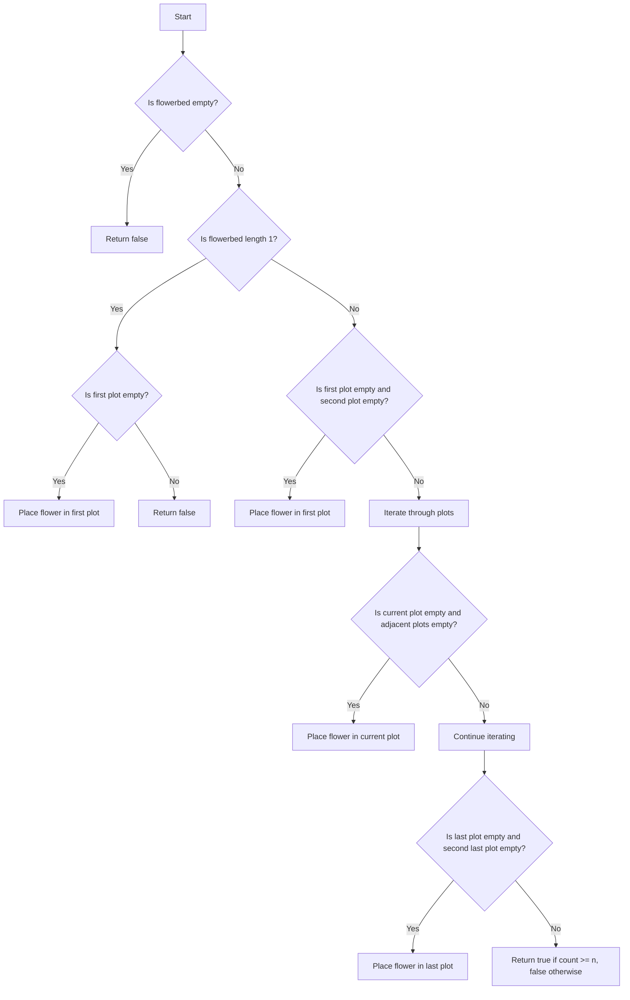

# Can Place Flowers JS

## Problem Understanding
The problem is asking whether it is possible to place a certain number of flowers in a flowerbed without violating the condition that no two flowers can be planted in adjacent plots. The key constraints are that the flowerbed is represented as an array of 0s and 1s, where 0 represents an empty plot and 1 represents a plot with a flower, and that we cannot place a flower in a plot that is adjacent to another flower. What makes this problem non-trivial is that we need to consider the edge cases, such as when the flowerbed has only one plot or when the first or last plot is empty.

## Approach
The algorithm strategy used is a greedy approach, where we iterate through the flowerbed and place a flower in an empty plot as soon as we find one that is not adjacent to another flower. The intuition behind this approach is that by placing a flower in the first available plot, we are maximizing the chances of placing the maximum number of flowers in the flowerbed. We use a simple array to represent the flowerbed, and we mark a plot as occupied by setting its value to 1. The approach handles the key constraints by checking the adjacent plots before placing a flower.

## Complexity Analysis
| Metric | Value | Detailed Reason |
|--------|-------|----------------|
| Time   | O(n)  | The algorithm iterates through the flowerbed once, where n is the number of plots in the flowerbed. Each operation inside the loop takes constant time. |
| Space  | O(1)  | The algorithm uses a constant amount of space to store the count of flowers placed and the length of the flowerbed, regardless of the size of the input. |

## Algorithm Walkthrough
```
Input: flowerbed = [1,0,0,0,1], n = 1
Step 1: Check the edge case for the first plot. Since the first plot is occupied, we move to the next plot.
Step 2: Iterate through the plots in the flowerbed. We find that the second plot is empty and the adjacent plots are empty, so we mark the plot as occupied and increment the count.
Step 3: We continue iterating through the plots and find that the third plot is also empty and the adjacent plots are empty, but we don't place a flower here because we only need to place 1 flower.
Step 4: We handle the edge case for the last plot, but we don't place a flower here because the plot is occupied.
Output: true, because we can place 1 flower in the flowerbed.
```

## Visual Flow


## Key Insight
> **Tip:** The key insight is to place flowers in empty plots with no adjacent flowers, which allows us to maximize the number of flowers that can be placed in the flowerbed.

## Edge Cases
- **Empty/null input**: If the input is empty or null, the algorithm returns false, because we cannot place flowers in an empty flowerbed.
- **Single element**: If the flowerbed has only one plot, we can place a flower in it only if it is empty.
- **Flowerbed with all plots occupied**: If all plots in the flowerbed are occupied, we cannot place any flowers, so the algorithm returns false.

## Common Mistakes
- **Mistake 1**: Not handling the edge cases correctly, such as not checking if the first or last plot is empty.
- **Mistake 2**: Not incrementing the count correctly when a flower is placed in a plot.

## Interview Follow-ups
> **Interview:** These are the exact follow-up questions interviewers ask:
- "What if the input is sorted?" → The algorithm still works correctly, because it only checks the adjacent plots, not the entire flowerbed.
- "Can you do it in O(1) space?" → The algorithm already uses O(1) space, because it only uses a constant amount of space to store the count and the length of the flowerbed.
- "What if there are duplicates?" → The algorithm still works correctly, because it only checks if a plot is empty or occupied, not the actual value of the plot.

## Javascript Solution

```javascript
// Problem: Can Place Flowers
// Language: javascript
// Difficulty: easy
// Time Complexity: O(n) — single pass through the flowerbed array
// Space Complexity: O(1) — constant space used
// Approach: Greedy algorithm — place flowers in empty plots with no adjacent flowers

class Solution {
    canPlaceFlowers(flowerbed, n) {
        // Edge case: empty input → return false
        if (!flowerbed) return false;
        
        let count = 0; // count of flowers placed
        let length = flowerbed.length; // length of the flowerbed
        
        // Handle edge case: first plot
        if (length === 1) {
            // If there is only one plot and it is empty, we can place a flower
            if (flowerbed[0] === 0) {
                flowerbed[0] = 1; // mark the plot as occupied
                count++; // increment the count
            }
        } else {
            // Check if we can place a flower in the first plot
            if (flowerbed[0] === 0 && flowerbed[1] === 0) {
                flowerbed[0] = 1; // mark the plot as occupied
                count++; // increment the count
            }
        }
        
        // Iterate over the plots in the flowerbed (excluding the first and last plots)
        for (let i = 1; i < length - 1; i++) {
            // Check if the current plot is empty and the adjacent plots are empty
            if (flowerbed[i] === 0 && flowerbed[i - 1] === 0 && flowerbed[i + 1] === 0) {
                flowerbed[i] = 1; // mark the plot as occupied
                count++; // increment the count
            }
        }
        
        // Handle edge case: last plot
        if (length > 1 && flowerbed[length - 1] === 0 && flowerbed[length - 2] === 0) {
            flowerbed[length - 1] = 1; // mark the plot as occupied
            count++; // increment the count
        }
        
        // Return true if we can place n flowers, false otherwise
        return count >= n;
    }
}

// Example usage:
let solution = new Solution();
console.log(solution.canPlaceFlowers([1,0,0,0,1], 1)); // true
console.log(solution.canPlaceFlowers([1,0,0,0,1], 2)); // false
```
