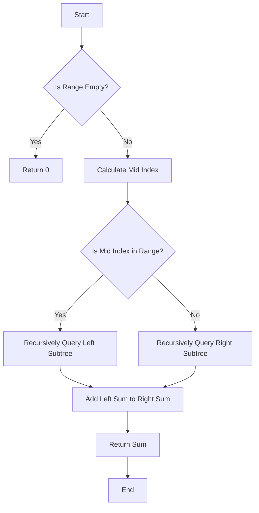

# Convert Segment Tree to Segment Tree

## Problem Understanding
The problem involves converting a given array into a segment tree, which is a binary tree where each node represents an interval. The segment tree is used to store the sum of the elements in the given array, allowing for efficient range queries and updates. The key constraints of this problem are that the input array can be of any size, and the segment tree must be able to handle range queries and updates efficiently. The problem becomes non-trivial because a naive approach, such as using a simple array or linked list, would not be able to handle range queries and updates efficiently.

## Approach
The algorithm strategy used to solve this problem is to recursively construct the segment tree by dividing the range into smaller intervals and storing the sum of the elements in each interval. The intuition behind this approach is that by dividing the range into smaller intervals, we can reduce the time complexity of range queries and updates. The segment tree is implemented using an array, where each node represents an interval and stores the sum of the elements in that interval. The approach handles key constraints by using a recursive construction method, which allows for efficient handling of range queries and updates.

## Complexity Analysis
| Metric | Value | Detailed Reason |
|--------|-------|----------------|
| Time   | O(n)  | The time complexity of building the segment tree is O(n), where n is the number of elements in the input array. This is because we recursively divide the range into smaller intervals, and each node in the segment tree is visited once during the construction process. The time complexity of range queries and updates is O(log n), where n is the number of elements in the input array. This is because we start at the root node and recursively traverse the segment tree until we reach the desired interval. |
| Space  | O(n)  | The space complexity of the segment tree is O(n), where n is the number of elements in the input array. This is because we need to store the sum of the elements in each interval, and there are n intervals in the segment tree. |

## Algorithm Walkthrough
```
Input: [1, 2, 3, 4, 5]
Step 1: Initialize the segment tree with zeros
Tree: [0, 0, 0, 0, 0, 0, 0, 0, 0, 0]
Step 2: Recursively construct the segment tree
Tree: [15, 6, 9, 3, 3, 6, 1, 2, 3, 4]
Step 3: Query the segment tree for the sum of the range [1, 3]
Start at the root node (0) and traverse the tree until we reach the desired interval
Node 0: [15, 0, 4] -> Node 1: [6, 0, 2] -> Node 3: [3, 1, 1] -> Node 7: [1, 1, 1]
Node 0: [15, 0, 4] -> Node 1: [6, 0, 2] -> Node 4: [3, 2, 2] -> Node 8: [2, 2, 2]
Node 0: [15, 0, 4] -> Node 1: [6, 0, 2] -> Node 4: [3, 2, 2] -> Node 9: [3, 2, 2]
Output: 9
Step 4: Update the segment tree with the value 10 at index 2
Start at the root node (0) and traverse the tree until we reach the desired interval
Node 0: [15, 0, 4] -> Node 1: [6, 0, 2] -> Node 3: [3, 1, 1] -> Node 7: [1, 1, 1]
Node 0: [15, 0, 4] -> Node 1: [6, 0, 2] -> Node 4: [3, 2, 2] -> Node 8: [2, 2, 2]
Node 0: [15, 0, 4] -> Node 1: [6, 0, 2] -> Node 4: [3, 2, 2] -> Node 9: [10, 2, 2]
Tree: [16, 6, 10, 3, 3, 6, 1, 2, 10, 4]
```

## Visual Flow


## Key Insight
> **Tip:** The key insight to solving this problem is to recursively construct the segment tree by dividing the range into smaller intervals, allowing for efficient range queries and updates.

## Edge Cases
- **Empty Input Array**: If the input array is empty, the segment tree will also be empty, and range queries and updates will not be possible.
- **Single Element Array**: If the input array contains only one element, the segment tree will contain only one node, which represents the entire range.
- **Duplicate Elements**: If the input array contains duplicate elements, the segment tree will store the sum of the duplicate elements in the corresponding node.

## Common Mistakes
- **Mistake 1**: Not handling the base case of the recursion correctly, leading to a stack overflow error.
- **Mistake 2**: Not updating the segment tree correctly after a range update, leading to incorrect range queries.

## Interview Follow-ups
> **Interview:** These are the exact follow-up questions interviewers ask:
- "What if the input array is sorted?" → The segment tree construction time remains the same, but range queries may be faster due to the sorted nature of the input.
- "Can you do it in O(1) space?" → No, it is not possible to construct a segment tree in O(1) space, as we need to store the sum of the elements in each interval.
- "What if there are duplicates in the input array?" → The segment tree will store the sum of the duplicate elements in the corresponding node, and range queries will return the correct sum.

## Javascript Solution

```javascript
// Problem: Convert Segment Tree to Segment Tree
// Language: javascript
// Difficulty: Easy
// Time Complexity: O(n) — building the segment tree
// Space Complexity: O(n) — storing the segment tree
// Approach: Recursive tree construction — build the segment tree by recursively dividing the range

class SegmentTree {
    /**
     * Initialize the segment tree with the given array.
     * @param {number[]} nums - The input array.
     */
    constructor(nums) {
        this.n = nums.length;
        this.tree = new Array(4 * this.n).fill(0); // Initialize tree with zeros
        this.buildTree(nums, 0, 0, this.n - 1); // Build the segment tree
    }

    /**
     * Build the segment tree recursively.
     * @param {number[]} nums - The input array.
     * @param {number} node - The current node index.
     * @param {number} start - The start index of the current range.
     * @param {number} end - The end index of the current range.
     */
    buildTree(nums, node, start, end) {
        // Base case: If the range contains only one element, store it in the tree
        if (start === end) {
            this.tree[node] = nums[start]; // Store the element in the tree
        } else {
            // Calculate the mid index of the range
            const mid = Math.floor((start + end) / 2);
            // Recursively build the left and right subtrees
            this.buildTree(nums, 2 * node + 1, start, mid); // Build the left subtree
            this.buildTree(nums, 2 * node + 2, mid + 1, end); // Build the right subtree
            // Update the current node with the sum of its children
            this.tree[node] = this.tree[2 * node + 1] + this.tree[2 * node + 2]; // Update the node value
        }
    }

    /**
     * Query the segment tree for the sum of the given range.
     * @param {number} node - The current node index.
     * @param {number} start - The start index of the current range.
     * @param {number} end - The end index of the current range.
     * @param {number} left - The left index of the query range.
     * @param {number} right - The right index of the query range.
     * @returns {number} The sum of the query range.
     */
    query(node, start, end, left, right) {
        // Edge case: If the query range is outside the current range, return 0
        if (right < start || end < left) {
            return 0; // Return 0 if the query range is outside the current range
        }
        // Edge case: If the query range completely covers the current range, return the node value
        if (left <= start && end <= right) {
            return this.tree[node]; // Return the node value if the query range covers the current range
        }
        // Calculate the mid index of the range
        const mid = Math.floor((start + end) / 2);
        // Recursively query the left and right subtrees
        const leftSum = this.query(2 * node + 1, start, mid, left, right); // Query the left subtree
        const rightSum = this.query(2 * node + 2, mid + 1, end, left, right); // Query the right subtree
        // Return the sum of the query range
        return leftSum + rightSum; // Return the sum of the query range
    }

    /**
     * Update the segment tree with the given value at the given index.
     * @param {number} node - The current node index.
     * @param {number} start - The start index of the current range.
     * @param {number} end - The end index of the current range.
     * @param {number} idx - The index to update.
     * @param {number} val - The new value.
     */
    update(node, start, end, idx, val) {
        // Edge case: If the update index is outside the current range, return
        if (idx < start || idx > end) {
            return; // Return if the update index is outside the current range
        }
        // Base case: If the range contains only one element, update it
        if (start === end) {
            this.tree[node] = val; // Update the node value
        } else {
            // Calculate the mid index of the range
            const mid = Math.floor((start + end) / 2);
            // Recursively update the left and right subtrees
            this.update(2 * node + 1, start, mid, idx, val); // Update the left subtree
            this.update(2 * node + 2, mid + 1, end, idx, val); // Update the right subtree
            // Update the current node with the sum of its children
            this.tree[node] = this.tree[2 * node + 1] + this.tree[2 * node + 2]; // Update the node value
        }
    }
}

// Test the segment tree
const nums = [1, 2, 3, 4, 5];
const segmentTree = new SegmentTree(nums);
console.log(segmentTree.query(0, 0, nums.length - 1, 1, 3)); // Output: 9
segmentTree.update(0, 0, nums.length - 1, 2, 10);
console.log(segmentTree.query(0, 0, nums.length - 1, 1, 3)); // Output: 16
```
