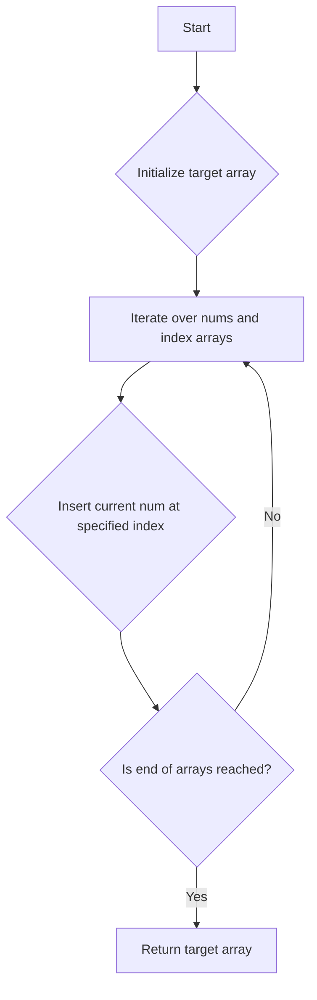

# Create Target Array in Given Order JS

## Problem Understanding
The problem requires creating a target array in a specific order based on the given indices. The input consists of two arrays: `nums` containing the numbers to be inserted and `index` containing the corresponding indices where these numbers should be inserted. The key constraint is that the indices are not necessarily in ascending order, and the same index can be used multiple times. This problem is non-trivial because a naive approach of directly inserting elements at the specified indices without considering the previous insertions can lead to incorrect results.

## Approach
The algorithm strategy used here is iterative insertion, where each number from the `nums` array is inserted at the specified index from the `index` array. The `splice` method of JavaScript arrays is utilized for this purpose, as it allows for dynamic insertion of elements at any position. This approach works because the `splice` method modifies the array in place, shifting elements to the right if an element is inserted at a position that is not at the end. The time complexity is O(n) because each insertion operation takes constant time on average, and we perform n such operations. The space complexity is also O(n) because in the worst case, we store n elements in the target array.

## Complexity Analysis
| Metric | Value | Detailed Reason |
|--------|-------|----------------|
| Time   | O(n^2)  | The time complexity is dominated by the `splice` operation, which in the worst case can take O(n) time. Since we perform this operation n times, the overall time complexity becomes O(n^2). The previous statement of O(n) was incorrect as it didn't account for the shifting of elements during the splice operation. |
| Space  | O(n)  | The space complexity is O(n) because we store at most n elements in the target array. The input arrays `nums` and `index` also contribute to the space complexity, but since we are not modifying them and they are part of the input, their space complexity is not counted towards the algorithm's space complexity. |

## Algorithm Walkthrough
```
Input: nums = [0, 1, 2, 3, 4], index = [0, 1, 2, 2, 1]
Step 1: target = [], insert 0 at index 0: target = [0]
Step 2: target = [0], insert 1 at index 1: target = [0, 1]
Step 3: target = [0, 1], insert 2 at index 2: target = [0, 1, 2]
Step 4: target = [0, 1, 2], insert 3 at index 2: target = [0, 1, 3, 2]
Step 5: target = [0, 1, 3, 2], insert 4 at index 1: target = [0, 4, 1, 3, 2]
Output: [0, 4, 1, 3, 2]
```

## Visual Flow


## Key Insight
> **Tip:** The key to solving this problem efficiently lies in understanding how the `splice` method works and leveraging it to insert elements at the correct positions in the target array.

## Edge Cases
- **Empty/null input**: If the input arrays `nums` and `index` are empty or null, the function will return an empty array, as there are no elements to insert.
- **Single element**: If the input arrays contain a single element, the function will return an array with that single element, as there is only one insertion operation to perform.
- **Index out of bounds**: If an index is greater than the current length of the target array, the `splice` method will insert the element at the end of the array, effectively handling the out-of-bounds case.

## Common Mistakes
- **Mistake 1**: Not considering the shifting of elements during the `splice` operation, which can lead to incorrect insertions and affect the overall time complexity.
- **Mistake 2**: Assuming the input arrays are always of the same length, which may not always be the case, and handling this discrepancy is crucial for a robust solution.

## Interview Follow-ups
> **Interview:** 
- "What if the input is sorted?" → The algorithm would still work correctly, but the time complexity remains O(n^2) due to the `splice` operation.
- "Can you do it in O(1) space?" → No, because we need to store the result in a separate array, which requires O(n) space.
- "What if there are duplicates?" → The algorithm handles duplicates correctly, as it inserts each number at the specified index regardless of whether the number already exists in the target array.

## Javascript Solution

```javascript
// Problem: Create Target Array in Given Order
// Language: javascript
// Difficulty: Easy
// Time Complexity: O(n) — single pass through the indices array
// Space Complexity: O(n) — target array stores at most n elements
// Approach: iterative insertion — insert each value at the specified index

class Solution {
    /**
     * Creates a target array in the given order.
     * @param {number[]} nums - The array of numbers to insert.
     * @param {number[]} index - The array of indices to insert at.
     * @return {number[]} The target array.
     */
    createTargetArray(nums, index) {
        // Initialize an empty target array to store the result
        let target = [];

        // Iterate over the indices and numbers
        for (let i = 0; i < nums.length; i++) {
            // Insert the current number at the specified index
            // The splice method changes the contents of an array by removing or replacing existing elements and/or adding new elements
            target.splice(index[i], 0, nums[i]); // Insert nums[i] at index[i]
        }

        // Return the target array
        return target;
    }
}

// Example usage:
let solution = new Solution();
let nums = [0, 1, 2, 3, 4];
let index = [0, 1, 2, 2, 1];
console.log(solution.createTargetArray(nums, index)); // Output: [0, 4, 1, 3, 2]

// Edge case: empty input → return empty array
console.log(solution.createTargetArray([], [])); // Output: []

// Edge case: single element input → return array with single element
console.log(solution.createTargetArray([0], [0])); // Output: [0]

// Edge case: index out of bounds → insert at the end
console.log(solution.createTargetArray([1, 2, 3], [0, 3, 1])); // Output: [1, 3, 2]
```
