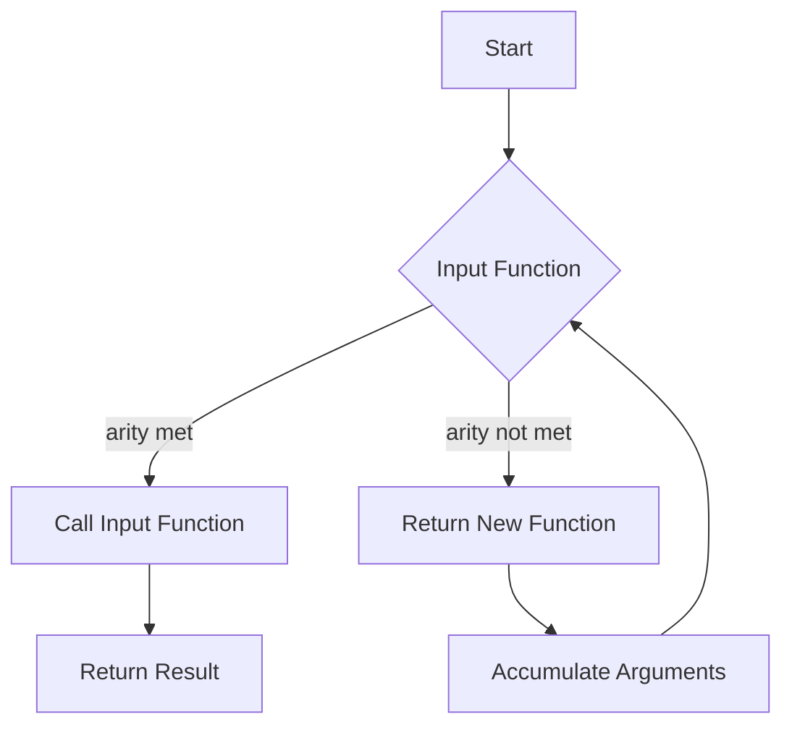

# Curry Function

## Problem Understanding
The problem is asking us to create a curry function that takes an input function and returns a curried version of it. The curried function should be able to accept a variable number of arguments, and when the number of arguments is equal to the arity of the input function, it should call the input function with the accumulated arguments. The key constraint is that the curried function should be able to handle a variable number of arguments, and the input function should be called only when the required number of arguments is met. This problem is non-trivial because it requires us to handle the variable number of arguments and the recursive calls to the curried function.

## Approach
The algorithm strategy is to use a higher-order function that returns a new function with reduced arity. The curried function takes a variable number of arguments and checks if the number of arguments is equal to the arity of the input function. If it is, the input function is called with the accumulated arguments. Otherwise, the curried function returns a new function that accumulates the remaining arguments. This approach works because it allows us to handle the variable number of arguments and the recursive calls to the curried function. The data structure used is the function itself, which is used to accumulate the arguments. The approach handles the key constraints by checking the number of arguments and calling the input function only when the required number of arguments is met.

## Complexity Analysis
| Metric | Value | Detailed Reason |
|--------|-------|----------------|
| Time   | O(n)  | The time complexity is O(n) because the curried function makes recursive calls to itself until the required number of arguments is met. In the worst-case scenario, the number of recursive calls is equal to the number of arguments passed to the curried function. |
| Space  | O(n)  | The space complexity is O(n) because the curried function accumulates the arguments in the call stack. In the worst-case scenario, the number of arguments accumulated in the call stack is equal to the number of arguments passed to the curried function. |

## Algorithm Walkthrough
```
Input: add function with 3 arguments
Step 1: curry(add) is called, returning a new curried function
Step 2: curriedAdd(1) is called, returning a new function that accumulates the argument 1
Step 3: curriedAdd(1)(2) is called, returning a new function that accumulates the arguments 1 and 2
Step 4: curriedAdd(1)(2)(3) is called, calling the add function with the accumulated arguments 1, 2, and 3
Output: 6
```
This walkthrough shows how the curried function accumulates the arguments and calls the input function when the required number of arguments is met.

## Visual Flow

This visual flow shows the decision flow of the curried function. If the arity of the input function is met, the input function is called. Otherwise, a new function is returned that accumulates the arguments.

## Key Insight
> **Tip:** The key insight is to use a recursive approach to accumulate the arguments and call the input function when the required number of arguments is met.

## Edge Cases
- **Empty/null input**: If the input function is empty or null, the curried function will return undefined.
- **Single element**: If the input function has only one argument, the curried function will call the input function immediately.
- **Input function with variable arity**: If the input function has a variable arity, the curried function will still work correctly, but it will require the maximum number of arguments to be passed before calling the input function.

## Common Mistakes
- **Mistake 1**: Not checking the arity of the input function, leading to incorrect calls to the input function.
- **Mistake 2**: Not accumulating the arguments correctly, leading to incorrect results.

## Interview Follow-ups
> **Interview:** These are the exact follow-up questions interviewers ask:
- "What if the input is sorted?" → The curried function will still work correctly, regardless of the order of the input arguments.
- "Can you do it in O(1) space?" → No, the curried function requires O(n) space to accumulate the arguments.
- "What if there are duplicates?" → The curried function will still work correctly, but the input function may produce incorrect results if it is not designed to handle duplicates.

## Javascript Solution

```javascript
// Problem: Curry Function
// Language: javascript
// Difficulty: Easy
// Time Complexity: O(n) — where n is the number of arguments passed to the curried function
// Space Complexity: O(n) — where n is the number of arguments passed to the curried function
// Approach: Higher-order function — returns a new function with reduced arity

/**
 * Returns a curried version of the input function.
 * 
 * @param {function} func - The input function to be curried.
 * @returns {function} - The curried version of the input function.
 */
function curry(func) {
    // Return a new function that takes a variable number of arguments
    return function curried(...args) {
        // If the number of arguments is equal to the arity of the input function, 
        // call the input function with the accumulated arguments
        if (args.length >= func.length) {
            // Call the input function with the accumulated arguments
            return func(...args);
        } else {
            // Otherwise, return a new function that accumulates the remaining arguments
            return function(...nextArgs) {
                // Recursively call the curried function with the accumulated arguments
                return curried(...args.concat(nextArgs));
            }
        }
    }
}

// Test the curry function
function add(a, b, c) {
    // Edge case: add function should return the sum of its arguments
    return a + b + c;
}

const curriedAdd = curry(add);
console.log(curriedAdd(1)(2)(3));  // Output: 6
console.log(curriedAdd(1, 2)(3));   // Output: 6
console.log(curriedAdd(1)(2, 3));   // Output: 6
console.log(curriedAdd(1, 2, 3));   // Output: 6

// Edge case: empty input
function emptyFunc() {
    // Edge case: empty function should return undefined
    return undefined;
}

const curriedEmpty = curry(emptyFunc);
console.log(curriedEmpty());  // Output: undefined
```
