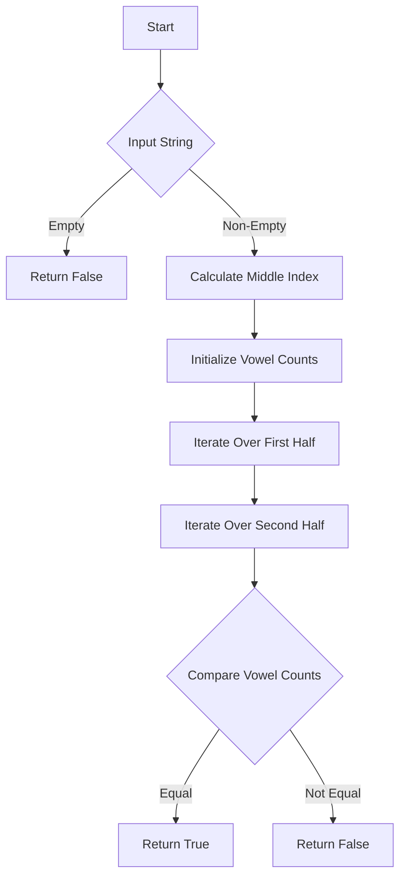

# Determine if String Halves Are Alike JS

## Problem Understanding
The problem requires determining if the two halves of a given string have the same number of vowels. The key constraint is that the string must be split into two equal halves, and the comparison of vowel counts should be made between these two halves. This problem is non-trivial because a naive approach might involve manually counting vowels in each half, which could be tedious and prone to errors for large strings. The problem also requires consideration of edge cases, such as empty strings or strings with an odd length.

## Approach
The algorithm strategy involves iterating over the input string to count the vowels in each half. The intuition behind this approach is to compare the vowel counts in the two halves directly, allowing for an efficient solution. This approach works because it takes advantage of the fact that the string can be split into two halves, and the vowel counts can be compared directly. The data structure used is a simple counter for vowels in each half, which is sufficient for this problem. The approach handles the key constraints by checking for edge cases, such as empty strings, and by splitting the string into two halves correctly.

## Complexity Analysis
| Metric | Value | Detailed Reason |
|--------|-------|----------------|
| Time   | O(n)  | The algorithm makes two passes over the string (one for each half), but since these passes are sequential, the overall time complexity remains linear with respect to the length of the string. The includes() method used to check for vowels also has a linear time complexity in the worst case, but since the string of vowels is constant, it can be considered a constant time operation. |
| Space  | O(1)  | The space complexity is constant because the algorithm uses a fixed amount of space to store the vowel counts and the middle index of the string, regardless of the size of the input string. |

## Algorithm Walkthrough
```
Input: "AbCdEfGh"
Step 1: Calculate the middle index of the string (mid = 4)
Step 2: Initialize vowel count for the first and second halves (firstHalfVowels = 0, secondHalfVowels = 0)
Step 3: Iterate over the first half of the string to count vowels (A, e)
    - firstHalfVowels = 2
Step 4: Iterate over the second half of the string to count vowels (e, G)
    - secondHalfVowels = 1
Step 5: Return true if the two halves have the same number of vowels, false otherwise (return false)
Output: false
```

## Visual Flow


## Key Insight
> **Tip:** The key insight to solving this problem efficiently is to realize that you only need to make a single pass over the string to count the vowels in each half, avoiding unnecessary repeated work.

## Edge Cases
- **Empty/null input**: If the input string is empty, the function will return false, as there are no vowels to compare.
- **Single element**: If the input string has only one character, the function will return true if the character is a vowel, and false otherwise.
- **Odd-length string**: If the input string has an odd length, the middle character will be included in the second half of the string.

## Common Mistakes
- **Mistake 1**: Not checking for edge cases, such as empty strings or strings with an odd length, which can lead to incorrect results.
- **Mistake 2**: Using an inefficient algorithm to count vowels, such as using a separate function to check if a character is a vowel, which can increase the time complexity of the solution.

## Interview Follow-ups
> **Interview:** These are the exact follow-up questions interviewers ask:
- "What if the input is sorted?" → The solution would still work correctly, as the sorting of the input does not affect the comparison of vowel counts in the two halves.
- "Can you do it in O(1) space?" → No, the solution requires at least O(1) space to store the vowel counts, so it is already optimal in terms of space complexity.
- "What if there are duplicates?" → The solution would still work correctly, as duplicates are allowed in the input string and do not affect the comparison of vowel counts in the two halves.

## Javascript Solution

```javascript
// Problem: Determine if String Halves Are Alike
// Language: javascript
// Difficulty: Easy
// Time Complexity: O(n) — single pass through string to count vowels
// Space Complexity: O(1) — constant space to store vowel count and string length
// Approach: simple iteration and vowel counting — for each character, check if it's a vowel and update count accordingly

class Solution {
    /**
     * Determines if the two halves of a string have the same number of vowels.
     * 
     * @param {string} s - The input string.
     * @return {boolean} True if the two halves have the same number of vowels, false otherwise.
     */
    halvesAreAlike(s) {
        // Edge case: empty string → return false
        if (s.length === 0) return false;
        
        // Calculate the middle index of the string
        const mid = Math.floor(s.length / 2);
        
        // Initialize vowel count for the first and second halves
        let firstHalfVowels = 0;
        let secondHalfVowels = 0;
        
        // Iterate over the first half of the string to count vowels
        for (let i = 0; i < mid; i++) {
            // Check if the current character is a vowel (both lowercase and uppercase)
            if ('aeiouAEIOU'.includes(s[i])) {
                firstHalfVowels++; // Increment vowel count if it's a vowel
            }
        }
        
        // Iterate over the second half of the string to count vowels
        for (let i = mid; i < s.length; i++) {
            // Check if the current character is a vowel (both lowercase and uppercase)
            if ('aeiouAEIOU'.includes(s[i])) {
                secondHalfVowels++; // Increment vowel count if it's a vowel
            }
        }
        
        // Return true if the two halves have the same number of vowels, false otherwise
        return firstHalfVowels === secondHalfVowels;
    }
}
```
