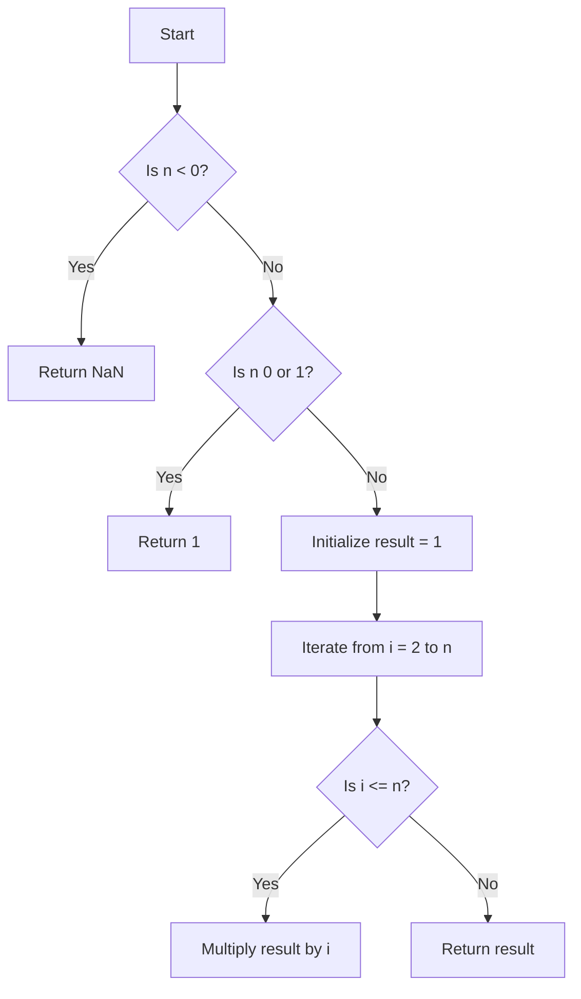

# Factorial

## Problem Understanding
The problem is asking to calculate the factorial of a given non-negative integer. The key constraint is that the input number should be a non-negative integer, as the factorial is not defined for negative numbers or non-integer values. What makes this problem non-trivial is handling the edge cases, such as negative input, 0, and 1, as well as avoiding potential overflow issues for large input values. The naive approach of directly calculating the factorial using recursion can be inefficient for large inputs due to the repeated computation involved.

## Approach
The algorithm strategy used here is iterative multiplication, where the result is calculated by multiplying all numbers from 1 to the input number. This approach works because it directly implements the mathematical definition of factorial, which is the product of all positive integers up to that number. A simple loop is used to iterate from 2 to the input number, multiplying the result by each number in the sequence. The data structure used is a single variable to store the result, making it efficient in terms of space complexity. This approach handles the key constraints by checking for edge cases at the beginning of the function.

## Complexity Analysis
| Metric | Value | Detailed Reason |
|--------|-------|----------------|
| Time   | O(n)  | The algorithm iterates from 2 to n, performing a constant amount of work for each iteration, hence the time complexity is linear with respect to the input size n. |
| Space  | O(1)  | The algorithm uses a constant amount of space to store the result and the loop counter, regardless of the input size n. |

## Algorithm Walkthrough
```
Input: 5
Step 1: Initialize result = 1
Step 2: Iterate from i = 2 to 5:
  - i = 2: result = 1 * 2 = 2
  - i = 3: result = 2 * 3 = 6
  - i = 4: result = 6 * 4 = 24
  - i = 5: result = 24 * 5 = 120
Output: 120
```
This example demonstrates how the algorithm calculates the factorial of 5.

## Visual Flow

This flowchart illustrates the decision-making process and the loop involved in calculating the factorial.

## Key Insight
> **Tip:** The key to efficiently calculating the factorial is to handle edge cases first and then use a simple iterative approach to avoid unnecessary recursion and potential stack overflow.

## Edge Cases
- **Empty/null input**: The function does not explicitly handle null or undefined inputs. To handle such cases, an additional check at the beginning of the function could return NaN or throw an error, as the factorial is not defined for non-numeric inputs.
- **Single element**: For an input of 0 or 1, the function correctly returns 1, as these are the base cases for the factorial function.
- **Negative input**: For any negative input, the function returns NaN, which is correct because the factorial is not defined for negative numbers.

## Common Mistakes
- **Mistake 1**: Not checking for edge cases such as negative numbers or 0 and 1, which can lead to incorrect results or unnecessary computations.
- **Mistake 2**: Using a recursive approach without considering the potential for stack overflow for large input values.

## Interview Follow-ups
> **Interview:** 
- "What if the input is sorted?" → This question does not directly apply to the factorial problem, as the input is a single number, not a list of numbers. However, if the question implies a sorted list of numbers for which we need to calculate the factorial, the approach remains the same for each number individually.
- "Can you do it in O(1) space?" → The current solution already uses O(1) space, as it only uses a constant amount of space to store the result and the loop counter, regardless of the input size.
- "What if there are duplicates?" → This question does not apply to the factorial problem, as the input is a single number. However, if the question implies calculating the factorial of a number that represents the count of items in a set with duplicates, the approach to calculating the factorial itself does not change based on the presence of duplicates in the set being counted.

## Javascript Solution

```javascript
// Problem: Factorial
// Language: JavaScript
// Difficulty: Easy
// Time Complexity: O(n) — single loop from 1 to n
// Space Complexity: O(1) — constant space, only one variable
// Approach: Iterative multiplication — for each number from 1 to n, multiply the result

class Solution {
    /**
     * Calculates the factorial of a given number.
     * @param {number} n The input number.
     * @return {number} The factorial of n.
     */
    factorial(n) {
        // Edge case: negative input → return NaN (Not a Number)
        if (n < 0) {
            return NaN; // Factorial is not defined for negative numbers
        }
        
        // Edge case: 0 or 1 → return 1 (base case of factorial)
        if (n === 0 || n === 1) {
            return 1; // Base case: factorial of 0 and 1 is 1
        }

        // Initialize result variable to 1
        let result = 1;
        
        // Iterate from 2 to n and multiply the result
        for (let i = 2; i <= n; i++) {
            // Multiply the current number with the result
            result *= i; 
        }
        
        // Return the calculated factorial
        return result;
    }
}

// Example usage:
let solution = new Solution();
console.log(solution.factorial(5));  // Output: 120
console.log(solution.factorial(0));  // Output: 1
console.log(solution.factorial(-1));  // Output: NaN
```
