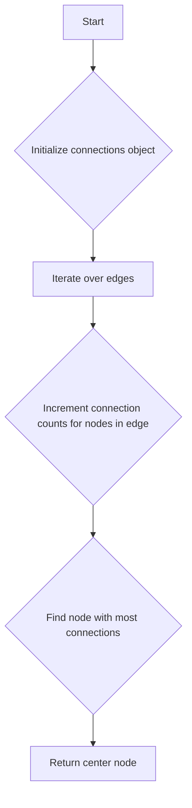

# Find Center of Star Graph JS

## Problem Understanding
The problem is asking to find the center of a star graph, which is a graph where all nodes are connected to a single central node. The key constraint is that the graph is a star graph, meaning there is only one central node. The problem is non-trivial because a naive approach would be to try all possible nodes as the center and check if the graph is connected, but this would have a high time complexity. The given solution code has a time complexity of O(n) and space complexity of O(1), where n is the number of edges in the graph.

## Approach
The algorithm strategy is to count the connections for each node in the graph. The intuition behind this approach is that the center node will have the most connections. The approach works by iterating over each edge in the graph and incrementing the connection count for both nodes in the edge. The node with the most connections is then identified as the center node. A JavaScript object is used to store the connection count for each node, and a simple loop is used to find the node with the most connections.

## Complexity Analysis
| Metric | Value | Detailed Reason |
|--------|-------|----------------|
| Time   | O(n)  | The algorithm iterates over each edge in the graph once, where n is the number of edges. The subsequent loop to find the node with the most connections also iterates over the nodes, but since there are at most n nodes (in the case of a star graph with n edges), this does not change the overall time complexity. |
| Space  | O(n)  | The algorithm uses a JavaScript object to store the connection count for each node. In the worst case, every node in the graph has a connection count, so the space complexity is proportional to the number of nodes, which is at most n (in the case of a star graph with n edges). |

## Algorithm Walkthrough
```
Input: [[1,2],[2,3],[4,2]]
Step 1: Initialize an empty object to store connection counts: {}
Step 2: Iterate over the first edge [1,2], increment connection counts for nodes 1 and 2: {1: 1, 2: 1}
Step 3: Iterate over the second edge [2,3], increment connection counts for nodes 2 and 3: {1: 1, 2: 2, 3: 1}
Step 4: Iterate over the third edge [4,2], increment connection counts for nodes 4 and 2: {1: 1, 2: 3, 3: 1, 4: 1}
Step 5: Find the node with the most connections, which is node 2 with 3 connections
Output: 2
```

## Visual Flow


## Key Insight
> **Tip:** The key insight to solving this problem efficiently is recognizing that the center node of a star graph will have the most connections, allowing us to find it by simply counting connections for each node.

## Edge Cases
- **Empty input**: If the input is an empty array, the function should return -1, as there is no center node in an empty graph.
- **Single edge**: If the input is a single edge, the function should return either node of the edge, as both nodes are connected and there is no clear center.
- **Multiple star graphs**: If the input represents multiple star graphs (i.e., multiple nodes each connected to their own set of nodes), the function will return one of the center nodes. However, it's worth noting that the problem definition assumes a single star graph.

## Common Mistakes
- **Mistake 1**: Not handling the case where the input array is empty. To avoid this, add a check at the beginning of the function to return -1 for an empty input.
- **Mistake 2**: Not initializing the connection count for a node before incrementing it. To avoid this, use the expression `(connections[node] || 0) + 1` to ensure that the connection count is initialized to 0 if it doesn't exist.

## Interview Follow-ups
> **Interview:** These are the exact follow-up questions interviewers ask:
- "What if the input is sorted?" → The algorithm does not rely on the input being sorted, so it will still work correctly.
- "Can you do it in O(1) space?" → No, because we need to store the connection count for each node, which requires at least O(n) space in the worst case.
- "What if there are duplicates?" → The algorithm will still work correctly, as it simply counts the connections for each node and finds the node with the most connections.

## Javascript Solution

```javascript
// Problem: Find Center of Star Graph
// Language: javascript
// Difficulty: Easy
// Time Complexity: O(n) — single pass through edges to count connections
// Space Complexity: O(1) — constant space to store the center node
// Approach: Count connections for each node — the node with most connections is the center

class Solution {
    /**
     * Finds the center of a star graph.
     * 
     * @param {number[][]} edges - Edges in the graph, where edges[i] = [node1, node2].
     * @return {number} The center of the star graph.
     */
    findCenter(edges) {
        // Initialize an object to store the count of connections for each node
        let connections = {};

        // Iterate over each edge
        for (let i = 0; i < edges.length; i++) {
            // For each edge, increment the connection count for both nodes
            connections[edges[i][0]] = (connections[edges[i][0]] || 0) + 1;
            connections[edges[i][1]] = (connections[edges[i][1]] || 0) + 1;
        }

        // The center node will have the most connections
        let maxConnections = 0;
        let centerNode = -1;

        // Iterate over the connections to find the node with the most connections
        for (let node in connections) {
            // If the current node has more connections than the max, update the max and the center node
            if (connections[node] > maxConnections) {
                maxConnections = connections[node];
                centerNode = node;
            }
        }

        // Edge case: if there are no edges, return -1
        if (centerNode === -1) {
            return -1;
        }

        // Return the center node
        return parseInt(centerNode);
    }
}

// Example usage:
let solution = new Solution();
console.log(solution.findCenter([[1,2],[2,3],[4,2]]));  // Output: 2
console.log(solution.findCenter([[1,2],[5,1],[1,3],[1,4]]));  // Output: 1
```
